################
2 Installation
################

You can download and install the File Server Agent software directly from the Web Portal. Complete the following steps to install the |prodname| File Server Agent software on your file server.

************************
2.1 System Requirement
************************

File Server Agent can be installed on the following OS

* Server OS

  - Windows 2022
  - Windows 2019
  - Windows 2016
    
* Client OS

  - Windows 10
  - Windows 8.1
  - Windows 8.0
  - Windows 7
  - Windows Vista
  - Windows XP
    

*****************
2.2 Preparation
*****************

File Server Agent depends on .NET framework 2.0 or later. If you are installing the file Server Agent on Windows Server 2022/2019/2016, you need to prepare the .NET environment. This usually can be done from the Windows Server Manager > Manage Roles and Features and then in the features section, select .NET Framework 3.5

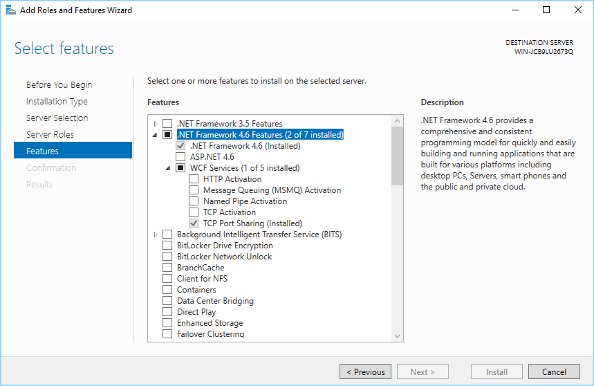

  WINDOWS SERVER 2016 .NET FRAMEWORK FEATURE

If you are installing File Server Agent on Windows 8/Windows 10, you can get .NET framework 2.0 (3.5) installed from "Program Files" -> Windows Components.

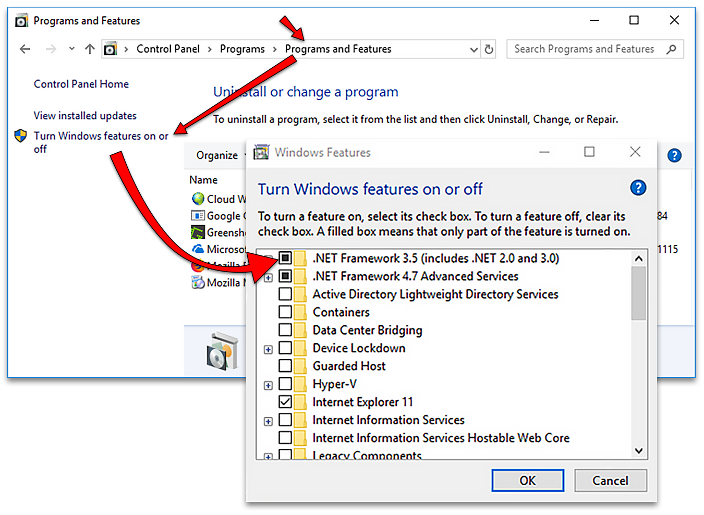
  
  WINDOWS 10 .NET FRAMEWORK 3.5 FEATURE
    

*************
2.3 Install
*************

.. important::

    Always install |prodname| File Server Agent as a Tenant Administrator when you are at the login dialog.
    
    File Server Agent belongs to a specific Tenant instead of belonging to a specific user. So it is best to download the File Server Agent as the Tenant Administrator and set it up to connect to the same Tenant Administrator's account.

Step 1 - Download the Installer Package
-----------------------------------------

From the File Server you wish to install the File Server Agent; open a browser and log in to the Web Portal as the Tenant Administrator. From the Management Console, click the **(+)** in the "Remote Active Directory" section on the right-hand side. 

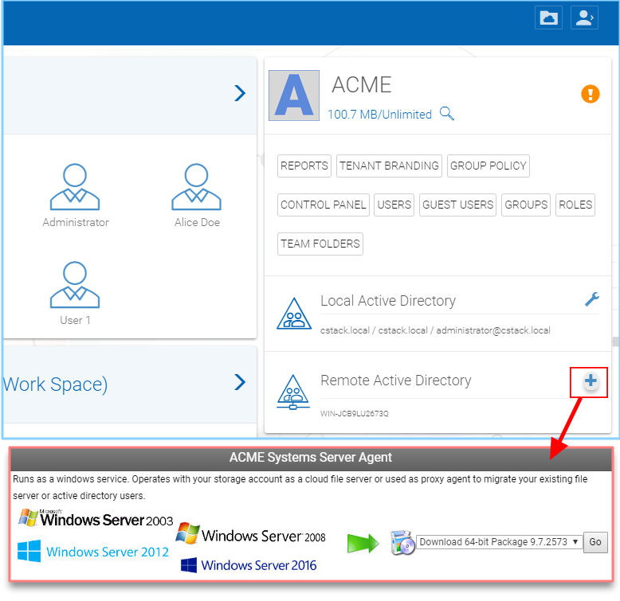
      
  SERVER AGENT DOWNLOADS ACCESS

In the pop-up window, choose your Download Package from the pull-down menu and click **Go** to begin the installation.

A window will open. Click the MSI file at the bottom of the browser to open the installer. 

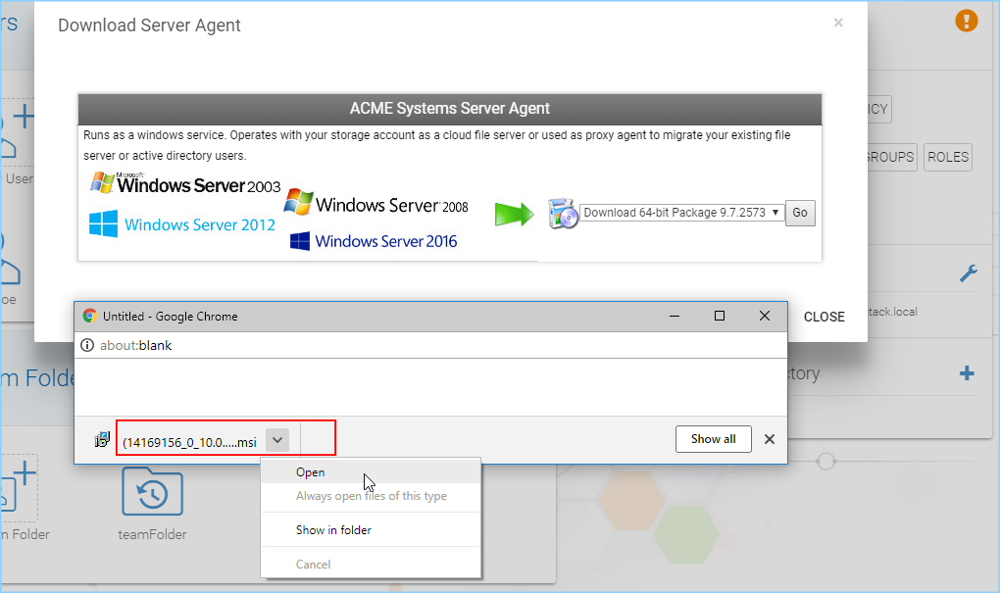
    
  OPEN THE INSTALLER
  
.. note::

    File Server agent software is capable of synchronizing three things between the local file server and remote cloud storage account.
    
    1. synchronize selected files and folders.
    2. synchronize selected Active Directory users from local to cloud.
    3. synchronize NTFS permissions on the local file server to cloud. 
    
    You can start installing file server agent from "Adding Remote Active Directory" or from "Adding Team Folder via Remote Server Agent".

Step 2 - Run the Installer Package
------------------------------------

Click **"Run"** to start the installation. 

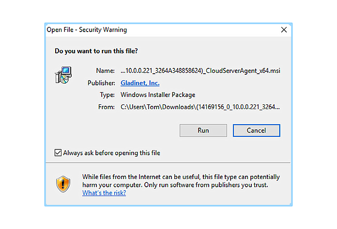
      
  RUN THE SERVER AGENT INSTALLER

Step 3 - Welcome Screen
-------------------------

On the Welcome Screen choose **"Next"** to continue. 

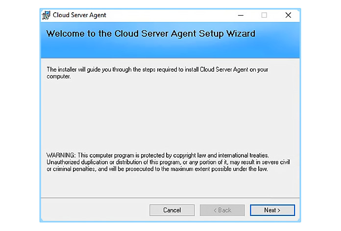
      
  WELCOME SCREEN

On the Welcome Screen choose **"Next"** to continue. 

Step 4 - License Agreement
----------------------------

Read and accept the license agreement by choosing **"I Agree"** and click the **"Next"** button. 

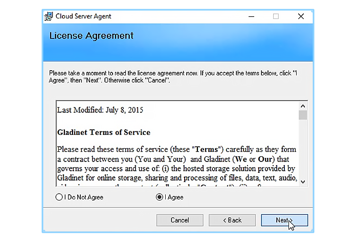
      
  ACCEPT LICENSE AGREEMENT

Step 5 - Confirm Installation
-------------------------------

Now we will complete the File Server Agent installation. Click **"Next"** to finish. 

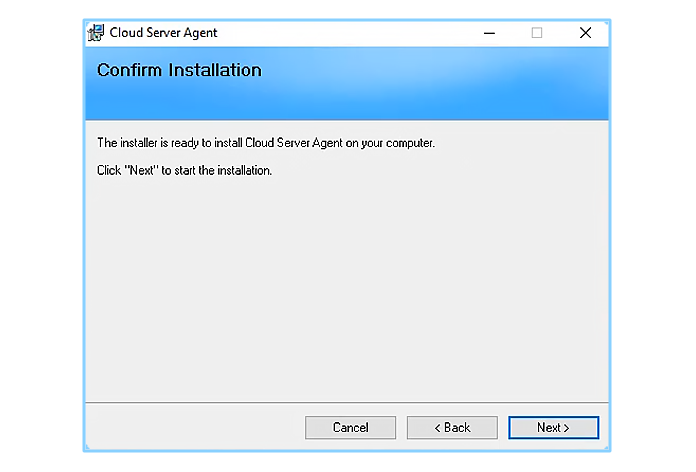
      
  CONFIRM INSTALLATION

Step 6 - Installation is Finishing
------------------------------------

It will only take a few minutes to complete the installation. 

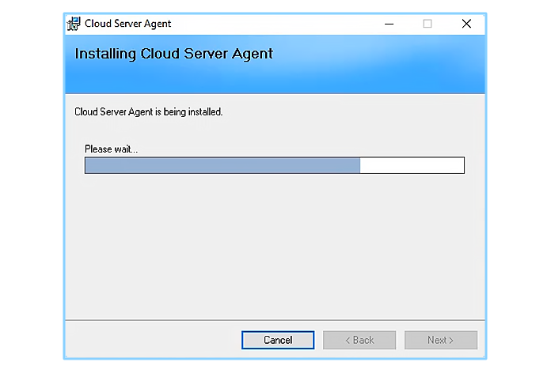
      
  FINAL INSTALLATION PROCESS

Step 7 - Installation Complete
--------------------------------

Once the installation is completed, click the **"Close"** button to finish. 

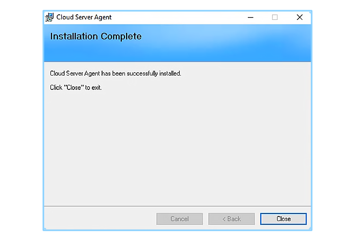
      
  CLOSE INSTALLATION WINDOW

Step 8 - Restart Your System
------------------------------

Just restart your system and File Server Agent is ready to use.  

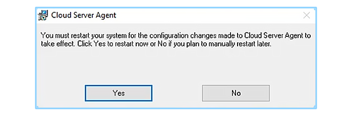
      
  RESTART YOUR SYSTEM
  

Step 9 - Login To |prodname|
-------------------------------

After the reboot, log back into Windows as the same Windows user. Be patient, as it will take a few minutes for the Login Panel to display. Login to |prodname| as using your Tenant Administrator credentials. 
  
.. note::
  The File Server Agent can be logged in to the Tenant already if you don't see the login dialog. You can go to the Web Portal side, login as the Tenant Administrator and go to the "Device Manager" side to see the File Server Agent. 
    
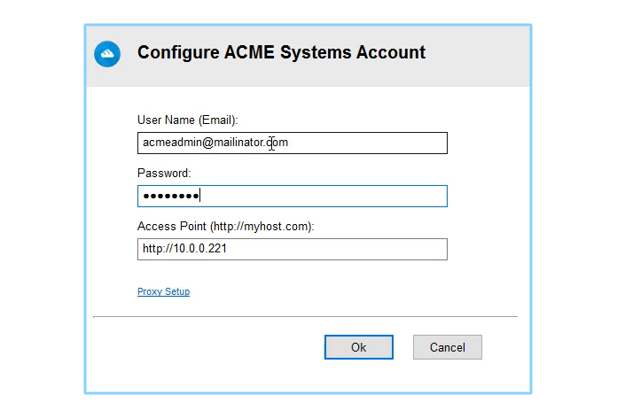
  
  LOG IN AS TENANT ADMIN
