#####################################
3 Administration and Configuration
#####################################

|prodname| File Server Agent runs as a Windows Service in the background. Since it is a background service, it always runs regardless of the users logging into the server. 

The administration of the File Server Agent is done via a Windows application (the Cloud Server Console). Most of the time, the Cloud Server Console will launch into the web browser based administration console.

There are two consoles, one on the Web Portal and the other one runs natively on a local machine. The one on the Web Portal is for general administration like settings. The native console is for advanced troubleshooting.

You need to log into the Windows server's console to use the |prodname| Server Agent Management Console for administration-related tasks. If you manage the Windows Server from remote locations, you can use Remote Desktop, or other remote control tools to access to the Windows server before you start the |prodname| Server Agent Management Console.

**********************************
3.1 File Server Agent Components
**********************************

There are 3 windows services and 1 windows Application

  - Cloud Access Service (gladgroupsvc.exe) - This is the main sync service
    
  - File Monitor Service (GladFileMonSvc) - This is responsible for Server Agent auto upgrade
    
  - File System Mounter (gladrmountsvc) - This is mount the Cloud File System for the Gateway mode
    
  - Management Console (GtaskMMC.exe) - This is responsible talking to the background servicer and provide management feedback
    
.. note::

    If GtaskMMC.exe is run with /runlocal /server command line parameter, it will launch into the local native management console. Otherwise the /server flag alone will launch the web based console.
  
  .. figure:: _static/image_s3_1_1.png
    :align: center
        
    GLADINET CLOUD ACCESS (GCA) SERVICE

By default the File Server Agent background windows service runs as a local system account.

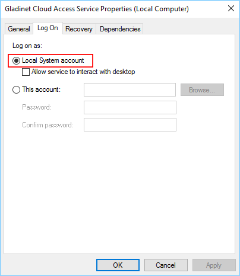
    
    GCA LOCAL SYSTEM ACCOUNT SERVICE

.. warning::

    Sometimes the LOCAL SYSTEM account doesn't have permission for the folders it wants to sync. In this case, the Log-on-as account for the Cloud Access Service (GladGroupSvc.exe) needs to be changed to a service account that has full control (read, write, delete, list) permission to the folder that it wants to sync.
    
    In an Active Directory environment, this normally can be changed to a Domain Admin Service Account.

*************************************
3.2 Cloud Server Console - Web View
*************************************

|prodname| Cloud Server Console will launch automatically after the reboot using the Tenant Admin credentials that were used to install the software.

.. warning::

    File Server Agent is tied to each Tenant, so the Tenant Admin's credential shall be used to link the File Server Agent to a specific Tenant.

The cluster admin is also the Tenant Admin for the very first Tenant in the |prodname| system so by default it is a Tenant Admin as well.

.. note::

    File Server agent is managed at Tenant level (not per-user level, nor cluster-level either)
    

|prodname| Cloud Server Management Console Login:

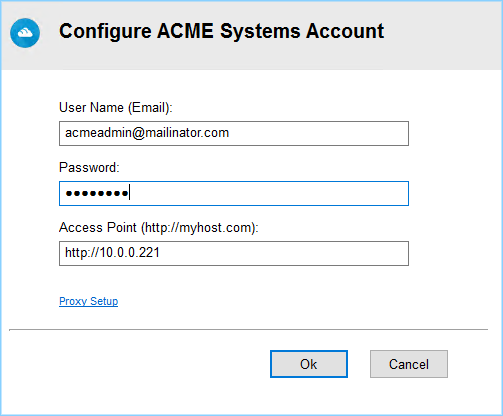
        
    MANAGEMENT CONSOLE LOGIN

|prodname| Cloud Server Management Console can also be launched from Windows Start Programs Menu:

Launch the Console from the Start Menu.

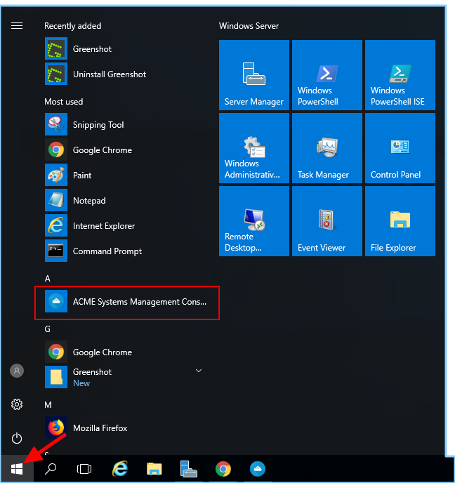
        
    LAUNCH THE CONSOLE
  
After launch, you see several options and tabs at the top of the view, Device Info is shown below.

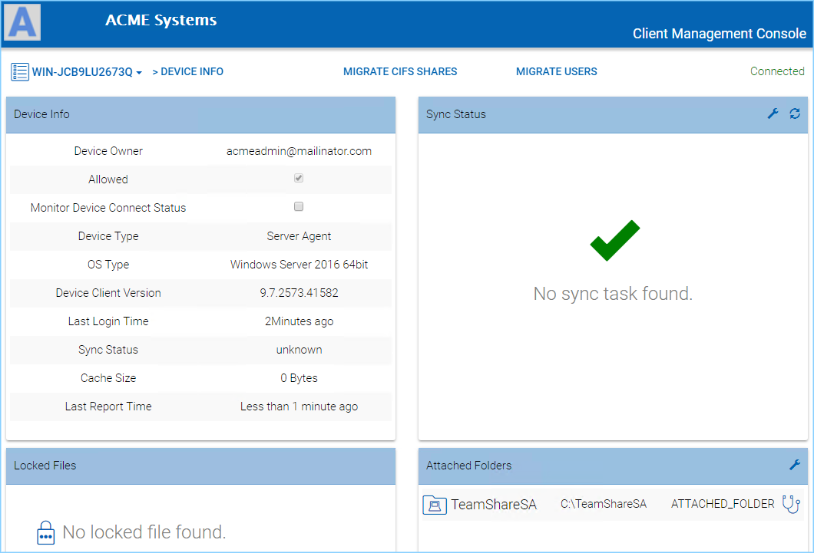
        
    CLIENT MANAGEMENT CONSOLE - DEVICE INFO

You can click on the left tab in the console to see more management items.

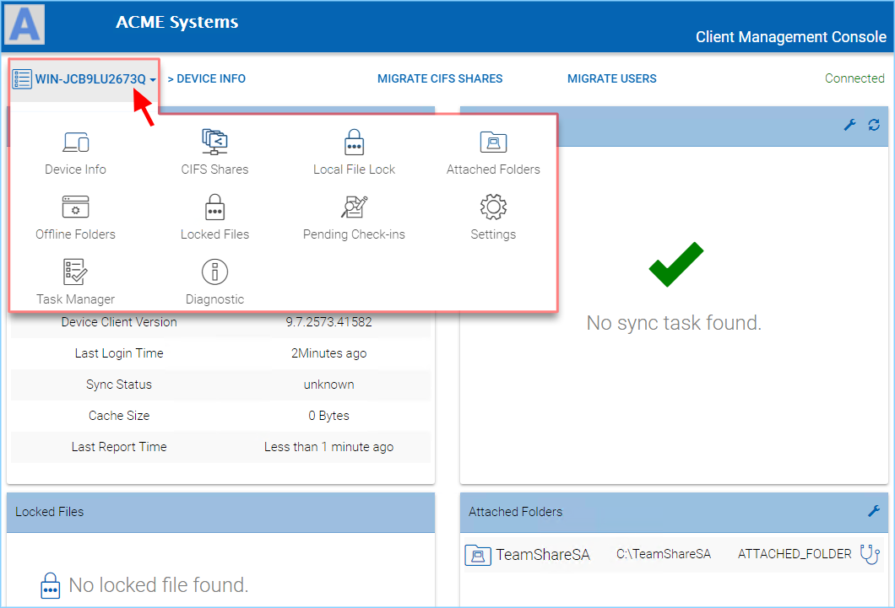
        
    ACCESSING THE CONSOLE MENU

3.2.1 Device Info
^^^^^^^^^^^^^^^^^^^

The default web console view is the device information panel. It shows the basic device information such as device name, device operating system, device version and etc.

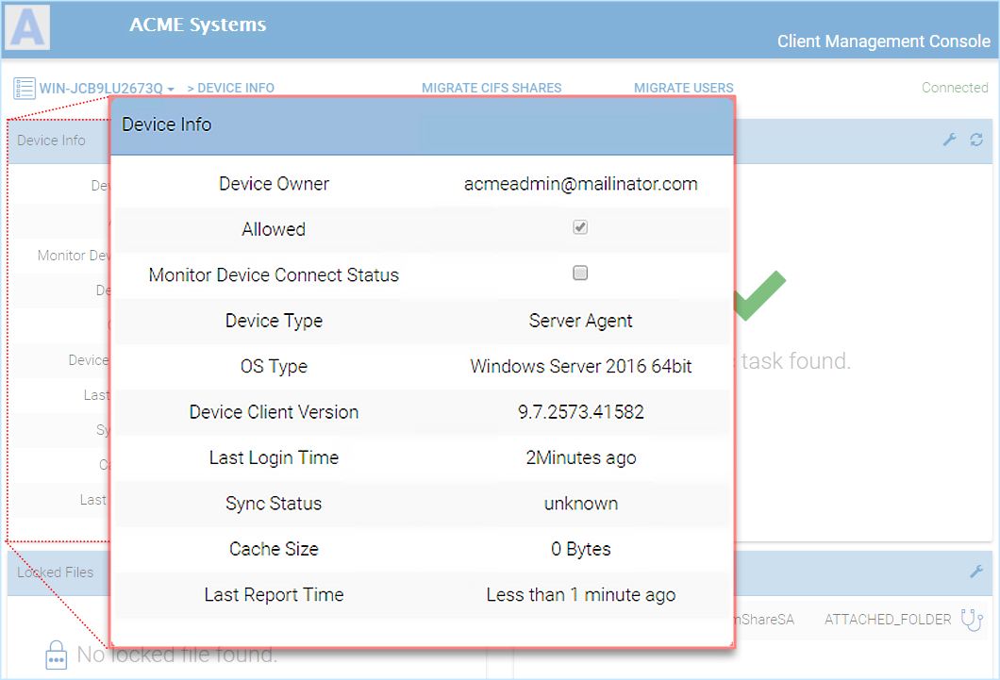
        
    CLIENT MANAGEMENT CONSOLE - DEVICE INFO

**Monitor Device Connect Status** - The device may get disconnected from the Internet for whatever reason, including but not limited to Internet outage, software crash, background service not running and etc. 
If the device is not connected to generate a healthy heart beat connection to the |prodname| server side software, this setting will
generate an email alert if the device is not actively connected to the tenant acacount.
When this alert is received, it needs to be investigated at high priority because it will lead to 
synchronization break-down.

3.2.2 CIFS Shares
^^^^^^^^^^^^^^^^^^^

CIFS (Common Internet File System) shares refers to Windows Network Shares that are available on the File Server Agent machine. CIFS shares or SMB (Server Message Block) shares are used interchangably here. 

.. figure:: _static/image_s3_2_5.png
    :align: center
        
    CIFS SHARES
  
You can start migrating file server network shares from the current machine to |prodname|.

.. note::

    Migration means setup two-way synchronization between the local folder and the remote |prodname| Server. It is a hybrid cloud configuration started by default. Over time, you may want to stop the local folder and go cloud only. That is reserved for future if you select to do so. Out of the box it is setup as a two-way synchronization folder for
    each CIFS share selected.

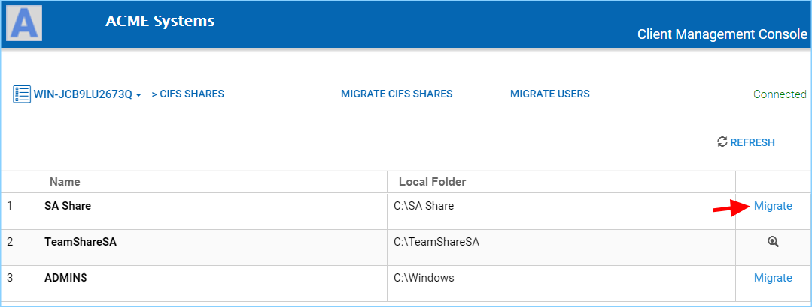
        
    MIGRATE A SHARE

.. note::

    The net result of migration is that you can access the files and folders from both the local file server and also the |prodname| side. Files changes on both side will synchronize to the other side. It is a hybrid local/cloud mode. Also when migration works on CIFS share (network share), optionally the local folder's NTFS permission can be replicated and synchronized to cloud side, while the local Active Directory users can be synchronized to cloud
    side.

Migrate
---------

Clicking on the migrate link button will start the migration process on a specific network share. Normally when the File Server Agent and the |prodname| Server are on two completely different locations, the **"Direct Access"** option will not be shown. The **"Two Way Sync"** will be the only option.

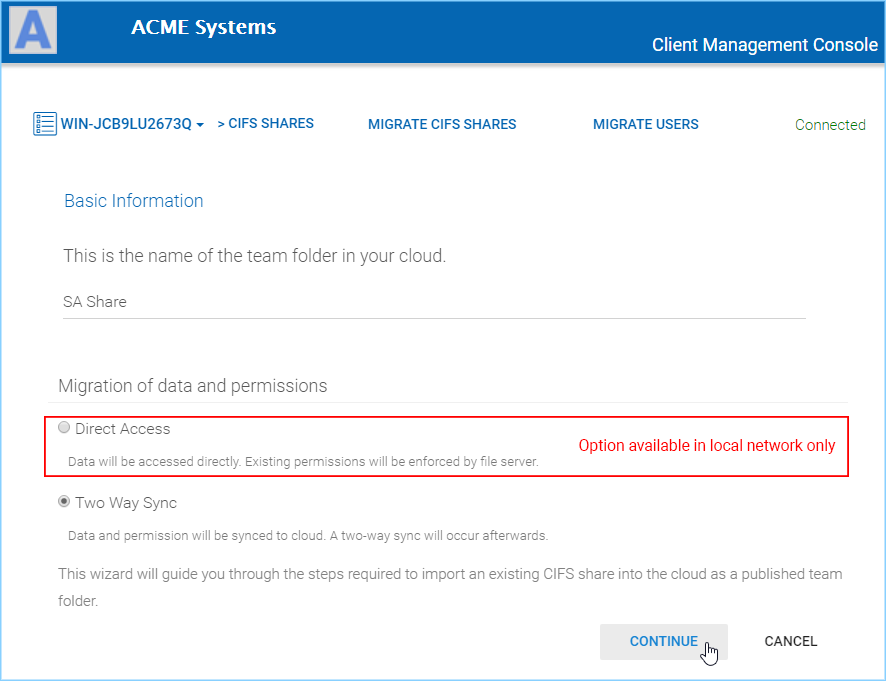
        
    MIGRATION OF DATA AND PERMISSIONS

3.2.3 Attached Folders
^^^^^^^^^^^^^^^^^^^^^^^^

How to Attach a Folder
------------------------

Attached folders, are folders on the local machine and can be synchronized to |prodname| and kept synchronized in a bi-directional way.

The Attached Folder section allows you to browse into the machine's file structure and pick a folder to synchronize. In the Console drop-down menu, select **"Attached Folders"**. 

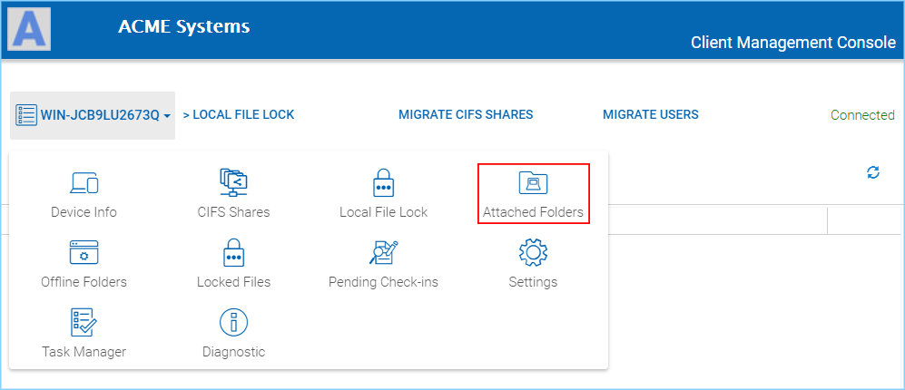
        
    ATTACHED FOLDERS

In the new view click the Attach Folder icon.

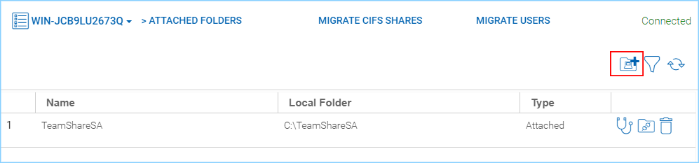
        
    ATTACH FOLDER BUTTON

In the folder selection view **(1)**, double click the drive **(2)** and navigate to the folder you wish to share. When you choose a folder, its path will appear in the Location field **(3)** and you should enter a name for your share in the Name field **(4)**. Click **"ATTACH"** to complete the process. 

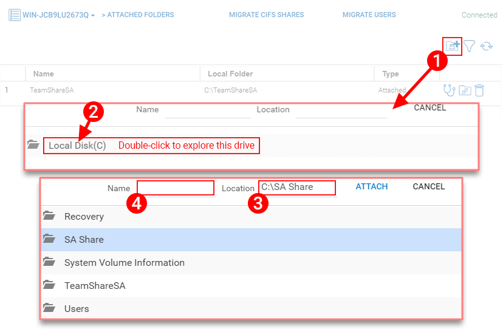
        
    ATTACHING A FOLDER

Filter Button
---------------

Using the Filter Button **(1)**, you can set some of your folders to be excluded from being synchronized. To accomplish this, after you click the **Filter** button, click the **(+)** button **(2)** and explore to a folder you wish to exclude. In this example, it is a sub-folder **(3)** of the **SA Share** folder. 

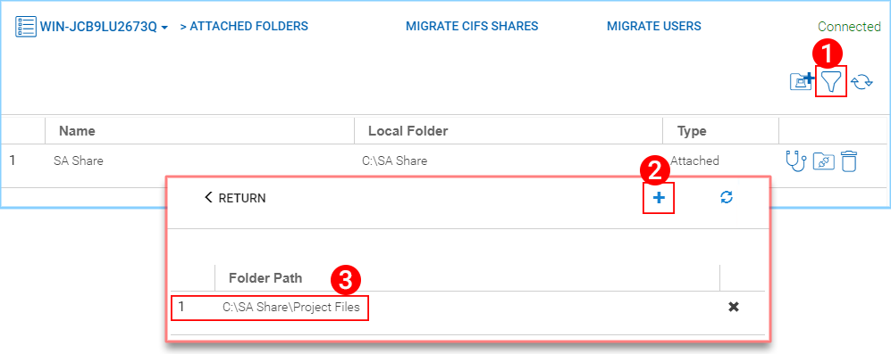
        
    FILTER BUTTON

Diagnostic Button
-------------------

The Diagnostic Button **(2)** can be used to **"Compare"** the cloud folder and the local network folder to determine if the y are the same. This is important to make sure that the local folder has been completely mirrored to the cloud. 

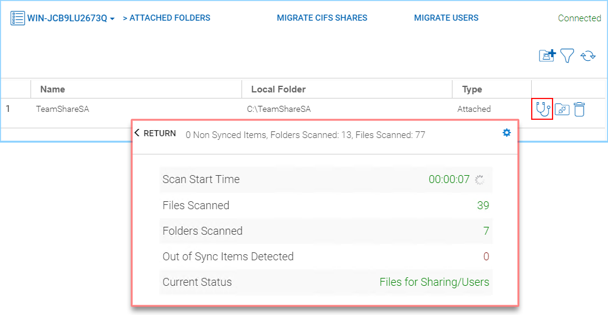
        
    DIAGNOSTIC BUTTON

Stop-Sync Button
-------------------

The Stop-Sync Button can be used to stop the synchronization between the folder from the Server Agent and the attached folder in the cloud. This is something you might want to do when all the users are accessing the folder from the cloud and no longer need local network access to the original folder. After the stop-sync, the local file changes are local changes, not related to cloud; and vise-versa, the file changes
in the cloud will not be related to the local files, they are just two separate independent entities.

.. warning::

    Stop-Sync is different from detach a previously attached folder. When a folder is detached, 
    not only it stop-sync, but also the cloud side folder will be hidden and subject to retention policy
    for purge in the near future. So if your use case is to continue to use the files and folders from
    the cloud side and cloud side only, you want to do a stop-sync instead of doing a 
    detach-folder.

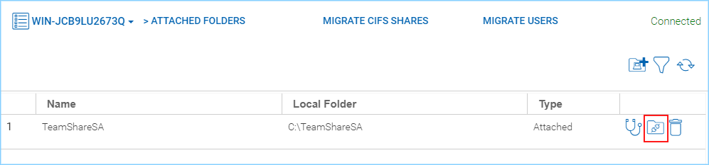
        
    STOP-SYNC BUTTON

.. note::

    What is the difference between Import a CIFS Share and attach a folder to |prodname|? 
    
    First of all, both maintain bi-directional synchronization. The key difference is "Import CIFS Share" will also import folder permission to |prodname|, while Attached Folder only synchronize folders without synchronize permissions.
    
    Under the hood, both are **"Attached Folders"**. 
    
    "Import CIFS Share" = "Attached Folder" + "Sync NTFS Permission"
    

Offline Folders
-----------------

You can mark folders as offline. Offline folders will be pre-fetched to the local machine. Files changed remotely in the offline folders will also be pre-fetched to local machine.

To access this feature, click the **"Offline Folders"** icon **(1)**. Then click he **(+)** icon **(2)** on the right side of the Offline Folders screen. In the explorer, navigate to the folder you wish to "Offline" and select it **(3)**. Then click **"ENABLE OFFLINE ACCESS"** **(4)** to complete the process. 

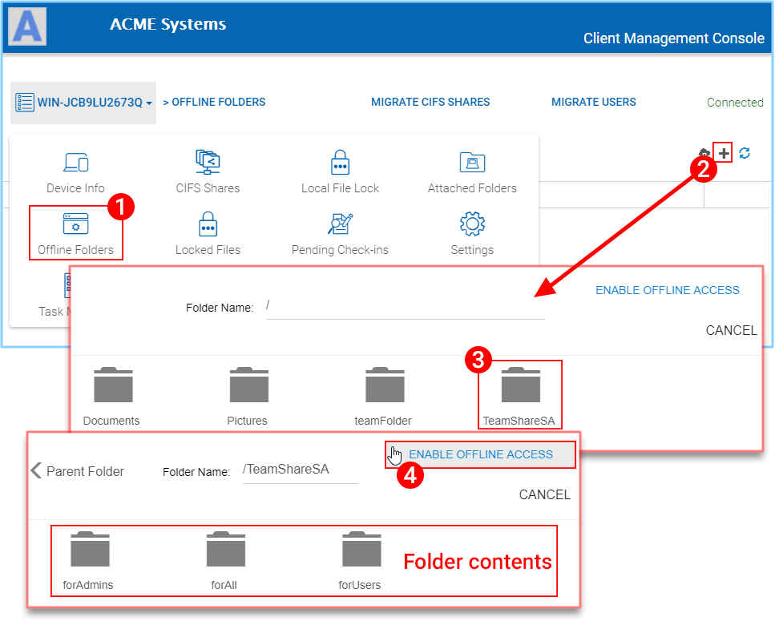
        
    CHOOSING A FOLDER FOR OFFLINE ACCESS
    
.. note::

    When to use offline folder? 
    
    When you have files and folders that you use frequently, you want to keep them local to the local
    file server, you can enable offline folder.
    
    Usually you use the offline folder for the gateway mode. When you use "Migrate CIFS share" or 
    when you use "Attach Folder", the files and folders by default are local so there is no need
    to enable offline folder for this use case since files are 100% off-line from attached folders.

Local File Lock
-----------------

Local File Lock section will show locked files from the local file server.

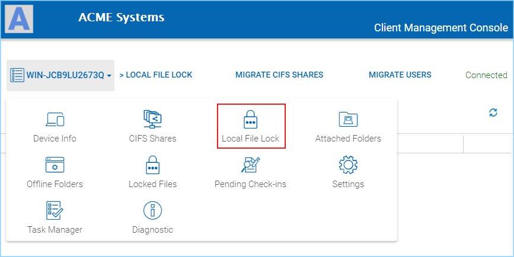
        
    LOCKED FILES

Locked Files
--------------

Locked files section will show locked files from the |prodname| Server, and provides information about who owns the file that is locked. Information shown includes: File Owner, File Path, Locked From, Type and Locked Time. 

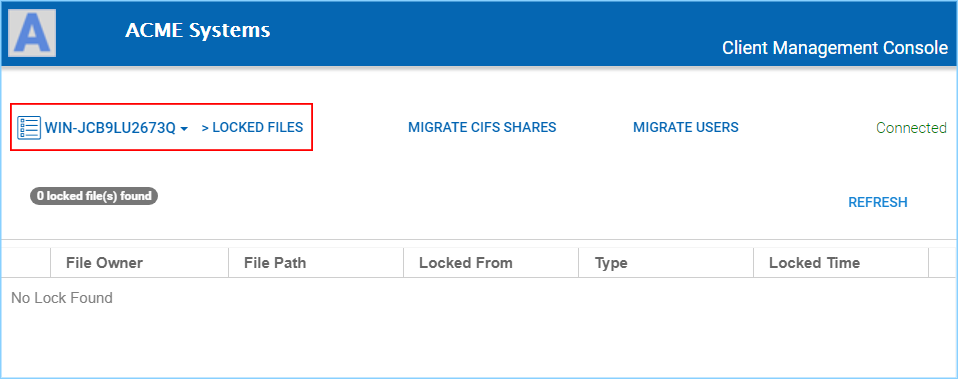
        
    LOCKED FILES

Pending Check-ins
-------------------

Pending check-ins will show files that are manually checked out from the local machine but haven't checked-in yet.

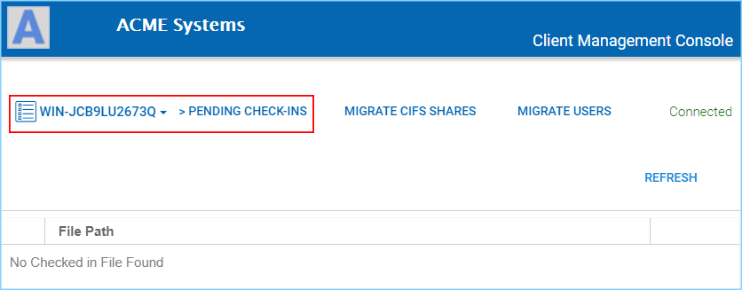
        
    PENDING CHECK-INS

3.2.4 Settings
^^^^^^^^^^^^^^^^

Settings Manager section will show client settings that can be changed and managed from the web console.

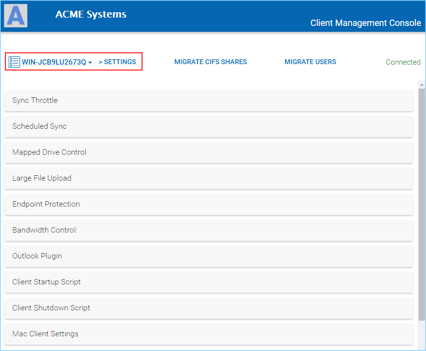
        
    SETTINGS MANAGER

3.2.5 Task Manager
^^^^^^^^^^^^^^^^^^^^

Task Manager section will show the synchronization tasks that are running on the local machine. If there is a number on **"Pending Tasks"** or **"Failed Tasks"** you can click the text links next to those numbers to open a window that shows the tasks currently in progress. There are **"PAUSE"** and **"START"** buttons available on the left side of each of the task bars as well. 

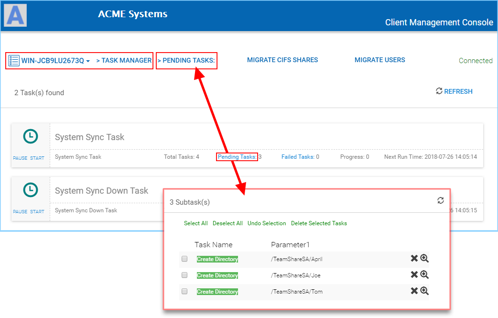
        
    TASK MANAGER

3.2.6 Migrate CIFS SHARES
^^^^^^^^^^^^^^^^^^^^^^^^^^^

Migrate CIFS Shares can be accessed from the Console menu or the **"MIGRATE CIFS SHARES"** text link. You can pick a network share on the local server and synchronize it to the cluster server. As explained above, this is how you migrate a folder and its NTFS permissions at the same time. 

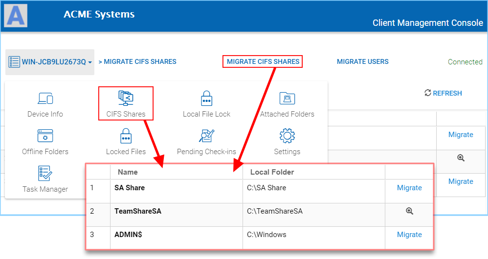
        
    MIGRATE CIFS SHARES

3.2.7 Migrate Users
^^^^^^^^^^^^^^^^^^^^^

Migrate users can import Active Directory users or local users to the |prodname| side as cloud users, while maintaining the same credentials as the local user.

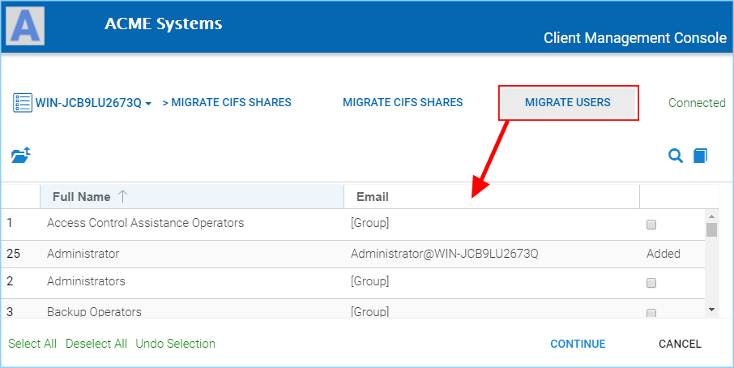
        
    MIGRATE USERS

***********************************
3.3 Cloud Server Console - Native
***********************************

You can launch the native management console from the program's installation folder. From the Command Prompt use the following command, ``C:\\Program Files\\Gladinet\\Cloud Server Agent>gtaskmmc /runlocal /server`` 

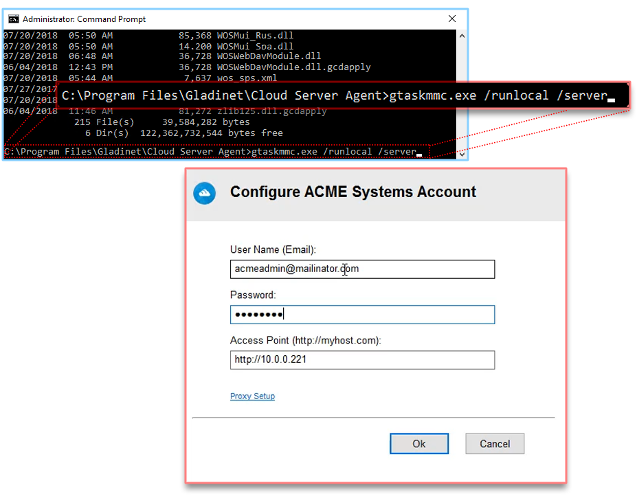
        
    LAUNCHING THE NATIVE MANAGEMENT CONSOLE

Once you have logged in the Native Console will open. This gives you local access to Server Agent settings. 

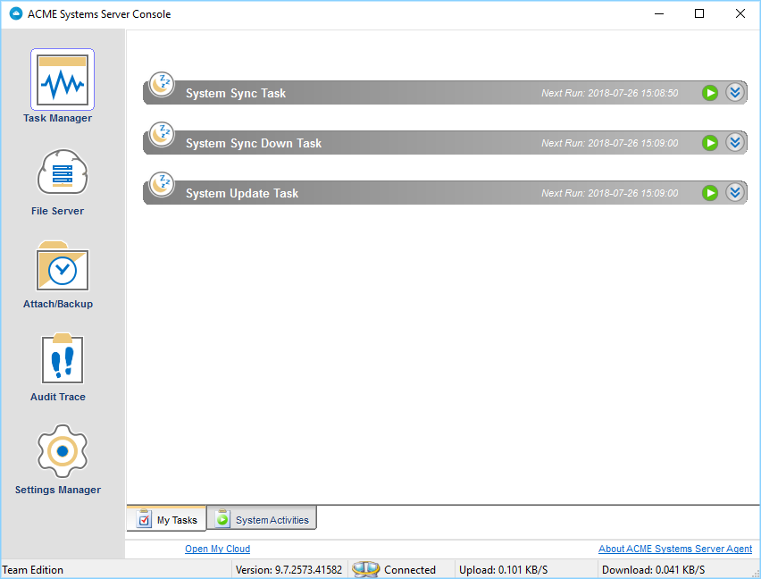
        
    NATIVE MANAGEMENT CONSOLE

3.3.1 Task Manager
^^^^^^^^^^^^^^^^^^^^

Task Manager shows all the system related tasks. 

You can also use the **"Open My Cloud"** link to access the Login Panel. 

Each of the Task Manager sections below include a series of tabs that include the following: 

**‘Summary’** 

    This tab shows a summary of all the **"System Update Tasks"**. It shows the **"Task Type"** where the type is the name of the task. It shows the ‘Status’ as **"Pending"** which means that the **"System Update Task"** is always looking for changes and is always in **"Pending"** state in case there are any updates that needs to occur. 

    Summary also shows the following: 

    **‘Last Run Time’** 
    
    This shows the time when the Server Agent software last detected the changes on the local file system and ran to update the files in the cloud.

    **‘Next Start Time’** 
    
    This shows the time when the **"Update Task"** will run next. The counter increments every 15 seconds. The software will run the update tasks right away. You can also use the **"Pause"** option to stop the update Administrator can force the updates by clicking on **"Start Now"** option in which case the task from updating local changes to the cloud. **"Delete Task"** option allows to delete any tasks for which updates are not desired. **"Refresh"** will refresh all the counters on the ‘Summary’ tab.

    **‘Completed Subtasks’**
    
    This shows the number of upload subtasks that have been completed.

**‘Running Subtasks’** 

    This shows how many subtasks are currently running. (See Tab for more info)

**‘Pending Subtasks’** 

    This shows the subtasks which are in pending state and waiting for their turn to get uploaded to the cloud. (See Tab for more info)

**‘Pending Retry Subtasks’** 

    This shows the number of any tasks which are pending retry meaning for some reason the changes for some files were not uploaded to the cloud and hence they are in the **"Pending Retry Subtasks"** queue and as soon as their turn comes the changes for files in **"Pending Retry Subtasks**" will also be uploaded to the cloud. (See Tab for more info)

**‘Trace’** 

    This tab provides trace information about tasks. (See Tab for more info) 

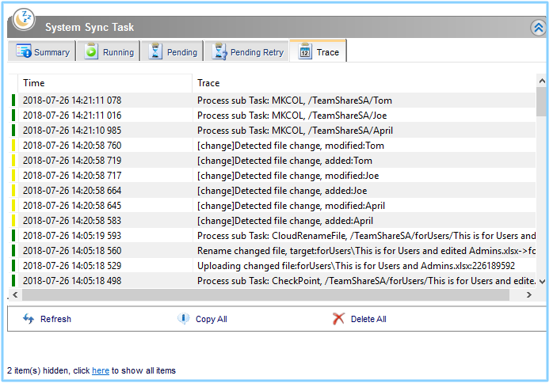
        
    SYSTEM SYNC TASK - TRACE

The **"Trace"** tab in the **"System Sync Task"** lists all the uploading, downloading, and monitoring tasks.

System Related Tasks
----------------------

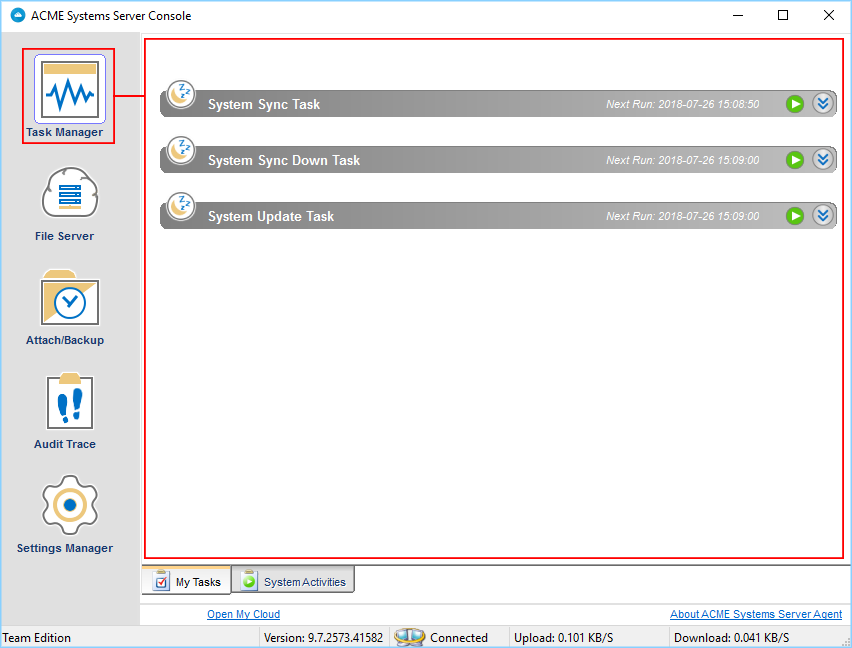
    
    SYSTEM RELATED TASKS

System Sync Task
------------------

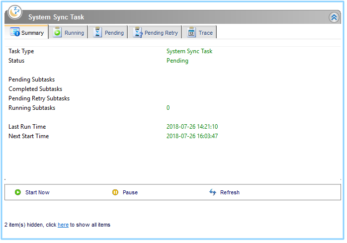
    
    SYSTEM SYNC TASK

It is the master sync task and its job is to keep an eye on both local file changes and file changes that are done in the cloud. This is the task which triggers the **"System Update Task"** or the **"System Sync Down Task"**.

System Sync Down Task
-----------------------

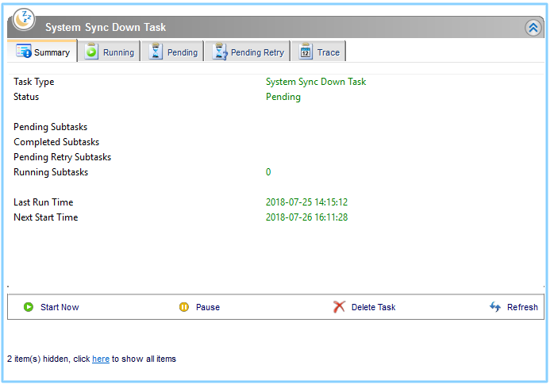
    
    SYSTEM SYNC DOWN TASK

It performs the exact same tasks as the **"System Update Task"** but its job is to ensure that the changes that are done to the files in the cloud are automatically synced down to the file server. The **"System Update Task"** and the **"System Sync Down Task"** are what provides the mirroring or two-way sync between the local files on the cloud server and the files in the cloud.

System Update Task
--------------------

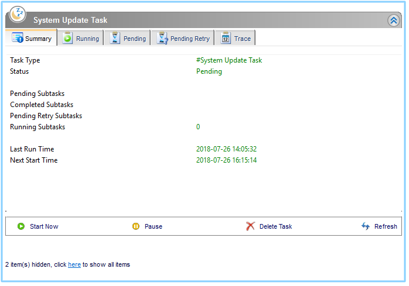
    
    SYSTEM UPDATE TASK

It shows all system related update tasks. Server Agent software checks the local file system every 15 seconds and when it notices the changes to the files, the changed files will be added to the upload queue. The real upload time depends on how big the upload queue is and if there is only one file with the changes, the changes to the file will be uploaded to the cloud in 15 seconds.

Edit Account Information
--------------------------

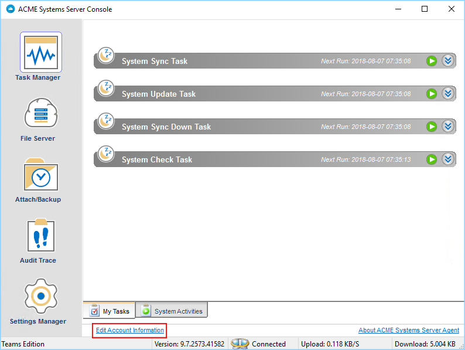
    
    EDIT ACCOUNT INFORMATION

This link at the bottom allows you to **Login with different credentials** to launch the Cloud Server Console and perform management related tasks.

3.3.2 File Server
^^^^^^^^^^^^^^^^^^^

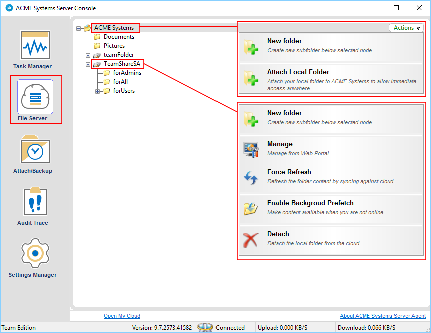
        
    FILE SERVER

**"File Server"** shows all the data that have been uploaded to the cloud and the files and folder structure. It lists folder structure which includes sub-folders as well. The local folders that are attached either from the file server or a user’s machine have the machine name in parenthesis.

An Administrator can create a new sub-folder below selected node or can attach additional local folders using the **"Attach Local Folder"** option under **"Actions"**. Attaching a local folder to |prodname| Cloud using the **"Attach Local Folder"** option allows immediate access to the local content from anywhere using any device. **“Attached Local Folder”** will be synchronized upwards to the cloud first and also the changes in the cloud will be sync down to the local file server.

Administrator can also highlight an existing cloud folder and create new sub-folders underneath that highlighted folder.

.. note::
  The two-way synchronization feature of the **“Attach Local Folder”** only applies to local folders such as those on the C: drive, D: drive and local hard drives in general. It won’t work for network share. The two-way synchronization depends on the local file system’s event change notification about files and folders. These changes will be detected and synchronization will happen based on the changes.

An administrator can also manage the folder using Web Portal by using the **"Manage"** option. This will allow an admin to convert any folders that have been attached to the cloud or are in the cloud to convert them into **"Team Folders"** for collaboration etc. Highlight the folder and select **"Manage"** under **"Actions"**.

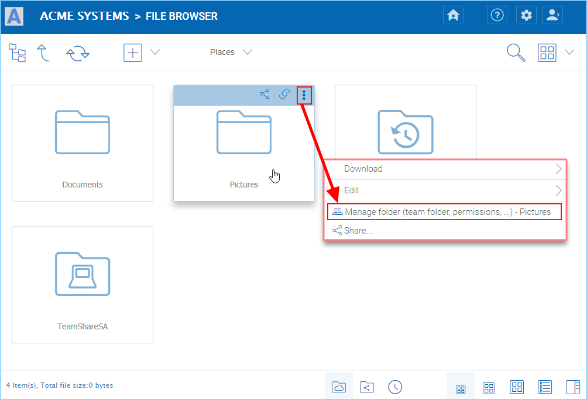
        
    FILE SERVER - MANAGE FOLDER IN WEB PORTAL

In the Manage Folder view, you must add collaborators to make this a team folder. The pop-up lets you choose a source for your users/groups; either Existing User/Group or AD. 

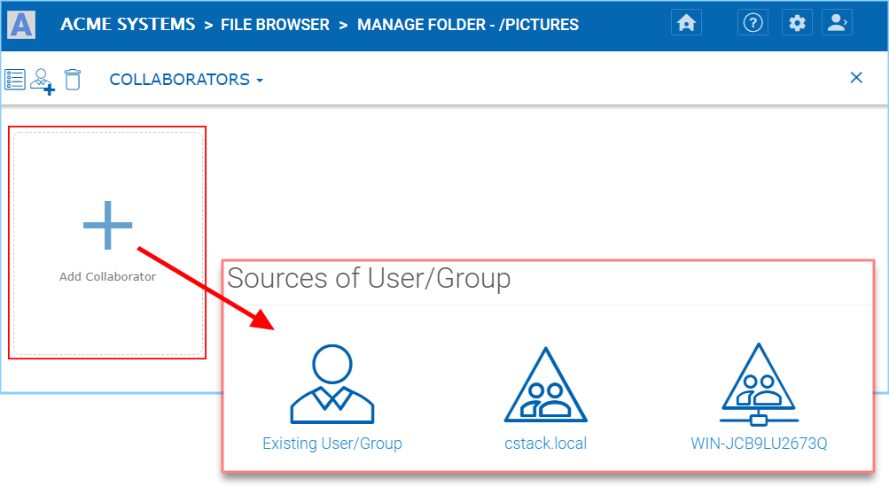
        
    ADDING COLLABORATION

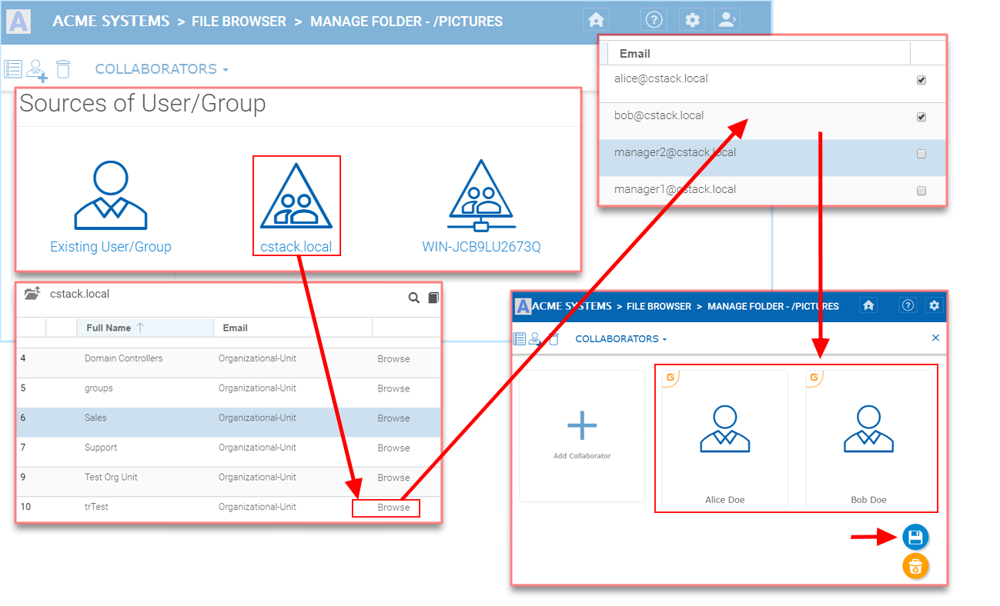
        
    ACCESS TEAM FOLDER SETTINGS

Once you have added your users/groups, click the Disk icon to save your changes. Click the Settings tab to modify settings for this share.

In the Settings tab view, you can modify the settings for this share including: Basic Settings, Permissions, Secure Data Room, IP White List and Quota and Retention Policy. Under the **(+)** Settings sub-menu you have access to: Disable further sharing, Create CIFS Share and Disable Offline Access options. 

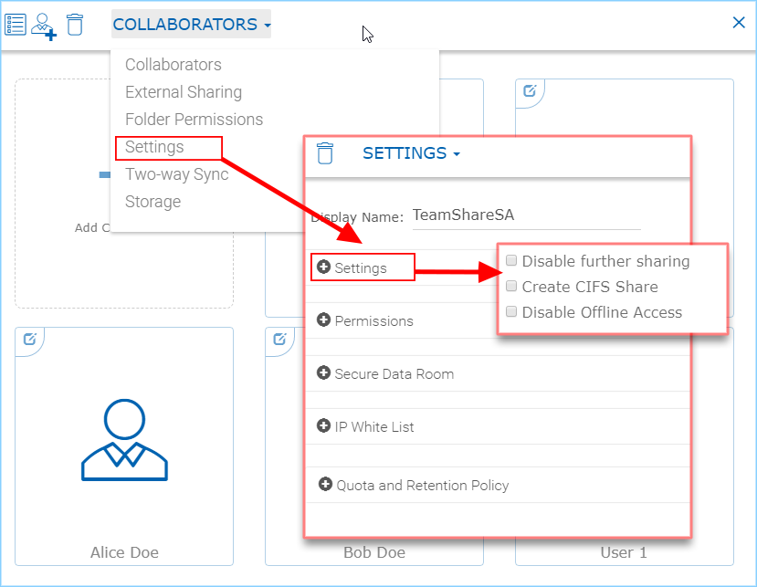
        
    TEAM FOLDER SETTINGS

That diversion shows you how you can create, access and modify folders and settings from within the Web Portal of |prodname|. Now we return back to the File Server section of the Server Console in Server Agent. **"Enable Background Prefetch" (1)** makes the contents of the selected folder available offline.

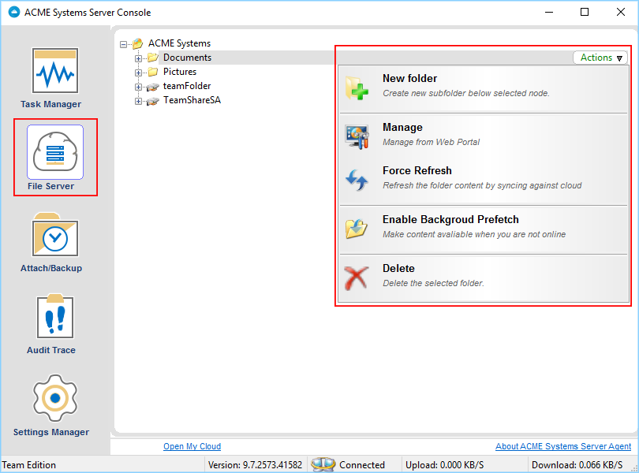
        
    FOLDER ACTIONS

**"Delete"** does not remove the content of the folder from local storage; however, it does detach the selected folder and its contents from the cloud. If you go to the Web Portal and re-create a folder with exactly the same name (including the machine’s name and the parenthesis), the folder can be shown with a cloud-only context without any local machine relationship. 

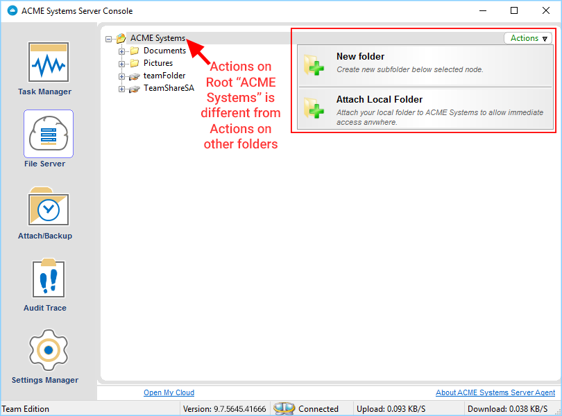
        
    FOLDER ACTIONS

**"Attach a Folder to Backup"** (see above) allows an administrator to attach and two-way synchronize a local folder to the cloud. The default view shows all the “Attached-Folders” on the local machine that are attached to the cloud. To add a folder click the browse icon **(...)** and search for a folder to sync to the cloud. 

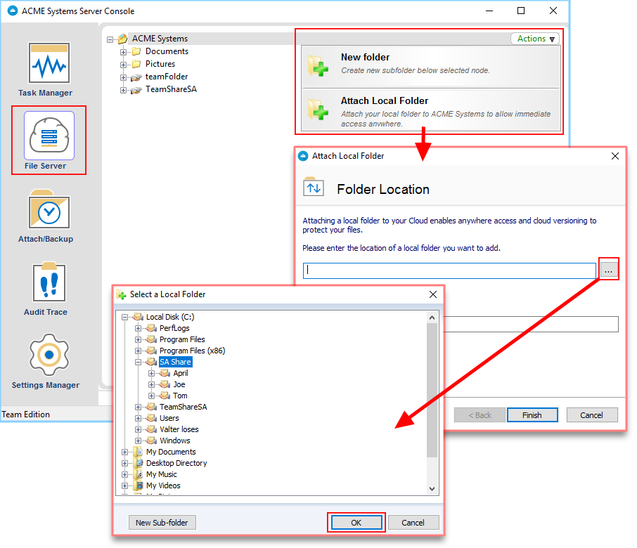
        
    ATTACH LOCAL FOLDER

Once a folder is attached, you can take advantage of one of the Folder Actions **"Manage"** that allows you to quickly open a Web Portal to edit Sharing and Collaboration settings for the folder. 

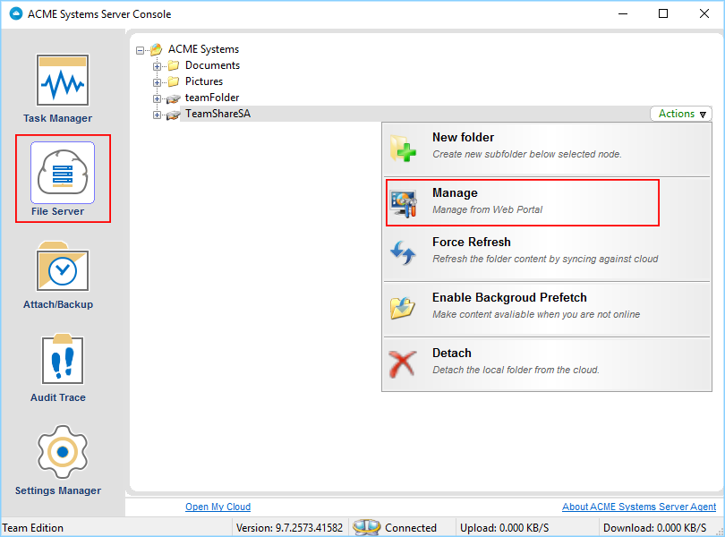
    
    MANAGE FOLDER FROM WEB PORTAL

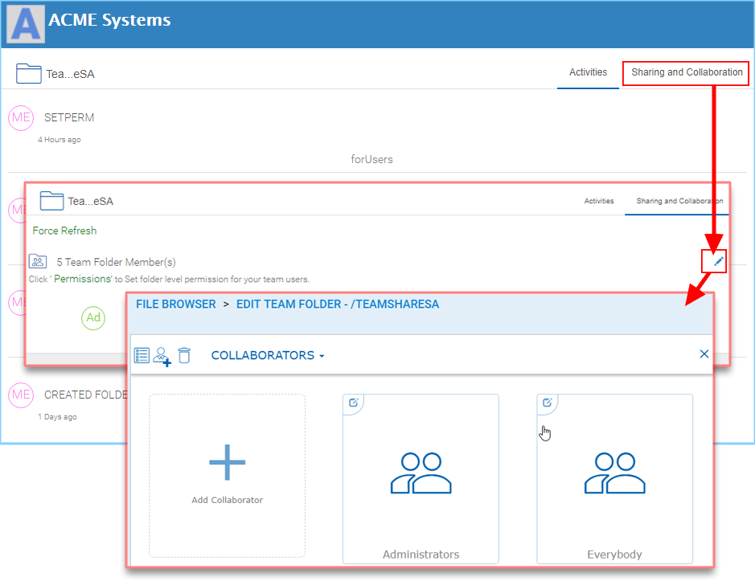
    
    SELECT SHARING AND COLLABORATION

3.3.3 Attach/Backup
^^^^^^^^^^^^^^^^^^^^^

Clicking the Attach/Backup button shows all of the folders currently attached.

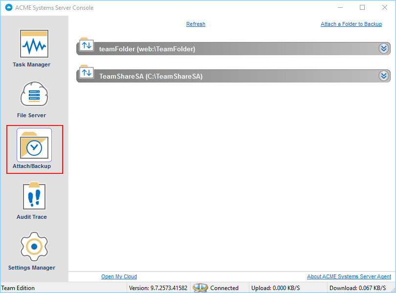
    
    ALL FOLDERS WITHIN ADMIN'S ROOT FOLDER

By clicking the double-down-arrow icon on the right of each share you can see the details of the folder and if the folder is linked to a local folder you will see **"Link to local"**. If it is already linked you will see **"Stop Sync"**. As shown below, you can also **Detach** the folder in this location. 

.. figure:: _static/image_s3_4_18.png
    :align: center
    
    ATTACH/BACKUP SETTINGS

Link to Local Folder
----------------------

You can take a folder that is in the cloud and sync it down to a local folder and then maintain two-way synchronization.

Stop Sync
-----------

You can break the two-way sync between a local folder and a folder in the cloud. After stop sync, the two sides continue to exist but there is no relationship between them any longer.

Detach
----------

Detach is the reverse of Attach. Attach means attach a local folder to the cloud under version control. Detach means remove it from the version control. Detach is an operation detaching the cloud side of the folder from version control. After detach, the local folder (if it is related to a local folder) is not affected at all. However, the folder in the cloud will disappear.

.. note::
  If you want the cloud side of the folder to reappear, you can use "Show Deleted" in the Web Portal to show the deleted folder and bring it back. Or you can create a same name folder from scratch to inherit the folder back.

3.3.4 Audit Trace
^^^^^^^^^^^^^^^^^^

Audit trace shows the history of all the tasks that have taken place. Administrators can query the **"Audit Trace"** to see the history of uploads, downloads, changes, and monitoring on the files in the cloud. You can also filter the tasks you would like to query by using the **"Only Show Traces Containing"** field **(1)**.

As an administrator you can also specify the times that you would like to run the query for **(2)**. Additionally, you can specify the amount of traces you would like to query **(3)** where **"0"** means unlimited traces.

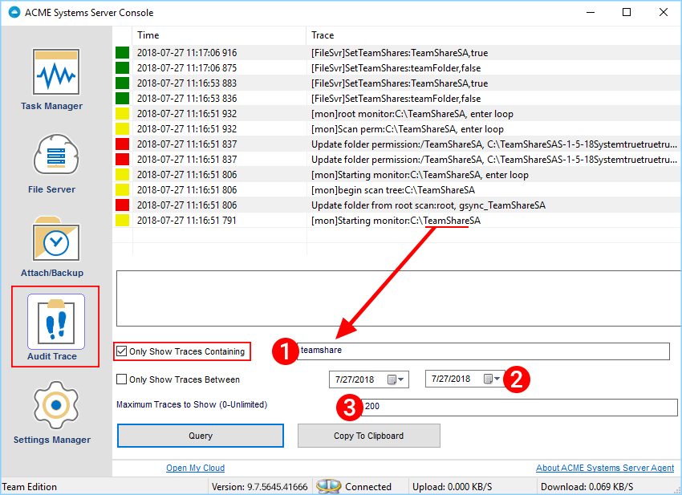
        
    AUDIT TRACE QUERY

3.3.5 Settings Manager
^^^^^^^^^^^^^^^^^^^^^^^^
Server Agent administrators can customize and configure many settings at the Server Console level by modifying the contents of the Settings Manager section. 

From here you can also access the **"Offline Folders"** tab. 

Offline Folders
-----------------

This section lists all the cloud folders which have been enabled for **"Offline Access"**, meaning users who have access to offline folders can access and edit the contents of such folders even when they are not online. All the changes done to files in offline folders will be automatically synced as soon as the users come back online.

  .. figure:: _static/image_s3_3_51.png
    :align: center
        
    OFFLINE FOLDERS

**"Add New Offline Folder"** You can click this link to configure a folder as an Offline Folder. 

Settings Tab 
--------------

Bandwidth Control
-------------------

As an administrator you have full control over how much bandwidth should be consumed for uploading contents to the cloud and also for downloading contents from the cloud. You can also control how many consequent uploads and downloads are allowed at any one time.

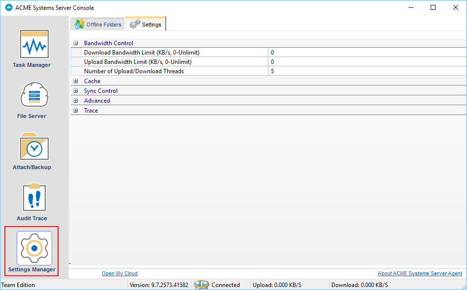
        
    SETTINGS MANAGER - BANDWIDTH CONTROL

**"Download Bandwidth Limit (KB/s, 0-Unlimited)"** Default is **"0"**. This setting is applied to the local machine (Server Agent). Usually something > 100KB/s is good. If it is too small, it can negatively affect performance and usability.

**"Upload Bandwidth Limit (KB/s, 0-Unlimited)"** Default is **"0"**. This setting is applied to the local machine (Server Agent). Usually something > 100KB/s is good.

**"Number of Upload/Download Threads"** Default is **"5"**. Set this from 5-10 in general. In some case, if you set it to a very big number such as 20, it may negatively affect performance. For example, if you are using Amazon S3 and Amazon S3 or other Cloud services may have per-client thread policy so if you have too many concurrent upload/download, it may get regulated outside of the Server Agent. 

Cache
-------

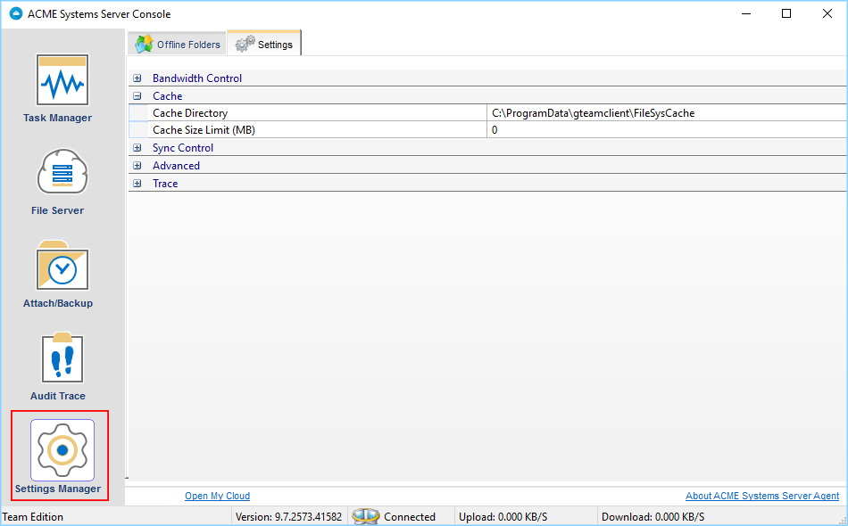
        
    SETTINGS MANAGER - CACHE SETTINGS

You can change the location of Cache (for files downloaded locally from cloud). You can 
also set the cache size.

Sync Control
--------------

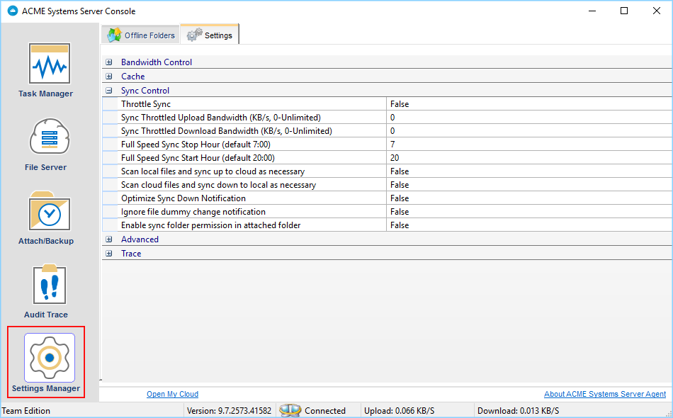
        
    SETTINGS MANAGER - SYNC CONTROL

**"Throttle Sync"** Default is **"False"**. If you set this flag to **"True"** it will stop and start the sync depending on the available bandwidth.

**"Sync Throttled Upload Bandwidth (KB/s, 0-Unlimited)"** Default is **"0"**. Where **"0"** means unlimited bandwidth is available for upload sync.

**"Sync Throttled Download Bandwidth (KB/s, 0-Unlimited)"** Default is **"0"**. Where **"0"** means unlimited bandwidth is available for download sync.

**"Full Speed Sync Stop Hour (dafault 7:00)"** Default is **"7"**. Use this setting to set when full sync stops, to prevent bogging down your system during business hours. 

**"Full Speed Sync Start Hour (dafault 20:00)"** Default is **"20"**.  Use this setting to set when full sync starts, to prevent bogging down your system during business hours. 

**"Scan local files and sync up to cloud as necessary"** Default is **"False"**. Set this to **"True"** if you want the agent to scan the local file system and make sure that everything which is not synced to the cloud is truly synced. 

**"Scan cloud files and sync up to local as necessary"** Default is **"False"**. Set this to **"True"** if you want the agent to scan the cloud and make sure that everything which is not synced to the local file system is truly synced. 

**"Optimize Sync Down Notification"** Default is **"False"**. If you want to see sync down notifications, then set this to **"True"**. 

**"Ignore file dummy change notification"** Default is **"False"**. If you don't want to see dummy file change notifications, then set this to **"True"**. 

**"Enable sync folder permission in attached folder"** Default is **"False"**. 

Advanced
----------

Administrator can locate the cache directory under **"Advanced"** option in settings. Using the **"Cache Size Limit (MB)"** field can specify the size
limit for the cache file.

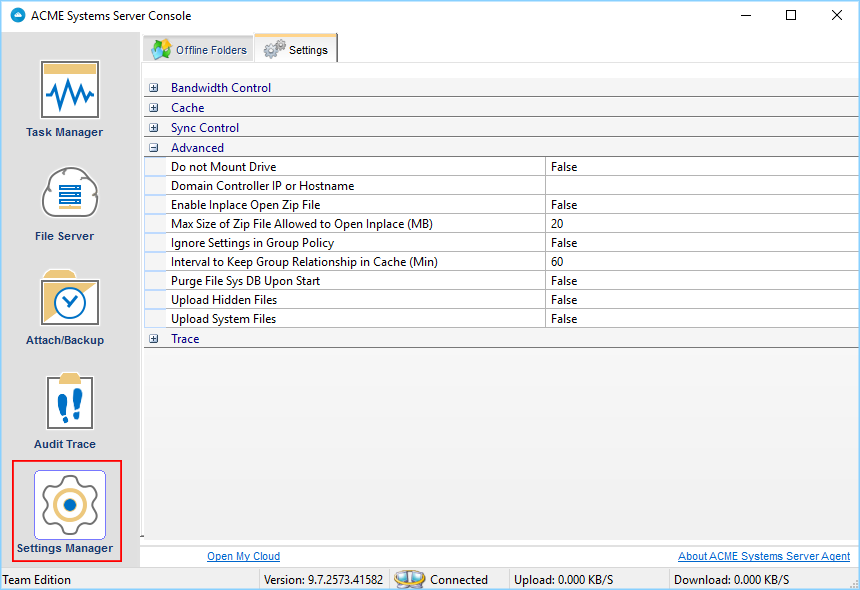
        
    SETTINGS MANAGER - ADVANCED

**"Do not Mount Drive"** Default is **"False"**. When you set this to **"True"** local drive on the Server Agent is unmounted.

**"Domain Controller IP or Hostname"** This setting is empty by default. 

**"Enable In-place Open Zip File"** Default is **"False"**. This field enables in-place editing on files which are in zipped folders in the cloud. You can also specify the maximum size for zipped files that are allowed for In-place editing.

**"Max Size of Zip File Allowed to Open Inplace"** This is **"20"** by default. Use this field to set the maximum size of Zip Files that can be opened inside the Cloud Drive in MB. 

**"Ignore Settings in Group Policy"** Default is **"False"**. When you set this flag to **"True"**, the configured settings in the Web Portal will be ignored and the settings configured here under ``Settings`` > ``Advanced`` will take precedence.

**"Interval to Keep Group Relationship in Cache (Min)"** The default is **"60"** minutes. This field is a performance optimization setting. The Server Agent will check the remote requests against the ACL (Access Control) set on the local files. Most of the times it involves Active Directory or NT domain group membership checking. The group membership checking is a CPU intensive work so the result is cached to improve performance. This controls how long the result will be cached. If users are not changing group frequently, you can set the interval to a long period of time.

**"Purge File Sys DB Upon Start"** The default is **"False"**. If you change this setting to True, upon startup the client will purge the cached cloud storage state file. This allows the client to rebuild the database as if it is being started for the first time.

**"Upload Hidden Files"** The default is **"False"**. If this flag is set to **"True"** then hidden files will also be uploaded to the cloud.

**"Upload System Files"** The default is **"False"**. If this flag when set to **"True"** then system files will also be uploaded to the cloud. 

Trace
-------

The audit trace log can grow exponentially if not kept under control. As an administrator you can specify the number of days to keep the audit trace. **"Days of Audit Trace to Keep"** setting is the field to specify the duration to keep the trace for.

    Trace Level when set to **"0"** which is the default does not collect any traces meaning it is disabled.
    
    Trace Level 1 – error will collect all the error traces.
    
    Trace Level 2 – warning will collect warning traces along with errors.
    
    Trace Level 3 – info will collect errors, warnings, as well as info traces.
    
    Trace Level 100 – verbose helps developers to collect detailed traces which helps them when debugging issues.

.. note:: 
    When it is necessary to collect DebugView trace for debugging purpose, the Trace Level typically is set to 101.

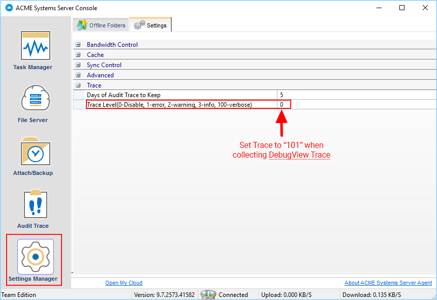
        
    SETTINGS MANAGER - TRACE
