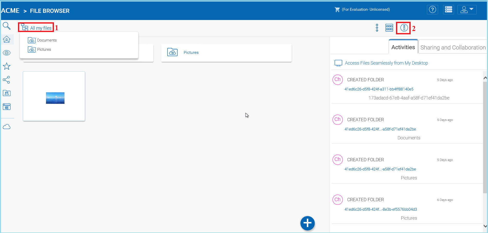
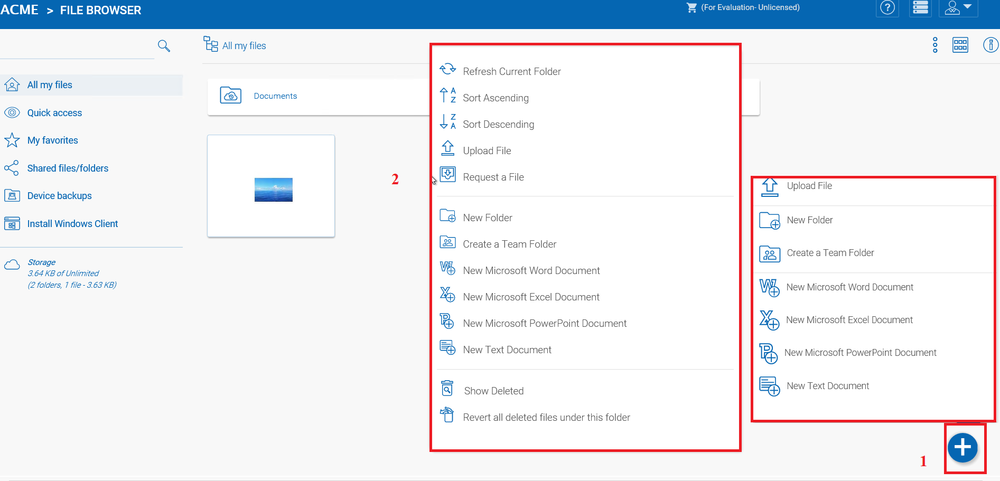
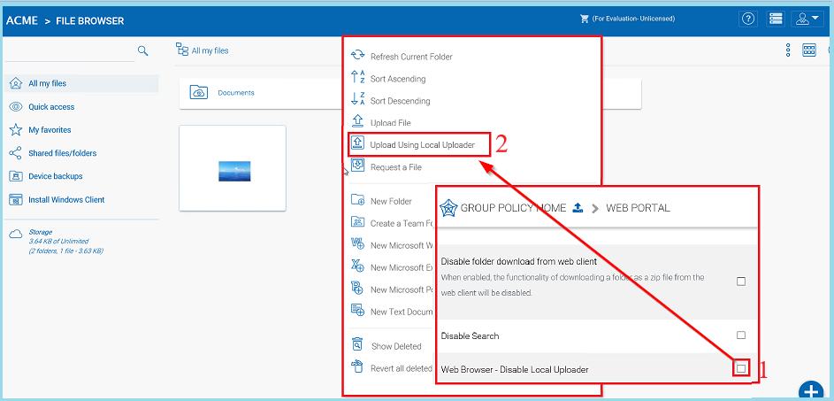
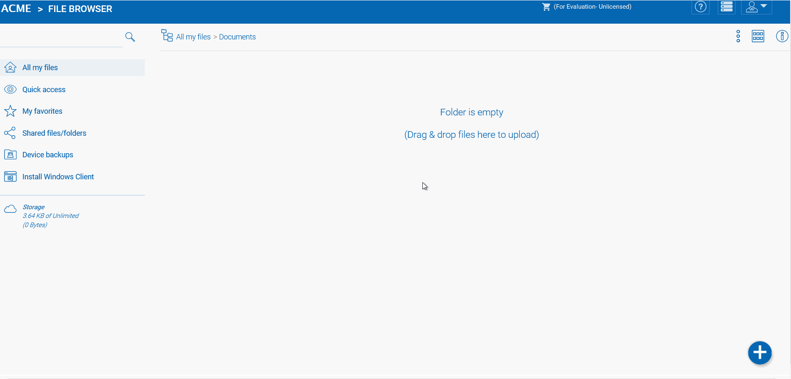
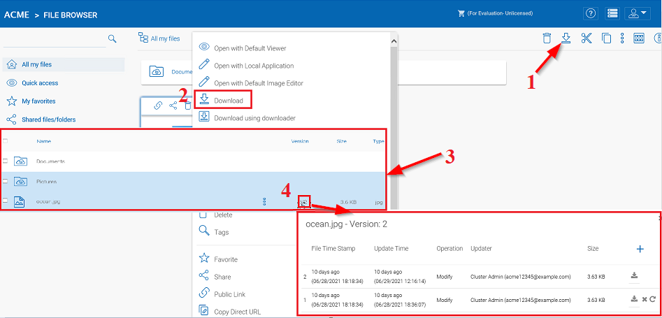
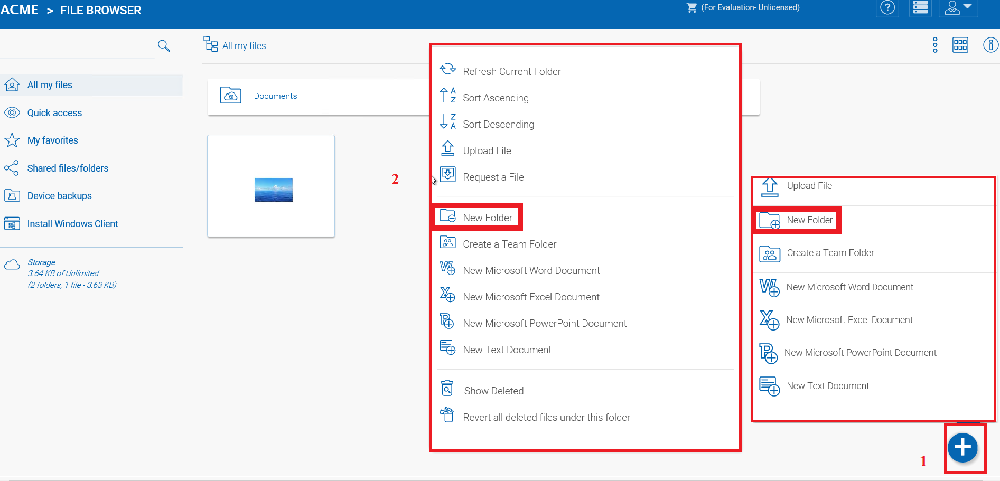
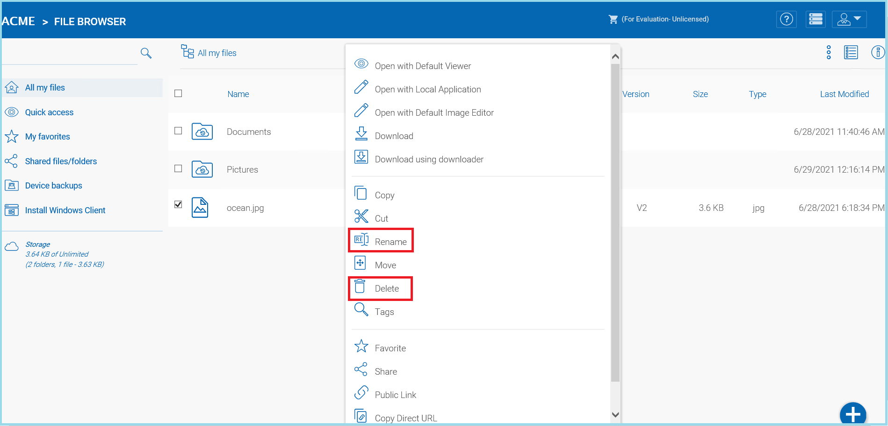

###################
The Web Interface
###################

The web client interface has three panels from left to right, the left tree panel, the middle file and folder panel, and the right information panel. Many of the management functionality are done over the web portal. The web client also has the files and folder’s view.

Normal Web Portal View
=======================

.. figure:: _static/image_s11_1_1.png
    :align: center

    WEB PORTAL VIEW

Left Tree View and Right Info Panel
=========================================

The left-tree view can be toggled by clicking the tree icon **(1)**. You can access the **"Info Panel"** by either clicking the icon settings menu **(2)** at the top-right and selecting **"Show/Hide Info Panel for file/folder"** text, or the Show/Hide button **(3)** on the bottom-right of the File Browser window. 

    ACCESSING SIDE PANELS

Switch Between Iconview and Listview
=====================================

.. figure:: _static/image_s11_1_3.png
    :align: center

    SWITCH BETWEEN ICON AND LIST VIEWS

When switched into list view, you get access to other icons such as version information (see inset "List View Example).

Color Themes
=============

Users can customize their web portal theme by clicking the user settings icon **(1)** and then the down-arrow icon **(2)**. There are 12 pre-defined Color Themes and one custom theme option.

.. figure:: _static/image_s11_1_4.png
    :align: center

    CUSTOMIZE YOUR WEB PORTAL THEME

Uploading Files
================

In |prodname|, you have different options to upload files and folders. You can upload one file at a time using the ‘Upload File’ option under Upload You can also upload folders using the ‘Upload Folder’ option under Upload. Last but not least you can also use ‘Upload Folders and Files’ to upload multiple files simultaneously, or drag & drop files from a local desktop to the |prodname| Cloud web portal to start the upload.

.. warning::

    Different upload methods may have different advantage and disadvantage on different web browsers and different web browser configuration, such as whether it is HTML5 enabled,
    Java enabled or Flash enabled.
    
    By default, only one upload method was exposed in the web user interface. However, the tenant administrator, based on the kind of web browser the company is using and the kind of
    configuration the web browser has, can decide which upload method to expose to the end user (Team User).
    
    Below is the Group Policy->Client Control->Web Portal setting administrator can control.
    
    .. figure:: _static/image_s11_2_1.png
        :align: center

        UPLOADER METHOD OPTIONS
    
    Web Browser - Disable Java Uploader
    
        Deselect this if your companies' desktop system web browsers use a Java Uploader.
    
    Web Browser - Disable Flash Uploader
    
        Deselect this if your company uses browsers that require Flash uploader functionality.  
    
    Web Browser - Disable Local Uploader
    
        Deselect this if your company allows the use of a local executable to upload files. 

Upload File or Folder
======================

It is possible to upload multiple files at a time. This is supported on all browsers. The same is true for Upload Folder. To access these options you can click the "+" icon **(1)** or right click on the portal background **(2)** and select your upload option there.

    UPLOADING FILES AND FOLDERS

After clicking the upload option, you can browse to the file or folder you want to upload. Use the Ctrl key to select multiple items.

.. figure:: _static/image_s11_3_2.png
    :align: center

    SELECTING FILES FOR UPLOAD

Upload Using Local Uploader
============================

(This is Windows only feature) When uploading big files and big folders, the “upload using local uploader” may be the best option for web browser based upload. If it is enabled by the Tenant Manager (deselected) **(1)** in the Group Policy Home > Web Portal settings. Clicking this option **(2)** will download a thin local uploader binary first and then the local uploader will do the upload. The local uploader has retry and other reliability measures to make sure the upload is successful. Basically it uses the web browser to download an executable, and the executable does the rest of the uploading work.

    ENABLE "UPLOAD USING LOCAL UPLOADER" OPTION

Drag and Drop Upload
=====================

Latest web browsers that support HTML5 drag and drop upload will see “Drop Files Here” in an empty folder. These web browsers allow you to drag & drop multiple files directly to the |prodname| Cloud. In latest Google Chrome, Drag and drop folder is also supported while the other HTML5 based web browser
support drag and drop multiple files.

    DRAG AND DROP FILES FOR UPLOAD

Downloading Files
==================

There are several ways to download files in |prodname|:

If you select a file in the "File Browser" you can use the download icon **(1)** in the top bar. You can also right-click a file and choose download **(2)** from the context menu. If you are in the "Detailed View" **(3)** you can select a file and use the download icon in the item's bar **(4)**. 

    DOWNLOAD FILE OPTIONS

If your are in "Detailed View" **(3)** any files with previous versions will show a number in the selected bar (e.g. "V2") **(5)** that you may click to open a list of all of the versions of that file. 

Creating Folders
=================

To create a folder, go to the parent folder and click "New Folder" in the drop-down menu **(1)** or right click in the folder background and choose "New Folder" **(2)** from the context menu. 

    CREATING FOLDERS

Renaming/Deleting Folders
==========================

Renaming and deleting files and folders can be achieved by right-clicking the file in the "File Browser" and selecting the appropriate context-menu item or using the small icons in the Detailed View bar of the selected item. 

    RENAMING FILES

