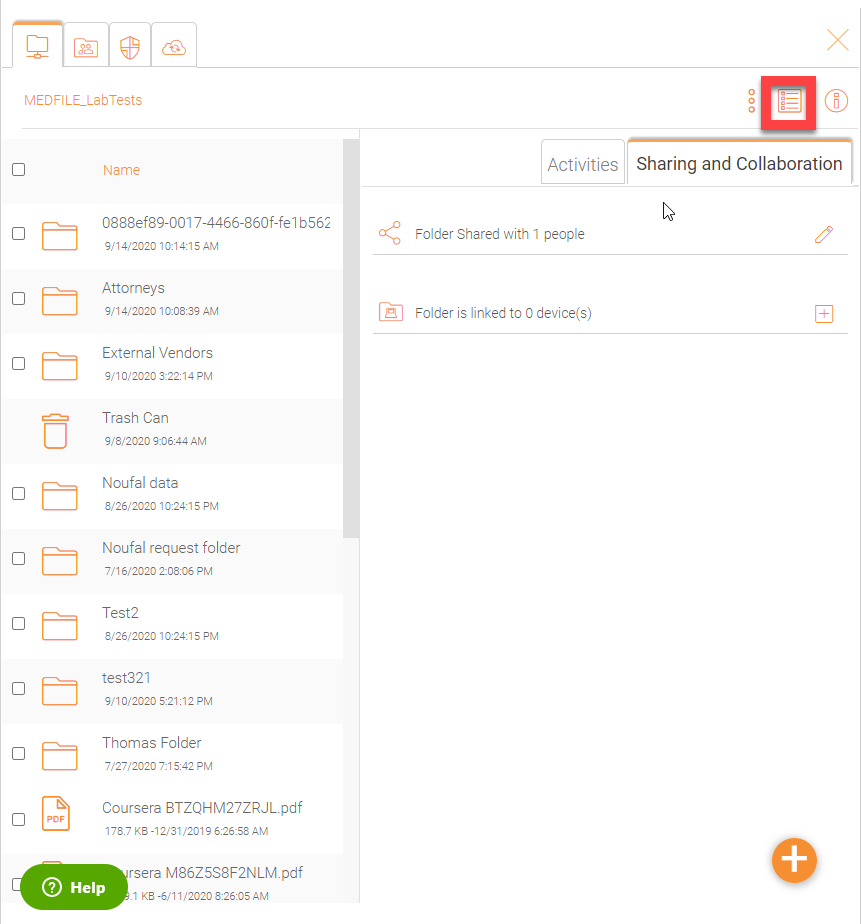
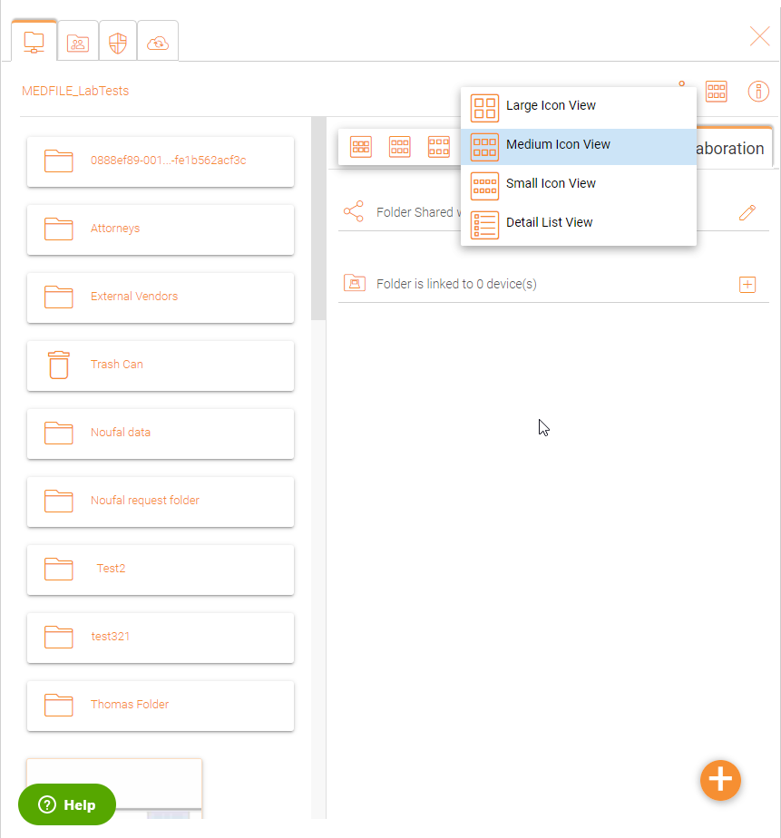
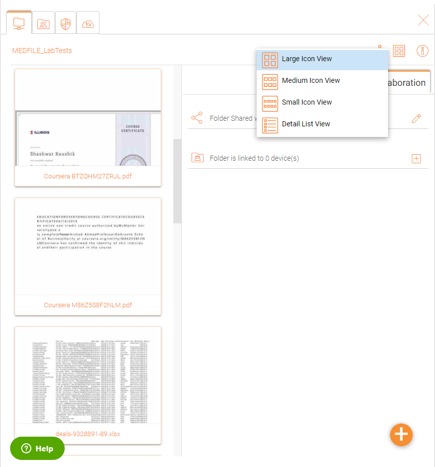
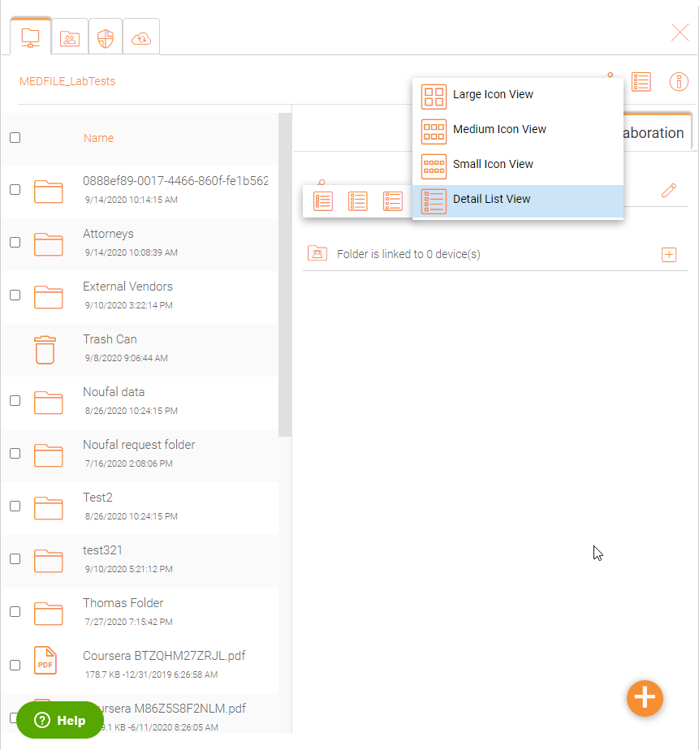
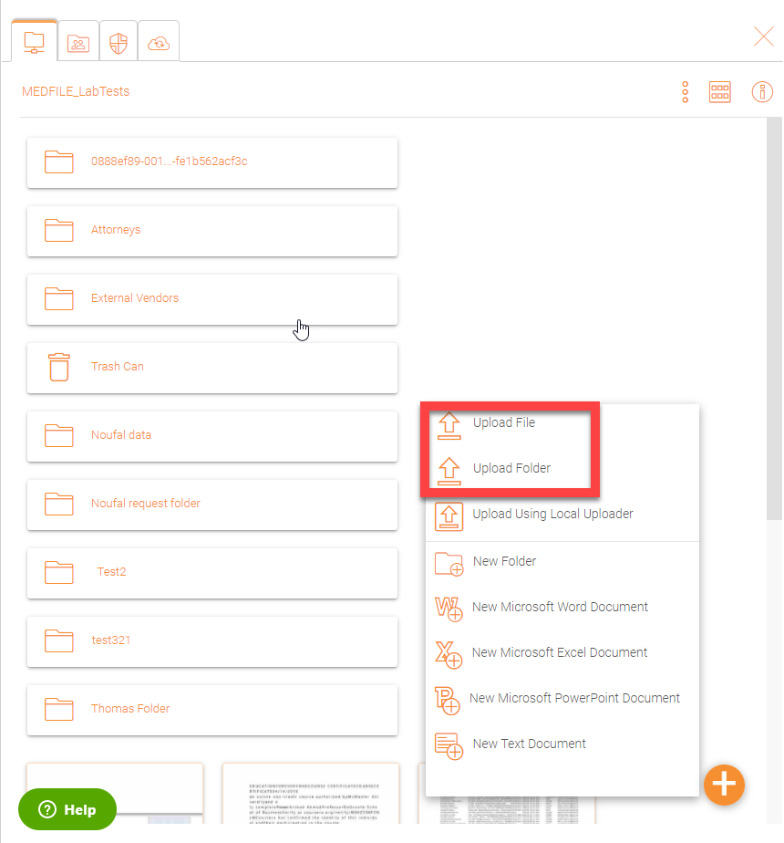
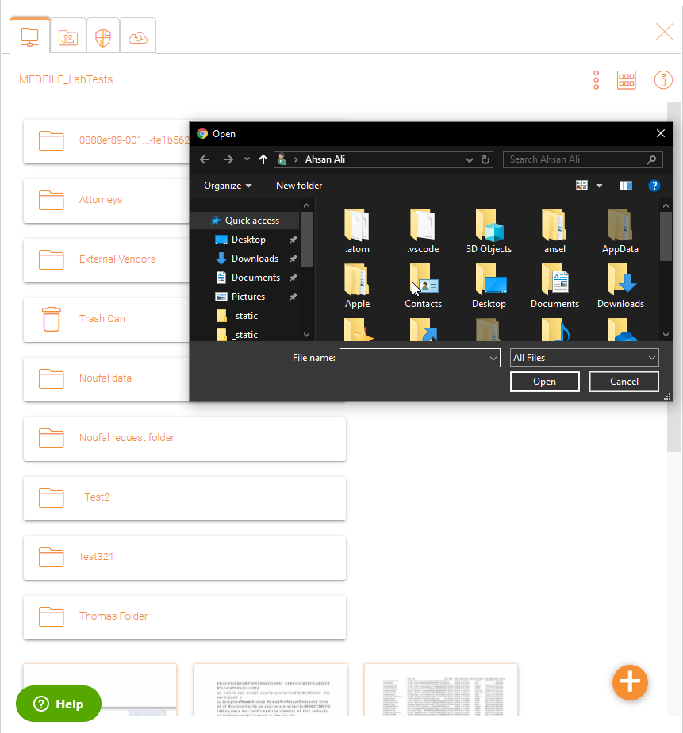
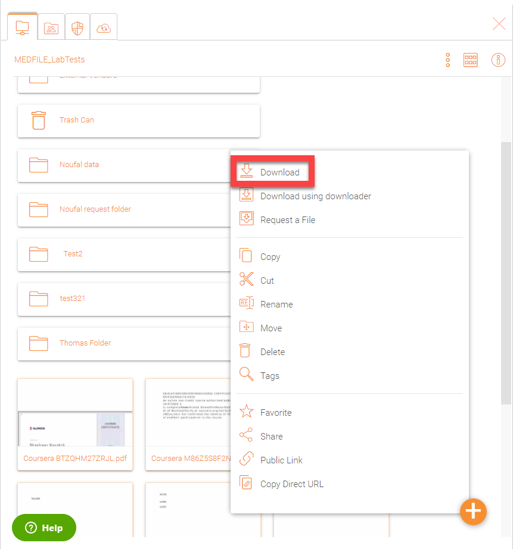
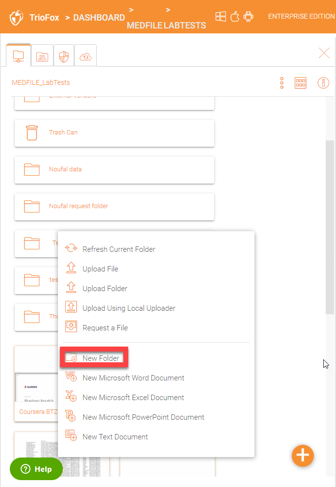
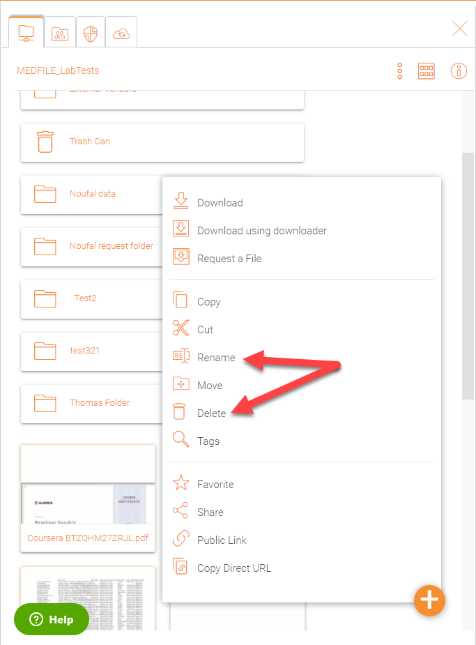

###################
The Web Interface
###################

The web client interface has three panels from left to right, the left tree panel, the middle file and folder panel, and the right information panel. Many of the management 
functionality are done over the web portal. The web client also has the files and folder’s view.

Normal Web Portal View (Medium Icon View)
=======================

    

    WEB PORTAL VIEW

Large Icon View
=========================================

Inside your server, click the icon with 6 small sqaures in it. It will give you a list of other icons and you can select Large Icon View

    

    LARGE ICON VIEW

Detail List View
=========================================

In the same settings aboce, it gives you the option to view files in 'Detail List View'

Uploading Files
================

In Triofox, you have different options to upload files and folders. You can upload one file at a time using the ‘Upload File’ option under Upload You can also upload folders using the ‘Upload Folder’ option under Upload. Last but not least you can also use ‘Upload Folders and Files’ to upload multiple files simultaneously, or drag & drop files from a local desktop to the |prodname| Cloud web portal to start the upload.

Upload File or Folder
======================

It is possible to upload multiple files at a time. This is supported on all browsers. The same is true for Upload Folder. To access these options you can click the "+" icon **(1)** or right click on the portal background **(2)** and select your upload option there.

    UPLOADING FILES AND FOLDERS

After clicking the upload option, you can browse to the file or folder you want to upload. Use Ctrl key to select multiple items.

    SELECTING FILES FOR UPLOAD

Downloading Files
==================

There are several ways to download files in Triofox:

If you select a file in the "File Browser" you can use the download icon **(1)** in the top bar. You can also right-click a file and choose download **(2)** from the context menu. If you are in the "Detailed View" **(3)** you can select a file and use the download icon in the item's bar **(4)**. 

    DOWNLOAD FILE OPTIONS

If your are in "Detailed View" **(3)** any files with previous versions will show a number in the selected bar (e.g. "V2") **(5)** that you may click to open a list of all of the versions of that file. 

Creating Folders
=================

To create a folder, go to the parent folder and click "Create Folder" in the drop-down menu **(1)** or right click in the folder background and choose "Create Folder" **(2)** from the context menu. 

    CREATING FOLDERS

Renaming/Deleting Folders
==========================

Renaming and deleting files and folders can be achieved by right-clicking the file in the "File Browser" and selecting the appropriate context-menu item or using the small icons in the Detailed View bar of the selected item. 

    RENAMING FILES

