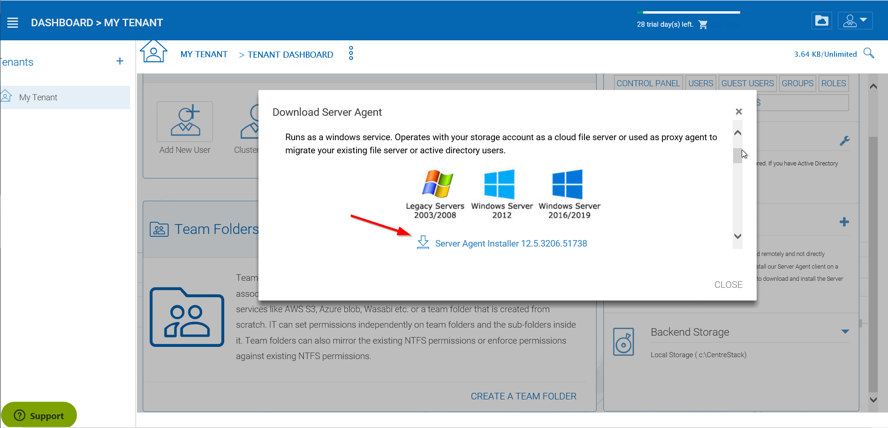
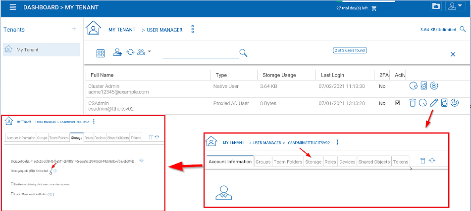
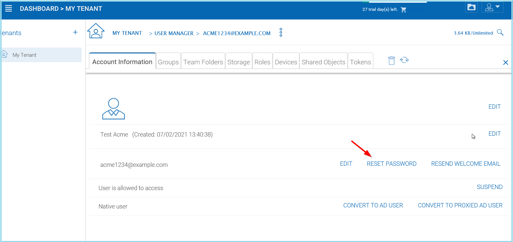

#################
User Management
#################

Go to the |prodname| server URL and enter the admin credentials to login.

.. figure:: _static/image_s8_1_1.png
    :align: center

    LOGIN AS TENANT ADMIN

After logging into the portal, select ‘My Tenant’ in the Tenant section of the web portal:

.. figure:: _static/image_s8_2_1.png 
    :align: center

    GO TO MANAGEMENT CONSOLE

    Under Management Console, an admin can configure storage, monitor shared objects, create and manage team folders, manage users, configure granular group policies, add new tenant administrators, look at different reports, and under advanced configure AD etc.

User Manager
=============

You can access the user manager by clicking one of these three items in the Management Console. 

.. figure:: _static/image_s8_2_2.png
    :align: center

    ACCESSING THE USER MANAGER

Users
=======

Active Directory - LDAP
------------------------

In the AD Settings view you can add your local settings. Click Edit **(1)**, then select "Enable Active Directory Integration" **(2)**. 

.. figure:: _static/image_s7_2_1.png
    :align: center

    CONNECTING TO ACTIVE DIRECTORY (AD)

This gives you access to all the settings fields and the Advanced Settings Tab **(3)**. Once you have filled in the settings with an Administrator User account from your Active Directory, click **APPLY** to accept your changes. 

Active Directory - Remote 
--------------------------

If the users are coming from remote locations, away from the |prodname| server (so it is not in the same Local Area Network), the first step to take is to install the "server agent" software on a remote file server, as long as the file server is in the same remote Active Directory domain. Log into |prodname| from your File Server and download your Server Agent client. You can access this by clicking the **(+)** icon. Once this is setup on your File Server, |prodname| can access it to connect to your Remote Active Directory. 

.. figure:: _static/image_s7_2_2.png
    :align: center

    ACCESS YOUR SERVER AGENT CLIENT

    DOWNLOAD AND INSTALL

.. note::

    "Server Agent" software can import remote file server network share, and also import remote Active Directory users. Once Server Agent is installed and setup in remote location, the tenant administrator can use the Client Management Console "Migrate CIFS Shares" and "Migrate Users" **(1)** to import shares and users from Active Directory. Other actions are availible through the dropdown menu **(2)**. 
    
    .. figure:: _static/image_s7_3_1.png
        :align: center

        MIGRATE SHARES AND USERS

Adding Users
=============

After signup, the administrator will get a login to |prodname|. To setup a team environment, the administrator needs to add team users. Only the administrator or delegated administrators or users that has a user manager role assigned can add users.

To manage users, go to ‘Management Console’ under user on the top right:

.. figure:: _static/image_s12_1_1.png
    :align: center

    ACCESSING THE MANAGEMENT CONSOLE

In the ‘Management Console’, click ‘User Manager’:

.. figure:: _static/image_s12_1_2.png
    :align: center

    WAYS TO ACCESS USER MANAGEMENT

In ‘User Manager’ window, click the ‘+’ icon or "Add User" on the top left.

    
    CREATING OR MIGRATING USERS

Add User
---------

You can add users from within the User Manager or simply click the Add New User button to open the **"Sources of New User"** panel. In that panel you have several options: add a Native User, Batch Create Users, import Active Directory users and permissions, and if you have Server Agents actively connected, you will also see those servers listed here as well.

.. figure:: _static/image_s8_2_3.png
    :align: center
    
    ADDING USERS

**Native User** 

    Native user refers to |prodname| user that is not related
    to any Active Directory.
    
**Batch create users**

    These are native users in a comma separated file that can 
    be paste into a text area so the users can be batch created.
    
**Active Directory**

    Active Directory means users from Local Area Network (LAN) 
    that is in the same network as the |prodname| server.
    
**Server-Agent-Name**

    If you already have the "Server Agent" installed and the 
    server agent is actively connected to |prodname|, you will
    also see the server agents listed by name in the Add User page.

Add Native User
--------------------

When a new user is created, the administrator will specify the amount of cloud storage that the new user is allowed to use. The email address will send a welcome email to the new user and will serve as his/her username.

.. figure:: _static/image_s8_2_4.png
    :align: center

    ADDING A NATIVE USER
    
.. note::

    When quota is left as zero, it means no limitation until the tenant quota limit is hit.

Add Active Directory Users from LDAP
-------------------------------------

If the Active Directory (LDAP) is not already configured, you will need to configure it first. Click the wrench icon in the right Local Active Directory panel to access the settings. 

.. figure:: _static/image_s8_3_1.png
    :align: center

    CONFIGURE YOUR ACTIVE DIRECTORY SETTINGS

If the Active Directory (LDAP) is already configured, you will see the Active Directory name at the bottom of the AD icon in the "Add User" view.

Add Active Directory Users where those users are from local area network.

.. figure:: _static/image_s8_2_5.png
    :align: center

    ADDING ACTIVE DIRECTORY USERS

After the Active Directory is configured, you can use the Add User
wizard to import Active Directory users into |prodname|.

.. note::

    For best practice, you will only configure Active Directory via LDAP if the file server is also local
    in the same network as the Active Directory server.

Add Active Directory Users from Server Agent
----------------------------------------------

When the Server Agent is available and connects to the specific
tenant in |prodname|, the Server Agent will show up
with the server's name at the bottom of the icon.

Click through the Server Agent icon, you will see the "Add User" wizard and complete the wizard to add users. This is very similar to the add AD user from local LDAP process above. 

.. note::

     When the Active Directory is at a remote location, not directly connected to |prodname| server, Server Agent can be used to facilitate the communication. Server Agent doesn't need to be installed directly on a remote Active Directory server, the Server Agent needs to be installed on a remote file server that is part of the remote Active Directory domain.

Other Users
------------

In the Web Portal you can also just add Native |prodname| Users by clicking the Users link. Once in the Manage Users view, click "Create or Migrate User" **(1)** and in the new window choose "Native User" **(2)**.

.. figure:: _static/image_s7_4_1.png
    :align: center

    ADDING A NATIVE |prodname| USER

Deleting Users
===============

When a user leaves the team, administrators can delete the user’s login. Just click the Delete icon in ‘User Manager’ window.

.. figure:: _static/image_s12_1_4.png
    :align: center

    DELETING A USER

Managing User Quotas
=====================

Administrators can assign a quota to each user. A user will not be allowed to upload files to |prodname| once their quota has been reached.

If the quota is 0 for the user, there is no limit on how much storage the user can use.

Click the ‘Management Console’ and select ‘User Manager’. Click the "Manage User" menu on a user to manage and select "Set Quota".

    EDITING STORAGE QUOTA

Managing User Credentials
==========================

Admins can change user passwords and login emails, if needed.

* Click ‘Management Console’ and select ‘User Manager’
* Click the "manage user" menu icon in the user block
* After that, can use "Reset Password" link to help the user.

    RESET USER PASSWORD

After changing the login password, an email will be sent to notify the user of the change. Admins can choose to include the new password in the email, or exclude the new password from the email. If the password is not included, the admin will need to convey the new password to the user in some other way.

.. figure:: _static/image_s12_1_7.png
    :align: center

    PASSWORD OPTIONS

When either the email or password is changed, please update the corresponding login credentials in the |prodname| Cloud Desktop or Cloud Server.

.. warning::

    This only applies to a native |prodname| user. If you have Active Directory users, you will need to manage user's credential the Active Directory way.