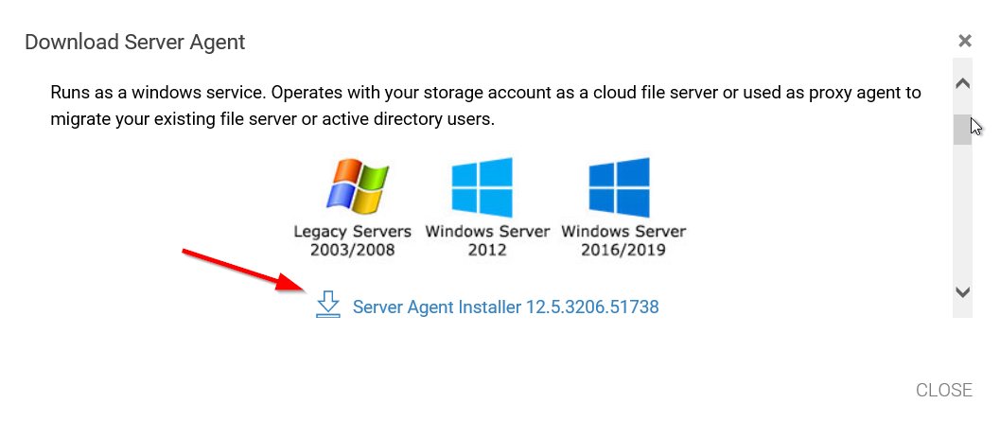
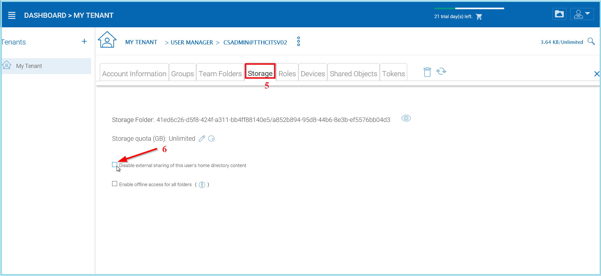

########################
Tenant Administrator
########################

Please reference the `Admin Guide`__ for full documentation of the tenant administration. Here we will go over several commonly touched areas for tenant administrators.

.. _Admin_Guide: https://centrestack.com/Library/AdminGuide/ 
__ Admin_Guide_

After you enter the "management console", you will be in the dashboard. When you are at the dashboard, you can access the tenant by clicking on the desired tenant from the options.

.. figure:: _static/image_s7_1_1.png
    :align: center

Under Management Console, an admin can configure storage, monitor shared objects, create and manage team folders, manage users, configure granular group policies, add new tenant administrators, look at different reports, and under advanced configure AD etc.

The top two objects to manage are users **(1)** and folders **(2)**. If you are using an Active Directory for importing users and permissions you can connect to your Active Directory by clicking the wrench icon **(3)**.

.. figure:: _static/image_s7_1_2.png
    :align: center

    MANAGE USERS AND FILES

User Manager
===============

You can access the user manager by clicking one of these three items in the Management Console. 

.. figure:: _static/image_s8_2_2.png
    :align: center

    ACCESSING THE USER MANAGER

Active Directory - LDAP
--------------------------

In the AD Settings view you can add your local settings. Click Edit **(1)**, then select "Enable Active Directory Integration" **(2)**. 

.. figure:: _static/image_s7_2_1.png
    :align: center

    CONNECTING TO ACTIVE DIRECTORY (AD)

This gives you access to all the settings fields and the Advanced Settings Tab **(3)**. Once you have filled in the settings with an Administrator User account from your Active Directory, click **APPLY** to accept your changes. 

Active Directory - Remote 
----------------------------

If the users are coming from remote locations, away from the |prodname| server (so it is not in the same Local Area Network), the first step to take is to install the "server agent" software on a remote file server, as long as the file server is in the same remote Active Directory domain. Log into |prodname| from your File Server and download your Server Agent client. You can access this by clicking the **(+)** icon. Once this is setup on your File Server, |prodname| can access it to connect to your Remote Active Directory. 

.. figure:: _static/image_s7_2_2.png
    :align: center

    ACCESS YOUR SERVER AGENT CLIENT

.. figure:: _static/image_s7_2_3.png
    :align: center

    DOWNLOAD AND INSTALL

.. note::

    "Server Agent" software can import remote file server network share, and also import remote Active Directory users. Once Server Agent is installed and setup in remote location, the tenant administrator can use the Client Management Console "Migrate CIFS Shares" and "Migrate Users" **(1)** to import shares and users from Active Directory. Other actions are availible through the dropdown menu **(2)**. 
    
    .. figure:: _static/image_s7_3_1.png
        :align: center

        MIGRATE SHARES AND USERS

Add Users
--------------

You can add users from within the User Manager or simply click the Add New User button to open the **"Sources of New User"** panel. In that panel you have several options: add a Native User, Batch Create Users, import Active Directory users and permissions, and if you have Server Agents actively connected, you will also see those servers listed here as well.

.. figure:: _static/image_s8_2_3.png
    :align: center
    
    ADDING USERS

**Native User** 

    Native user refers to |prodname| user that is not related
    to any Active Directory.
    
**Batch create users**

    These are native users in a comma separated file that can 
    be paste into a text area so the users can be batch created.
    
**Active Directory**

    Active Directory means users from Local Area Network (LAN) 
    that is in the same network as the |prodname| server.
    
**Server-Agent-Name**

    If you already have the "Server Agent" installed and the 
    server agent is actively connected to |prodname|, you will
    also see the server agents listed by name in the Add User page.

Add Native Users
""""""""""""""""""""""""

When a new user is created, the administrator will specify the amount of cloud storage that the new user is allowed to use. The email address will send a welcome email to the new user and will serve as his/her username.

.. figure:: _static/image_s8_2_4.png
    :align: center

    ADDING A NATIVE USER
    
.. note::

    When quota is left as zero, it means no limitation until the tenant quota limit is hit.

Add Active Directory Users from LDAP
"""""""""""""""""""""""""""""""""""""""""

If the Active Directory (LDAP) is not already configured, you will need to configure it first. Click the wrench icon in the right Local Active Directory panel to access the settings. 

.. figure:: _static/image_s8_3_1.png
    :align: center

    CONFIGURE YOUR ACTIVE DIRECTORY SETTINGS

If the Active Directory (LDAP) is already configured, you will see the Active Directory name at the bottom of the AD icon in the "Add User" view.

Add Active Directory Users where those users are from local area network.

.. figure:: _static/image_s8_2_5.png
    :align: center

    ADDING ACTIVE DIRECTORY USERS

After the Active Directory is configured, you can use the Add User
wizard to import Active Directory users into |prodname|.

.. note::

    For best practice, you will only configure Active Directory via LDAP if the file server is also local
    in the same network as the Active Directory server.

Add Active Directory Users from Server Agent
""""""""""""""""""""""""""""""""""""""""""""""""

When the Server Agent is available and connects to the specific
tenant in |prodname|, the Server Agent will show up
with the server's name at the bottom of the icon.

Click through the Server Agent icon, you will see the "Add User" wizard and complete the wizard to add users. This is very similar to the add AD user from local LDAP process above. 

.. note::

     When the Active Directory is at a remote location, not directly connected to |prodname| server, Server Agent can be used to facilitate the communication. Server Agent doesn't need to be installed directly on a remote Active Directory server, the Server Agent needs to be installed on a remote file server that is part of the remote Active Directory domain.

Deleting Users
-------------------

When a user leaves the team, administrators can delete the user’s login. Just click the Delete icon in ‘User Manager’ window.

    DELETING A USER

Managing User Quotas
------------------------

Administrators can assign a quota to each user. A user will not be allowed to upload files to |prodname| once their quota has been reached.

If the quota is 0 for the user, there is no limit on how much storage the user can use.

Click the ‘Management Console’ and select ‘User Manager’. Click the "Manage User" menu on a user to manage and select "Set Quota".

.. figure:: _static/image_s12_1_5.png
    :align: center

    EDITING STORAGE QUOTA

Managing User Credentials
-----------------------------

Admins can change user passwords and login emails, if needed.

* Click ‘Management Console’ and select ‘User Manager’
* Click the "manage user" menu icon in the user block
* After that, can use "Reset Password" link to help the user.

.. figure:: _static/image_s12_1_6.png
    :align: center

    RESET USER PASSWORD

After changing the login password, an email will be sent to notify the user of the change. Admins can choose to include the new password in the email, or exclude the new password from the email. If the password is not included, the admin will need to convey the new password to the user in some other way.

.. figure:: _static/image_s12_1_7.png
    :align: center

    PASSWORD OPTIONS

When either the email or password is changed, please update the corresponding login credentials in the |prodname| Cloud Desktop or Cloud Server.

.. warning::

    This only applies to a native |prodname| user. If you have Active Directory users, you will need to manage user's credential the Active Directory way.

Team Folders
================

Adding files and folders can be accomplished by clicking **"Create Team Folder"**. Once the **"Team Folder Storage Locations"** view opens you can choose from many options: Existing Tenant Storage, File Servers in Local Area Network, Remote File Servers or Cloud Storage. 

.. figure:: _static/image_s7_5_1.png
    :align: center

    WAYS TO ADD STORAGE LOCATIONS

**File Servers**

If you have an existing file server in the Local Area Network (LAN), you can import the network share directly to |prodname| **(1)**. Under Remote File Servers, you can install the Server Agent client **(2)** and access your file server remotely.

    ADDING REMOTE FILES
    
    .. note::
    
       The Server Agent is only required when the remote file server doesn't have direct LAN (local area network) access
        to |prodname|. The Server Agent will be used in this case to facilitate communication between
        the |prodname| server to the remote file server.

|prodname| enables the creation of team folders which are owned by the administrator and published to other |prodname| users.

Once a folder is published, it is displayed as a team folder to the users who have access permissions. Users can access these folders from |prodname| Web or other client agents. The published folder will appear under the user's root folder, and its name will be appended with
"(Team Folder)".

.. figure:: _static/image_s14_1_4.png
    :align: center

    TEAM FOLDER TAG

.. warning::

    Different upload methods may have different advantage and disadvantage on different web browsers and different web browser configuration, such as whether it is HTML5 enabled,
    Java enabled or Flash enabled.
    
    By default, only one upload method was exposed in the web user interface. However, the tenant administrator, based on the kind of web browser the company is using and the kind of
    configuration the web browser has, can decide which upload method to expose to the end user (Team User).
    
    Below is the Group Policy->Client Control->Web Portal setting administrator can control.
    
    .. figure:: _static/image_s11_2_1.png
        :align: center

        UPLOADER METHOD OPTIONS
    
    Web Browser - Disable Java Uploader
    
        Deselect this if your companies' desktop system web browsers use a Java Uploader.
    
    Web Browser - Disable Flash Uploader
    
        Deselect this if your company uses browsers that require Flash uploader functionality.  
    
    Web Browser - Disable Local Uploader
    
        Deselect this if your company allows the use of a local executable to upload files. 

Sharing Security
==================

Preventing Users From Sharing
------------------------------

Sometimes for security reasons, users should not be allowed to share files/folders.

There are two types of files and folders a user can access.

*	User's own folders, including versioned folders and attached local folders from the user's desktop.

When an administrator creates new users, he/she can disable sharing home directory content with external party, to prevent the newly
created user from sharing his/her own files and folders.

.. figure:: _static/image_s15_1_10.png
    :align: center

    MANAGE USER SETTINGS

In the Manage User panel use the drop-down menu (4) to access the "Storage" settings (5). Once you are in the Storage View you can select (6) the "Disable team-user share home directory content externally" option. 

    DISABLE EXTERNAL SHARING

When publishing a team folder, administrator can check 'Disable further sharing', to prevent users from sharing anything in the team folder. You can access this setting after choosing your storage location. Click the "Create Team Folder" icon (1) and select your storage type (2), then select the "Disable further sharing" option (3). 

.. figure:: _static/image_s15_1_12.png
    :align: center

    DISABLE FURTHER SHARING

Protecting Shares By Requiring Login
-------------------------------------

When a user shares a file or folder, |prodname| will generate a URL. By default, anyone can use the URL to access the share.

Administrators can protect shares by requiring login credentials. Once enabled, when a user accesses the share URL, he /she will be prompted to
login to the |prodname| Cloud. After login, the user can view the file/folder shared with him/her under 'Files shared with me'.

To access this setting use the drop-down menu (1) and in the "Group Policy -> Sharing" (2) panel, select the "...user must login to his/her account..." setting. 

.. figure:: _static/image_s15_1_13.png
    :align: center

    SECURING SHARED FILES AND FOLDERS

