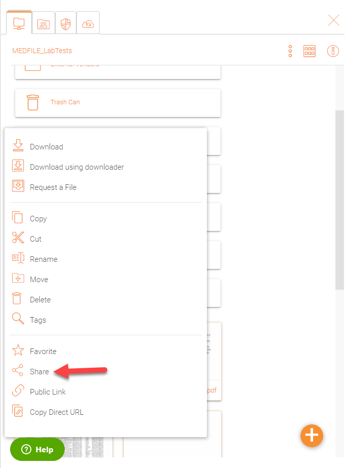
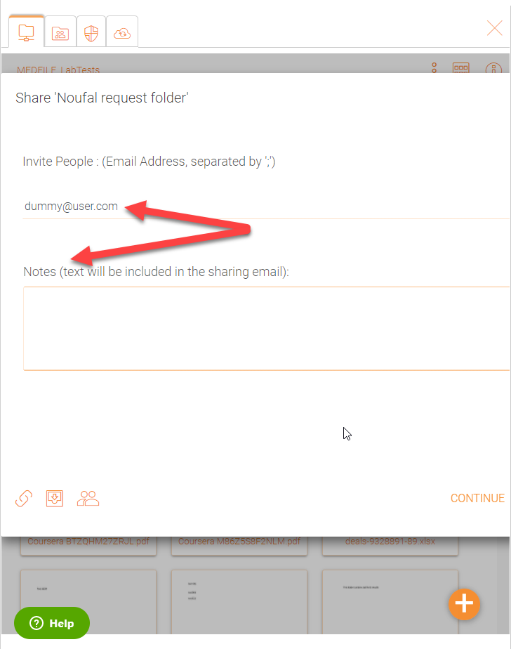
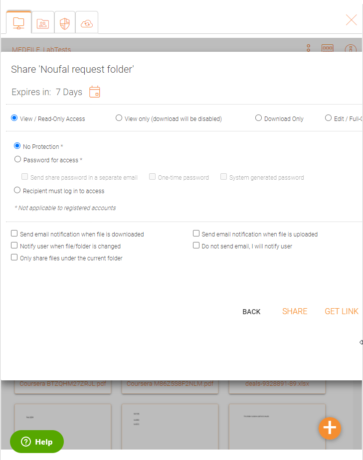

#########
Sharing
#########

Sharing vs Access to File Server Shares
==========================================

There are two ways to share files and folders in |prodname|  – File server share access and sharing.

*  **File Server Shares Access:** 
 
    Only available for the administrator who can enable remote access to any existing file server shares or folders created in Triofox. An admin can give access to shares to
    native Triofox users or existing Active Directory users.  
 
*  **Sharing:** 
 
    Both the administrator and users can share files and folders with anyone that has an email address if IT allows it. The recipient of the share will get an
    email with a link to open the folder or download the file. If the email recipient is also a |prodname| Cloud user, he/she can access the shared file or folder directly 
    from the |prodname|.

    Administrators can prevent users from sharing if needed.

Sharing Files And Folders
==========================

File Sharing
-------------

To share a file, highlight the file and clock the 3 dots which will bring up the context menu from where you can select the share icon, (1)revealed in the header of the file. 
You can also right click the file and select Share (2) in the context menu. Once the file is selected, if the right panel (3) is open, there is a Share link (4) there as well.

    SHARING FILES

After clicking ‘Share’ above, in ‘Invite People’ window, click the email field and enter email address(es) seperated by semicolons (;) for anyone that needs access to the file. 
You can also add notes if required. Click CONTINUE.

    INVITE PEOPLE TO YOUR SHARE

On the second share window you have access to the share options panel where you can make important decisions such as how long you want the share to be active and 
how much control you want to give the user (e.g., read only, full control access). You can also make this share available to the public by getting a public link. Also, if desired,
you can subsribe to notifications for the share.

    SHARE OPTIONS PANEL

