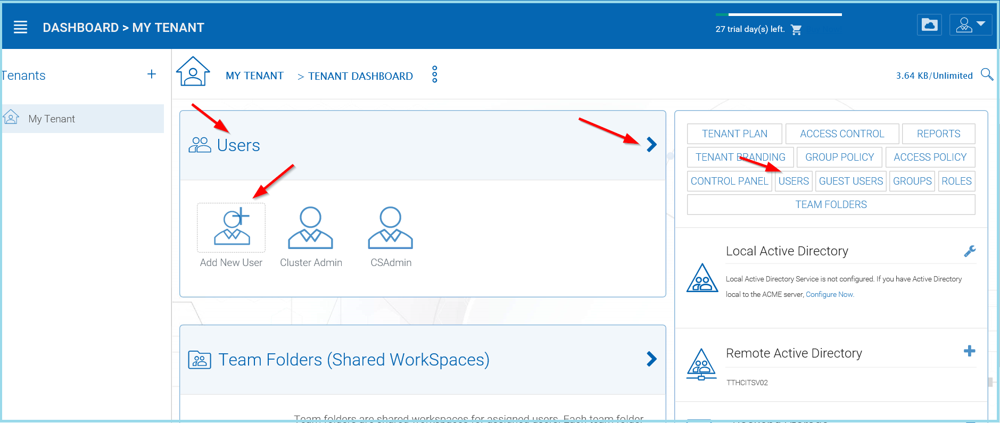
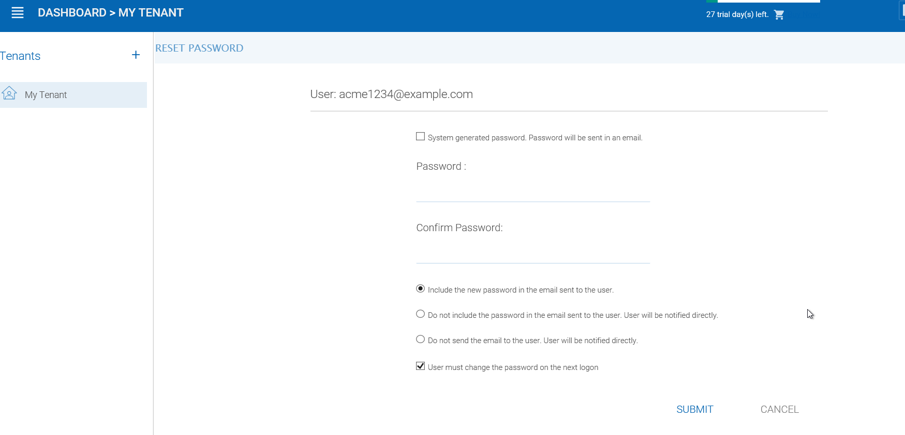

#################
User Management
#################

Adding Users
=============

After signup, the administrator will get a login to the |prodname|. To setup a team environment, the administrator needs to add team users. Only the administrator or delegated administrators or users that has user manager role assigned can add users.

To manage users, go to ‘Management Console’ under user on the top right:

.. figure:: _static/image_s12_1_1.png
    :align: center

    ACCESSING THE MANAGEMENT CONSOLE

In the ‘Management Console’, click ‘User Manager’:

    WAYS TO ACCESS USER MANAGEMENT

In ‘User Manager’ window, click the ‘+’ icon or "Add User" on the top left.

.. figure:: _static/image_s12_1_3.png
    :align: center

    CREATING OR MIGRATING USERS

Deleting Users
===============

When a user leaves the team, administrators can delete the user’s login. Just click the Delete icon in ‘User Manager’ window.

.. figure:: _static/image_s12_1_4.png
    :align: center

    DELETING A USER

Managing User Quotas
=====================

Administrators can assign a quota to each user. A user will not be allowed to upload files to |prodname|  once their quota has been reached.

If the quota is 0 for the user, there is no limit on how much storage the user can use.

Click the ‘Management Console’ and select ‘User Manager’. Click the "Manage User" menu on a user to manage and select "Set Quota"

.. figure:: _static/image_s12_1_5.png
    :align: center

    EDITING STORAGE QUOTA

Managing User Credentials
==========================

Admins can change user passwords and login emails, if needed.

* Click ‘Management Console’ and select ‘User Manager’
* Click the "manage user" menu icon in the user block
* After that, can use "Reset Password" link to help the user.

.. figure:: _static/image_s12_1_6.png
    :align: center

    RESET USER PASSWORD

After changing the login password, an email will be sent to notify the user of the change. Admins can choose to include the new password in the email, or exclude the new password from the email. If the password is not included, the admin will need to convey the new password to the user in some other way.

    PASSWORD OPTIONS

When either the email or password is changed, please update the corresponding login credentials in |prodname| Cloud Desktop or Cloud Server.

.. warning::

    This only applies to native |prodname| user. If you have Active Directory users, you will need to manage user's credential the Active Directory way.
    
