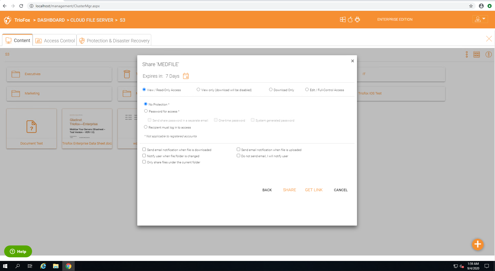

#########
Sharing
#########

Sharing vs. Publishing
=======================

There are two ways to share files and folders in |prodname|  – publishing and sharing.

*  **Publishing:** 
 
    Only available for the administrator who can share any tenant-wide folder. It will only work with team-users in a specific |prodname| account (tenant account). Publishing a team folder can’t go outside of the tenant scope.

*  **Sharing:** 
 
    Both the administrator and team-users can share files with anyone that has an email address. The recipient of the share will get an
    email with a link to open the folder or download the file. If the email recipient is also a |prodname| Cloud user, he/she can access the shared file or folder directly from the |prodname|.

    Administrators can prevent team-users from sharing if needed.

Sharing Files And Folders
==========================

File Sharing
-------------

To share a file, click it and select the Share icon (1)revealed in the header of the file. You can also right click the file and select Share (2) in the context menu. Once the file is selected, if the right panel (3) is open, there is a Share link (4) there as well.

.. figure:: _static/New025
    :align: center

    SHARING FILES

After clicking ‘Share’ above, in ‘Invite People’ window, click the email field (5) and enter email addresses seperated by semicolons (;) for anyone that needs access to the file. You can also add notes (6) if required. Click CONTINUE (7). 

    INVITE PEOPLE TO YOUR SHARE

On the second share window you have access to the share options panel where you can make important decisions such as how long you want the share to be active and how much control you want to give the user (e.g., read only, full control access). You can also make this share available to the public by get

    SHARE OPTIONS PANEL

