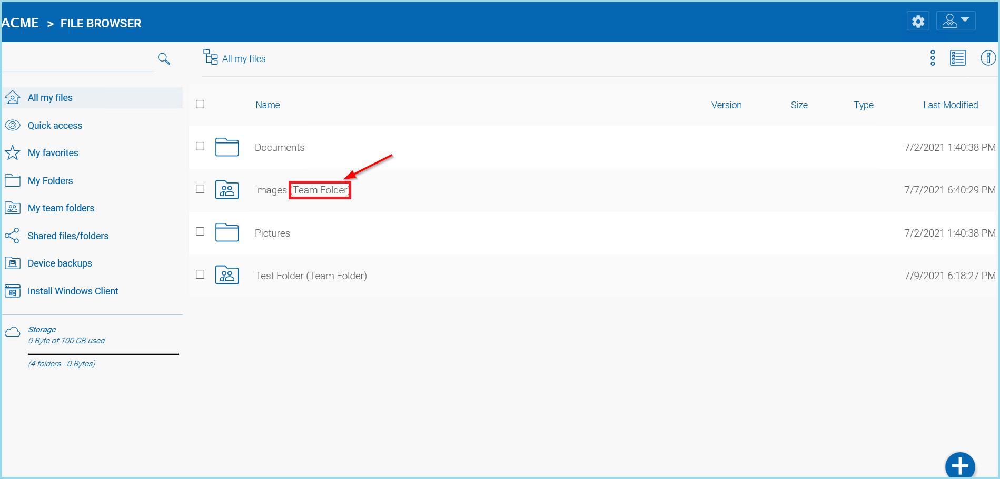

##############
Team Folders
##############

What Is A Team Folder?
=======================

|prodname| enables the creation of team folders which are owned by the administrator and published to other |prodname|  users.

Once a folder is published, it is displayed as a team folder to the users who have access permissions. Users can access these folders from |prodname| Web or other client agents. The published folder will appear under the user's root folder, and its name will be appended with
"(Team Folder)".

    TEAM FOLDER TAG

Adding User Folders
=======================

Folders Created in |prodname| are Versioned Folders.

|prodname| will maintain the version history of any files uploaded to versioned folders. From |prodname|, a user can download any previous versions of a file. From |prodname| Desktop/Server Agent, a user can restore previous versions of files and recover deleted files.

To create a folder right click in the File Browser window background and select **"Create Folder"** from the pop-up context menu. 

.. figure:: _static/image_s14_1_1.png
    :align: center

    CREATING A FOLDER

Attaching a Folder From the Client
====================================

Users can also Attach a Local Folder from their client. 

.. figure:: _static/image_s14_1_1a.png
    :align: center

    ATTACHING A FOLDER

These folders are the local folders from the local PC/Mac that |prodname| users have attached to |prodname|. Once a local folder is attached, a user can immediately access it in |prodname|. |prodname| will maintain the version history of files in the attached local folder. The local folder is also being synchronized with |prodname| ("cloud side").

.. figure:: _static/image_s14_1_2.png
    :align: center

    ATTACHED LOCAL FOLDER

