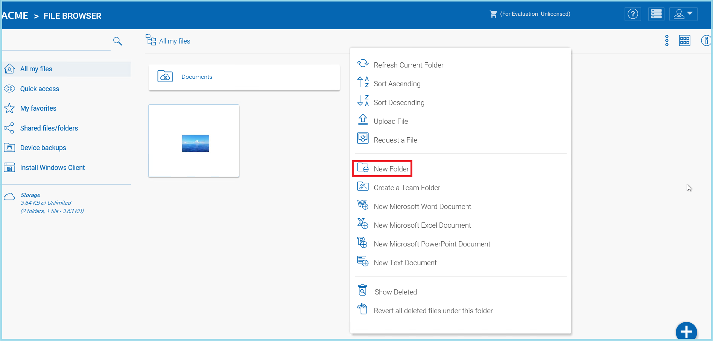

###############
Notifications
###############

Folder Notifications 
======================================================

|prodname| enables the creation of team folders which are owned by the administrator and published to other |prodname| users.

    ACTIVATE FOLDER NOTIFICATIONS

Share Notifications 
======================================================

Users can enable share notifications through the settings it displays once you decide who you will share your file with.

|prodname| will maintain the version history of any files uploaded to versioned folders. From |prodname|, a user can download any previous versions of a file. From the |prodname| Desktop/Server Agent, a user can restore previous versions of files and recover deleted files.

To create a folder right click in the File Browser window background and select **"Create Folder"** from the pop-up context menu. 

    CREATING A FOLDER

Attaching a Folder From the Client
====================================

Users can also Attach a Local Folder from their client. 

.. figure:: _static/image_s14_1_1a.png
    :align: center

    ACTIVATE SHARE NOTIFICATIONS
