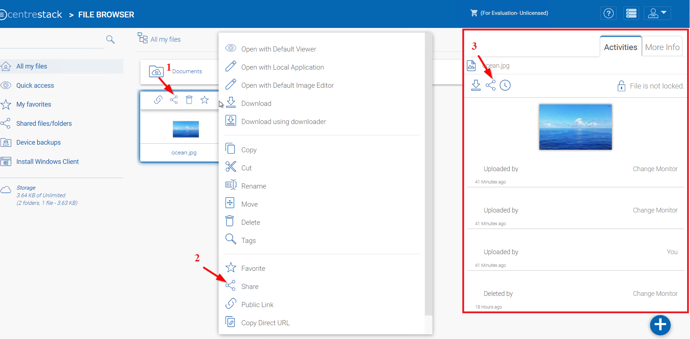
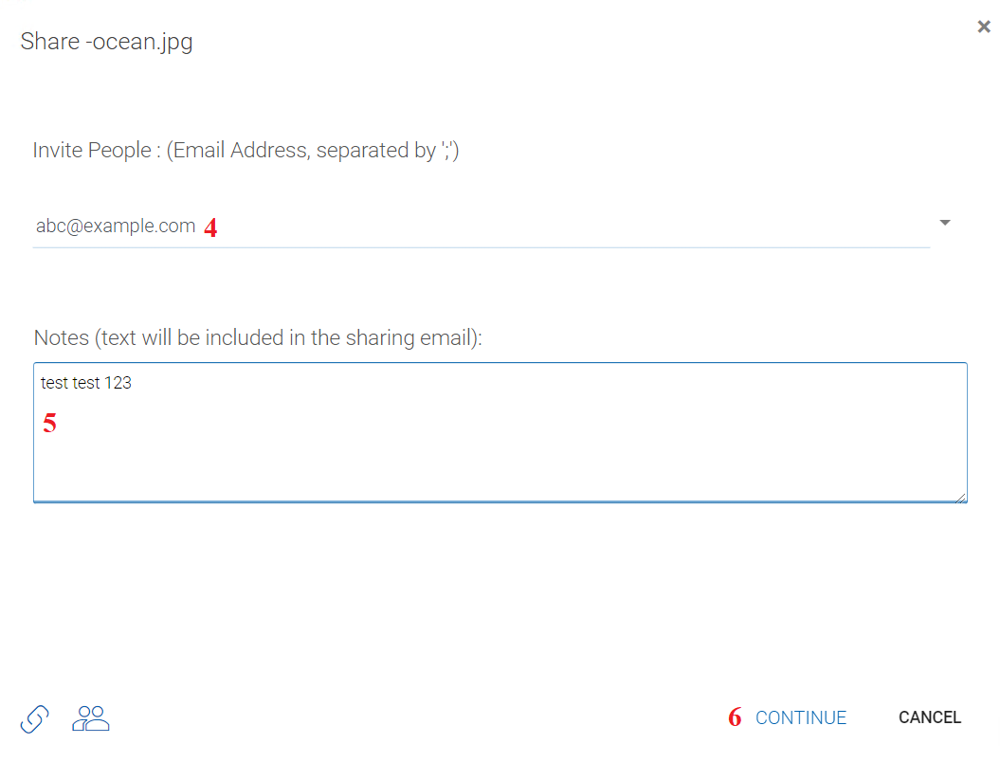
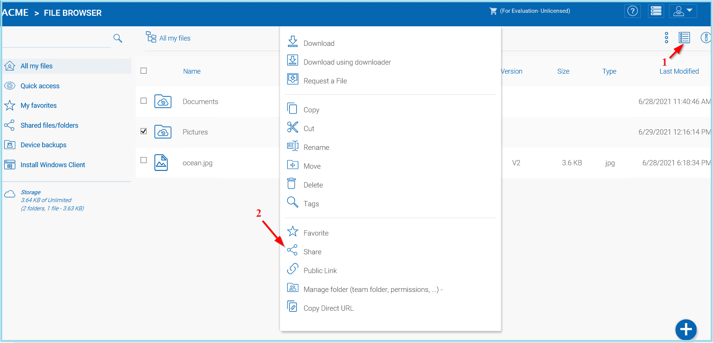
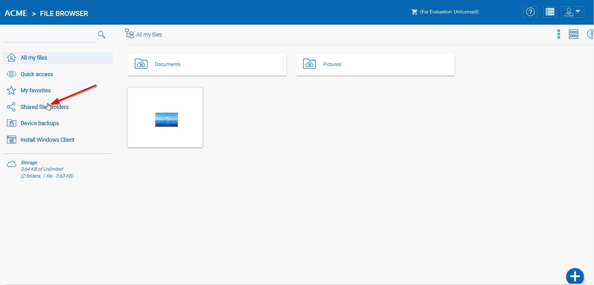

#########
Sharing
#########

Sharing vs. Publishing
=======================

There are two ways to share files and folders in |prodname|  – publishing and sharing.

*  **Publishing:** 
 
    Only available for the administrator who can share any tenant-wide folder. It will only work with team-users in a specific |prodname| account (tenant account). Publishing a team folder can’t go outside of the tenant scope.

*  **Sharing:** 
 
    Both the administrator and team-users can share files with anyone that has an email address. The recipient of the share will get an
    email with a link to open the folder or download the file. If the email recipient is also a |prodname| Cloud user, he/she can access the shared file or folder directly from |prodname|.

    Administrators can prevent team-users from sharing if needed.

Sharing Files And Folders
==========================

File Sharing
-------------

To share a file, click it and select the Share icon (1)revealed in the header of the file. You can also right click the file and select Share (2) in the context menu. Once the file is selected, if the right panel is open(click the encircled "i" button), there is a Share link (3) there as well.

    SHARING FILES

After clicking ‘Share’ above, in ‘Invite People’ window, click the email field (4) and enter email addresses seperated by semicolons (;) for anyone that needs access to the file. You can also add notes (5) if required. Click CONTINUE (6). 

    INVITE PEOPLE TO YOUR SHARE

On the second share window you have access to the share options panel where you can make important decisions such as how long you want the share to be active and how much control you want to give the user (e.g., read only, full control access). You can also make this share available to the public by get

    SHARE OPTIONS PANEL

You can access previously shared items by clicking the share icon (2) on a folder of file. Other shares can be accessed by opening the right panel (1) and clicking the edit button (3) next to the "Shared Items" option. 

    ACCESSING SHARED ITEMS SETTINGS

Folder Sharing
---------------

In this example, the icon view has been changed to detailed view (1) of the files in this folder. To share a folder, mouse-over it and select the Share icon (2) in its row. You can also right click the file and select ‘Share’ in the context menu.

    SHARING FOLDERS

Removing shares
================

During share setup, a user can define its expiration date. Once the share expires, other users will no longer be able to access the shares.

Users can also delete the share manually. First go to the Drive Root (1). 

To delete a user's access to a share, open the right panel click the "Manage" icon (2) on shared items. In the next panel choose the item you wish to modify, then in the pop-up window, click the Delete icon (3) to remove this user's permission from the share.  

.. figure:: _static/image_s15_1_6.png
    :align: center

    DELETING A USER'S PERMISSION

Accessing 'Files/Folders Shared With Me'
=========================================

When a file or folder is shared with the user, he/she will get an email. The link in the email can be used to open the file or folder.

If the user has a |prodname|  account with the given email address, the shared files and folders will appear under the ‘Files shared with
me’ folder, in both the |prodname| Web Portal and |prodname| Desktop App.

Web Portal
----------------------

You can access shared files by clicking the "Shared files/folders" button in the "File Browser" view of the Web Portal. 

    WEB PORTAL SHARED FILES LOCATION

Windows Client
--------------------

In the Windows Client you can access shared files by using windows explorer to navigate to the Cloud Drive (1) where you will find any shared files listed (2) with information about who shared (3) the file with you. 

.. figure:: _static/image_s15_1_9.png
    :align: center

    WINDOWS CLIENT SHARED FILES LOCATION

If the user has write permission to the folder shared, he can modify the files in the folder.

Preventing Users From Sharing
==============================

Sometimes for security reasons, users should not be allowed to share files/folders.

There are two types of files and folders a user can access.

*	User’s own folders, including versioned folders and attached local folders from the user's desktop.

When an administrator creates new users, he/she can check ‘Disable sharing home directory content with external party, to prevent the newly
created user from sharing his/her own files and folders.

.. figure:: _static/image_s15_1_10.png
    :align: center

    MANAGE USER SETTINGS

In the Manage User panel use the drop-down menu (4) to access the "Storage" settings (5). Once you are in the Storage View you can select (6) the "Disable team-user share home directory content externally" option. 

.. figure:: _static/image_s15_1_11.png
    :align: center

    DISABLE EXTERNAL SHARING

When publishing a team folder, administrator can check ‘Disable further sharing’, to prevent users from sharing anything in the team folder. You can access this setting after choosing your storage location. Click the "Create Team Folder" icon (1) and select your storage type (2), then select the "Disable further sharing" option (3). 

.. figure:: _static/image_s15_1_12.png
    :align: center

    DISABLE FURTHER SHARING

Protecting Shares By Requiring Login
=====================================

When a user shares a file or folder, |prodname| will generate a URL. By default, anyone can use the URL to access the share.

Administrators can protect shares by requiring login credentials. Once enabled, when a user accesses the share URL, he /she will be prompted to
login to the |prodname| Cloud. After login, the user can view the file/folder shared with him/her under ‘Files shared with me’.

To access this setting use the drop-down menu (1) and in the "Group Policy -> Sharing" (2) panel, select the "...user must login to his/her account..." setting. 

    SECURING SHARED FILES AND FOLDERS

