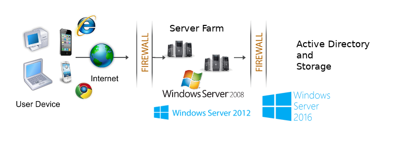

############
Background
############

Architectural Background
=========================
Before we examine the capabilities of the solution, let’s review its architectural background. As illustrated in Figure 1, the |prodname| File Sync and Share platform 
has three primary components:

    *	The Storage Layer and the Internal IT infrastructure such as Active Directory and File Server - to the right
    *	The |prodname| Cluster (Server Farm) - at the center 
    *	The |prodname| access client agents - to the left

The web portal belongs to the client tier on the left. Web portal functionality includes

    * administration
    * files and folders management
    * download other client agent software
    * files and folders sharing
    
Two Deployment Scenarios
=========================
The services can be deployed in flexible combinations to meet different needs. There are two primary ways to deploy the |prodname|.

    1. Deploy in the same site as the File Servers and Active Directory domain controllers:
    
    .. image:: _static/SelfHostedCentreStackDirectShare.svg
    
    2. Deploy in a site remote, such as Amazon Web Services EC2, Microsoft Azure, or in a Data Center where the Managed Service Provider (MSP) hosts their infrastructure:
    
    .. image:: _static/SelfHostedCentreStackRemoteShare.svg
    
Existing Infrastructure
========================

Active Directory
-----------------
|prodname| can connect to existing IT infrastructure such as
current file servers and existing Active Directory. 

Data Storage
-------------
|prodname| Storage can actually be powered by any storage service, including:

    *   Local File Server Network Share
    
        - CIFS/SMB Network Share
        - DFS (Microsoft Distributed File System)
        
    *	Cloud Storage Services
    
        - Amazon S3 (or any S3 compatible service)
        - OpenStack Swift
        - Windows Azure Blob Storage
        - Windows Azure File Storage
        - Google Cloud Storage
        - Rackspace CloudFiles

When a new |prodname| account (Tenant Account) is created, any of these services can be selected to power the tenant's root storage folder. And regardless of which provider you select here, additional services can be mounted below the root of the tenants' storage tree where they will appear as a sub-folder in the root folder.

|prodname| Server Farm (Cluster)
----------------------------------
 
The |prodname| Cluster (One or more |prodname| servers) provides the access infrastructure and management services and acts as a liaison between the user-facing access clients and the backend storage services. It consists of a group of web services which include:

    *	Account Management
    *	Login and User Load Balancing
    *	Web Portal UI
    *	Generic Storage Services (powered by backend provider)
    *	Data Persistence
    *	Local Storage/Device Relay

These services can be deployed in flexible combinations to meet different needs. 

The |prodname| has an all-in-one installer, so it can easily be self-hosted by you or you can use the one hosted
already in the cloud.

|prodname| Client Agent Software
----------------------------------------------

The |prodname| Clients enable the use of |prodname| services. Supported clients include:

    *	Desktop Client for Windows
    *	Desktop Client for Mac
    *	Server Agent for Windows Server (background sync)
    *	iOS client for iPhone and iPad
    *	Android Client
    *	Windows Phone Client
    *	Windows Tablet Client
    *	Web Client (Internet Explorer, Chrome, Safari, Firefox, Opera and etc)

These clients allow native use of cloud storage on the corresponding device through a mapped drive, file share or whatever mechanism is commonly used to access files. This makes it easy for a user to access all their files with any device or share them with users of any device.

Each client tries to keep things familiar for the end user. For example, the server client integrates cloud storage with file shares so that shared cloud folders can be easily published as file shares with access controls that can be based on existing Active Directory identities and the desktop client maintains a mapped drive view of the cloud storage which operates like any other drive on the desktop.

