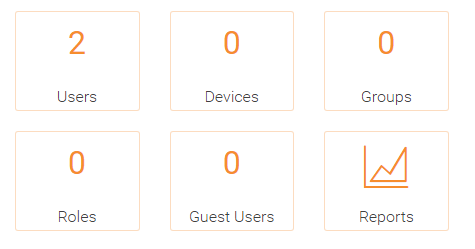

#################
Getting Started with the initial login
#################

To get started, point your web browser at the Triofox server.

If you are the system administrator for the Triofox server
and you are in the server's console, you can point your 
web browser at http://localhost

If you are in the Local Area Network, you can point your
web browser at the IP address of the Triofox server - http://<ip-address>

Most common, and in production,  you will be pointing your web browser at the 
Triofox server's DNS name, such as https://<DNS-Name-Of-Server>

Once you are in the web portal, you will be seeing the login 
page first.

    Triofox LOGIN