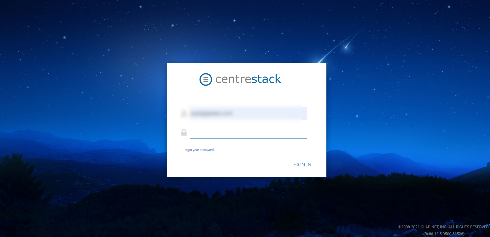

#################
Getting Started
#################

To get started, point your web browser at the |prodname| server.

If you are the system administrator for the |prodname| server
and you are in the server's console, you can point your 
web browser at http://localhost

If you are in the Local Area Network, you can point your
web browser at the IP address of the |prodname| server - http://<ip-address>

Most common, and in production,  you will be pointing your web browser at the 
|prodname| server's DNS name, such as https://<DNS-Name-Of-Server>

Once you are in the web portal, you will be seeing the login 
page first.

    |prodname| LOGIN