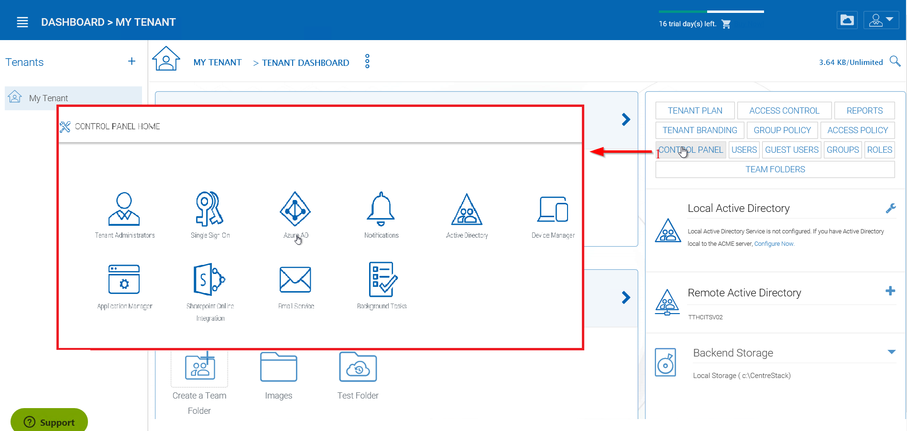
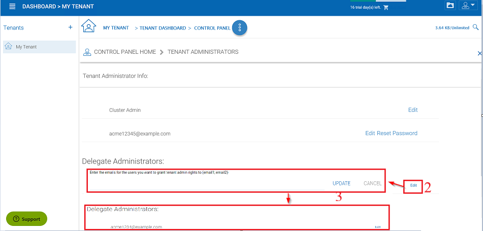
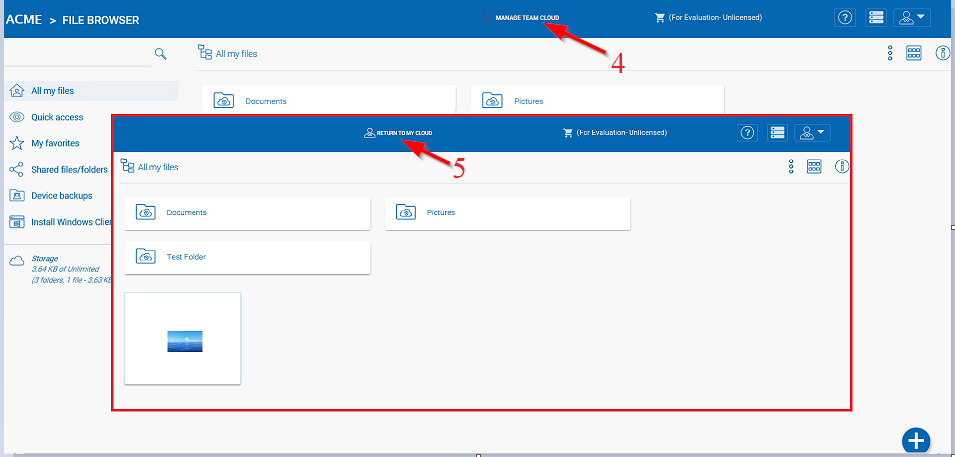
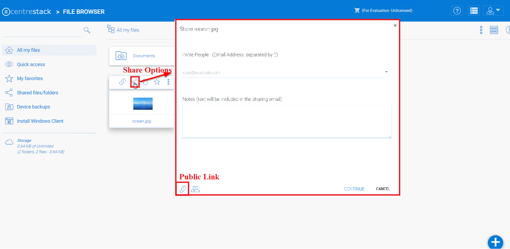

##########################
Different Scope of Users
##########################

Tenant Administrator
=====================

Tenant is a management scope that typically map to a company or a group of users that collaborates on a set of documents. In |prodname|, it is referred to as the Tenant Account as well.

On a per-tenant basis, you can create team users inside the tenant; you can setup Active Directory connection per-tenant; you can setup team folder to share among users inside the tenant. 

As a |prodname| administrator, you can think of a tenant as a company, who is your client/customer, which in turn may have some of its own users too.

Team User
==========

Team user are users inside a tenant scope. They have credentials to login to |prodname|. They are regular users in a tenant that have home directory and storage quota assigned. If a tenant is a company, the team user are employees in 
the company.

Delegate Administrator
=======================

A delegated administrator is a team user most of the time. However, delegated administrators can be elevated to full tenant administrators by clicking on the "Manage Team Cloud" link. This link is only visible if you are logged in as a Delegate Administrator. To create this type of administrator follow these steps as Tenant Admin. 

Logged in as Tenant Admin, you can delegate administrators through the Control Panel of the Tenant Dashboard (1). 

    TENANT ADMINISTRATORS SETTINGS

In the Tenant Administrators panel you can choose a user you want to add from the field upon clicking the "Edit" option (2). Choose "Update" (3) when finished. 

Tenant administrators can be removed by clearing the field given in the "Edit" option. 

    DELEGATED ADMINISTRATORS

When a team user (with delegate administrator assignment) logs in, there will be a "Manage Team Cloud" link available (4). 

    MANAGE TEAM CLOUD ACCESS

And when the delegate administrator is finished managing the team cloud, they can return to their normal File Browser view by clicking "Return To My Cloud" (5).

Guest User
===========

Guest user are users that have credentials to login to |prodname|, but these users don't have home directory.

Anonymous User
===============

If the public link and anonymous (no login required) sharing is enabled,
users can use a link to come to the web portal and see files and folders
that are shared.

    PUBLIC LINK
