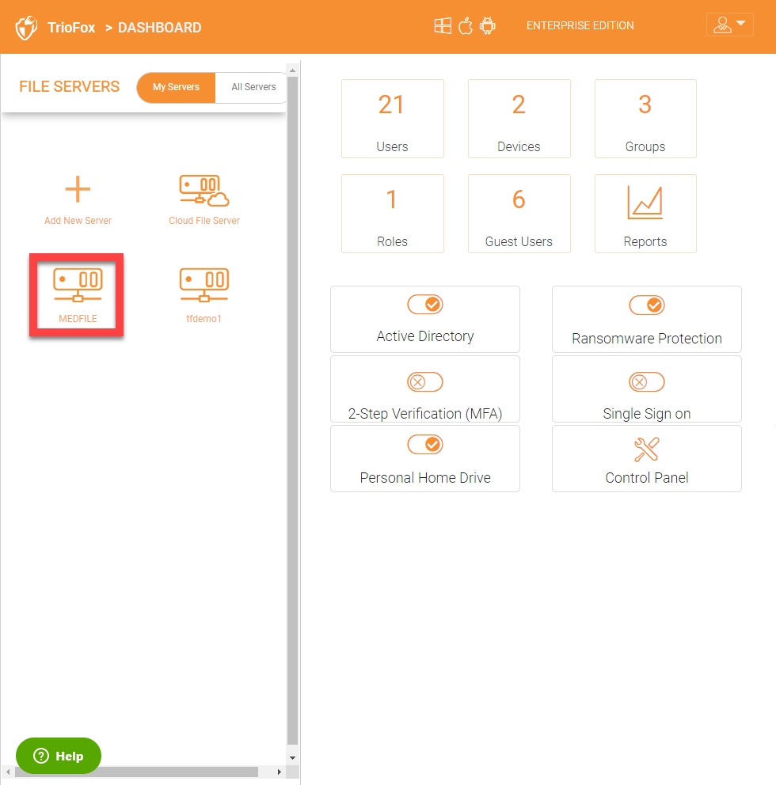
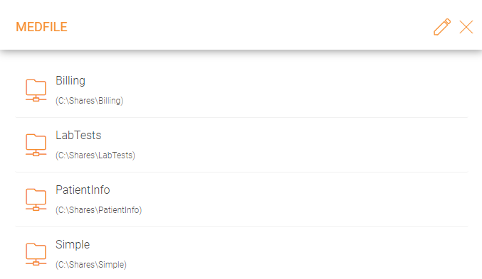
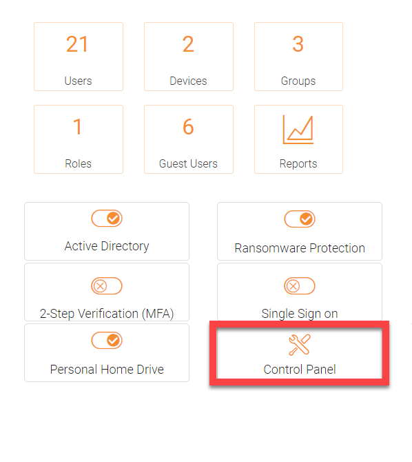
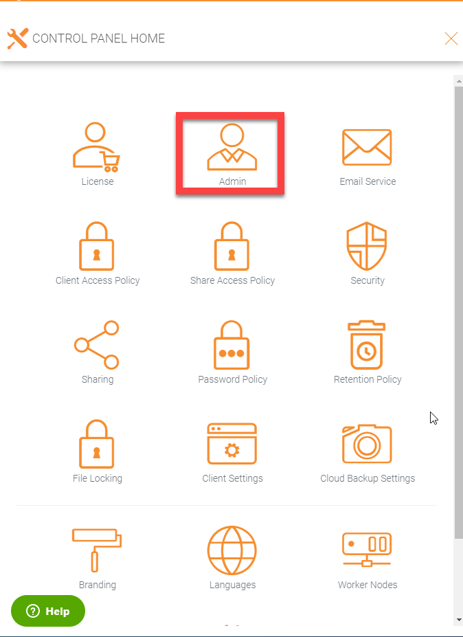
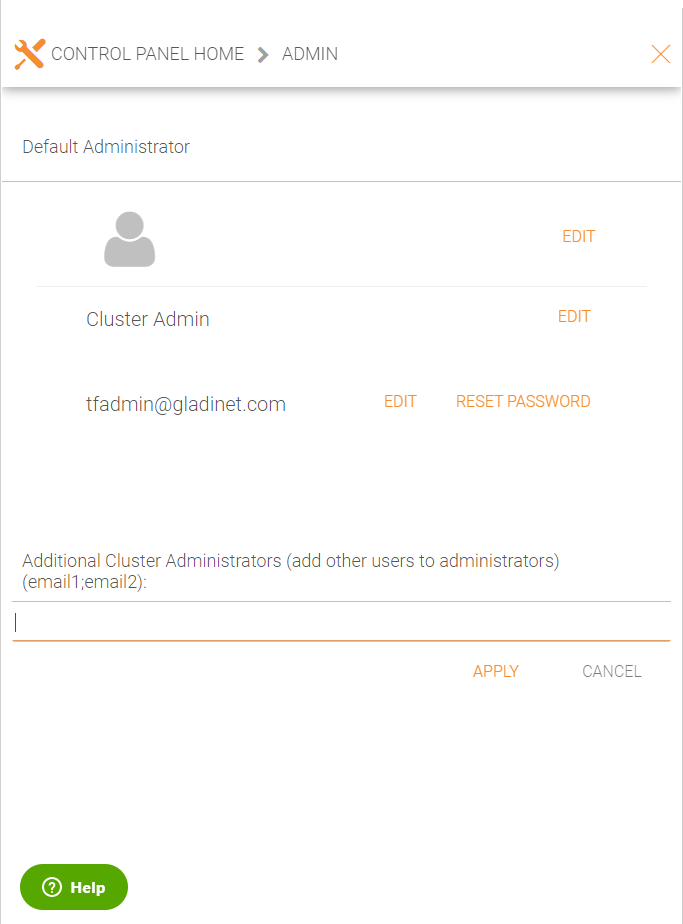

##########################
Different Scope of Users
##########################

Administrator
=====================

Administrator is a management scope that typically maps to a company or a group of users that collaborates on a set of documents. In Triofox, it is referred to as the 
Cluster Administrator count as well.

In this scope once all the file servers are discovered in your network after integration with Active Directory, you can choose a file server and see a list of all shares on that
file server. 

In the screenshot below, it displays all the shares on 'MEDFILE' file server.

Delegated Administrator
=======================

A delegated administrator is a normal user most of the time. However, delegated administrators can be elevated to cluster administrators by adding them under Control Panel\Admin. 
To create this type of administrator follow these steps as Cluster Admin. Click on the Control Panel in the Dashboard.

Then click on the Admin icon

Then add the user email address(s) for additional cluster administrators

Native User
===========

Native users are users that have credentials to log into Triofox and are not in Active Directory. They can be manually added under Access Control for different folders to 
give them access.

Active Directory(AD) Users
===============

AD users are users who are added once you have integrated Active Directory into your Triofox environment. You can add users via groups in your Active Directory domain controller 
or you can add individual users. 

