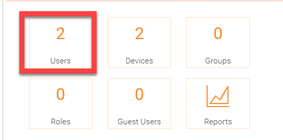
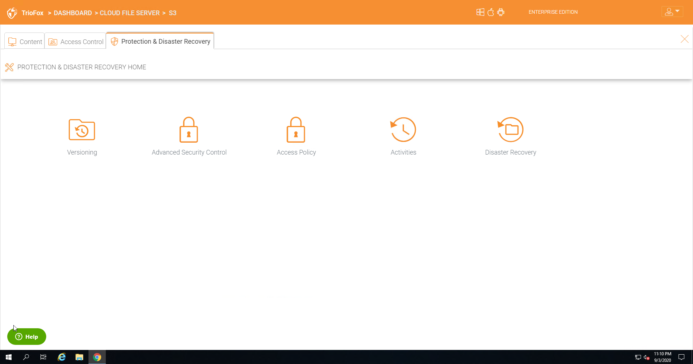

######################
Tenant Administrator
######################

Please reference the `Admin Guide`__ for full documentation of the tenant administration. Here we will go over several commonly touched areas for tenant administrators.

.. _Admin_Guide: https://centrestack.com/Library/AdminGuide/ 
__ Admin_Guide_

Login and Manage
=================

    IMPORTANT SETTINGS AND FEATURES

The small user icon **(5)** gives you access to template settings, connected devices, guest users, notifications storage information, feedback, and client download options. You can also change your password or logout. 

    

    Versioning

Versioning allows you to revert back files that have been updated or recover files that have been attacked by malware or have been deleted. It can be found in the 'Protection and Disaster Recovery'
tab in your server. 

