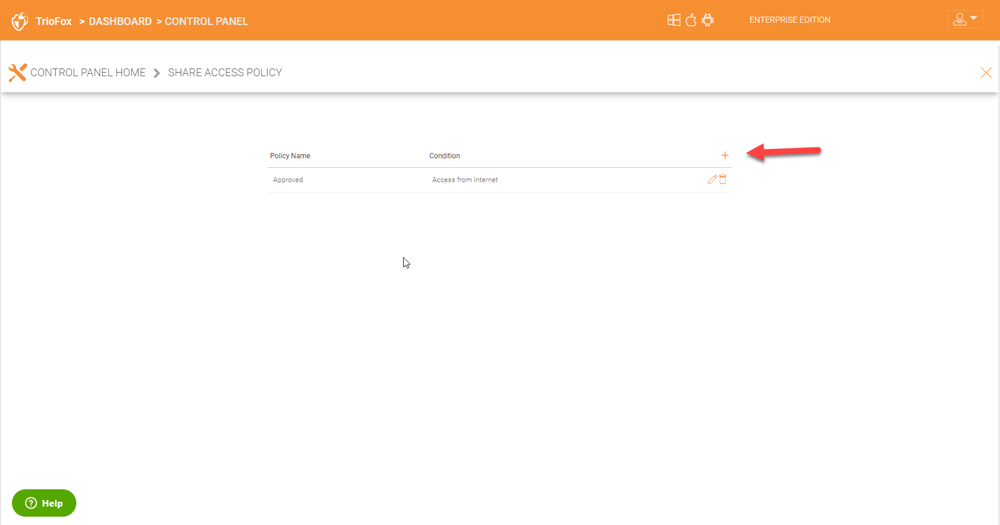

######################
Cluster Administrator
######################

Please reference the `Admin Guide`__ for full documentation of the Triofox administration. Here we will go over several commonly touched areas by Cluster administrators.

.. _Admin_Guide: https://triofox.com/documents/Admin_Guide/ 
__ Admin_Guide_

Login and Manage
=================

After you log into the web portal as a Cluster Administrator, you will be in the dashboard. Here you will see all your servers including your file servers in your network.

As a Cluster Administrator you can also see **(1)** total number of users in the system, **(2)** devices currently connected, **(3)** number of Groups, **(4)** roles created,
**(5)** guest users, **(6)** and reports.

Cluster Administrator can also enable other features in the dashboard. For example, **(7)** Active Directory if it is already not enabled, **(8)** Ransomware Protection, 
**(9)** 2-Step Verification (MFA), **(10)** Single Sign-On, **(11)** and Personal Home Drive.

The Control Panel has many other options that can be configured by the Cluster Administrator.

Control Panel Options
======================

License
========

The 'License' option in Control Panel displays details about licensing including the license edition, number of users, cluster id and Triofox server version. You can also upgrade 
your Triofox evironment to a higher edition by clicking on the shopping cart next to your edition.

Admin
========

'Admin' option allows a Triofox administrator to change the default cluster admin email if desired, reset the password, and also add additional administrators.

Email Service
===============

'Email Service' option allows a Triofox administrator to configure their own SMTP service for notifying users or when their users send out sharing and receive links.

Client Access Policy
=====================

'Client Access Policy' option allows a Triofox administrator to configure a global client access policy. For example, IT can allow access to company data from a public internet,
local network, allow access only from custom defined networks, or disable access from specific custom defined networks.

Share Access Policy
=====================

'Share Access Policy' option is similar to 'Client Access Policy which allows a Triofox administrator to configure a global share access policy. For example, IT can allow sharing 
of company files from a public internet, local network, from anywhere, allow access only from custom defined networks, or disable access from specific custom defined networks.

Security
==========

'Security' option is where IT can enable options to notify users if their emails have changed or disable remote assistance.

Sharing
==========

'Sharing' has many settings which IT can enable or configure to lock down sharing of company files and configure for example expiration options on shares.

Password Policy
=================

'Password Policy' is where an admin can define mimimum requirements and complexity for passwords.

Retention Policy
=================

'Retention Policy' is a critical component to protect data. This is where IT can define thier own retention policy rules for example, the number of versions for each file,
the retention period for deleted items, and notifications etc.

File Locking
=================

'File Locking' is another critical component to ensure users are not overwriting each others' changes. You can enable and or disable all file locking options under this control.

Client Settings
=================

'Client Settings' is to enable settings for Windows and Mac clients for example, 'Mapped Drive Controls', 'Bandwidth Control', 'Outlook plugin' etc.

Cloud Backup
=================

'Cloud Backup' is where IT can configure offsite backup location for example another file server in a disaster recovery datacenter or choose a cloud storage service provider
to backup their data to.

Branding
=================

Organizations can choose to brand the Triofox environment using their logos and colors under branding. They can perform end to end branding for example Windows client,
MAC client, email templates etc.

.. figure:: _static/New072.png 
    :align: center 

Languages
=================

IT can also set the desired language under Control Panel\Languages.

Worker Nodes
=================

You can look at the Triofox server name, the server version, its status and whether management is allowed or not. You can also check or change the external url by clicking
on the pencil icon. The small gear icon in the upper right can be used to enforce SSL for all connections. Additional Triofox nodes can be added here as well by clicking
the + icon.

Client Version Manager
=======================

IT can push out the latest versions of clients under 'Client Version Manager' by publishing them. Once the client is published, users clients will be automatically upgraded to 
the latest version.

Settings
=======================

IT can configure many granular settings for the cluster under Control\Panel Settings. You can also configure the limits for upload and bandwidth utilization here.
Timeouts can be set, different languages can be chosen and duration for file changes can be set here.

Please reference the `Admin Guide`__ for full explanations of all the options in the Control Panel. 

.. _Admin_Guide: https://triofox.com/documents/Admin_Guide/ 
__ Admin_Guide_

