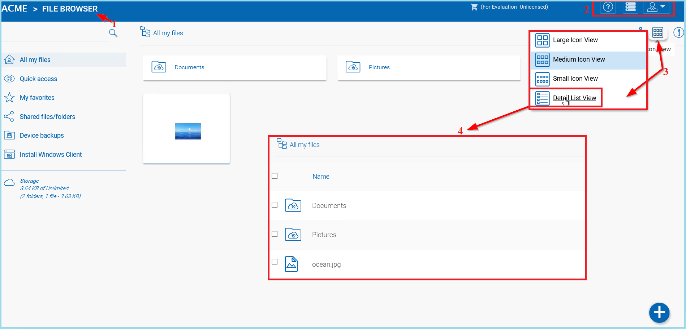

######################
Tenant Administrator
######################

Please reference the `Admin Guide`__ for full documentation of the tenant administration. Here we will go over several commonly touched areas for tenant administrators.

.. _Admin_Guide: https://centrestack.com/Library/AdminGuide/ 
__ Admin_Guide_

Login and Manage
=================

After you log in to the web portal, the file and folder view **(1)** will show important settings and features that can be accessed by clicking the icons in the top right **(2)**. The small down arrow icon **(3)** allows you to choose different icon sizes or switch to a detailed list view, which gives you access to more information about the files **(4)**, such as versions.

    IMPORTANT SETTINGS AND FEATURES

The small user icon **(5)** gives you access to template settings, connected devices, guest users, notifications storage information, feedback, and client download options. You can also change your password or logout. 

.. figure:: _static/image_s6_1_2a.png
    :align: center
    
    TEMPLATE, DOWNLOAD AND OTHER SETTINGS

The house icon **(6)** takes you to your dashboard. The **"?"** icon **(7)** is for tutorial access. If you are logged in as an administrator, the gear icon **(8)** goes to the management console, which is where the main capabilities of the Tenant Administrator are revealed. If you are logged in as a non-admin, the same icon takes you to your user settings. 

.. figure:: _static/image_s6_1_2b.png
    :align: center
    
    SETTINGS AND ICONS

If the small trashcan with the magnifying glass icon **(9)** is visible, you can click it to access deleted files. The trashcan with the **"X" (10)** allows you to purge deleted files. The larger magnifying glass icon **(11)** lets you perform searches. The house icon **(6)** takes you to your dashboard.
