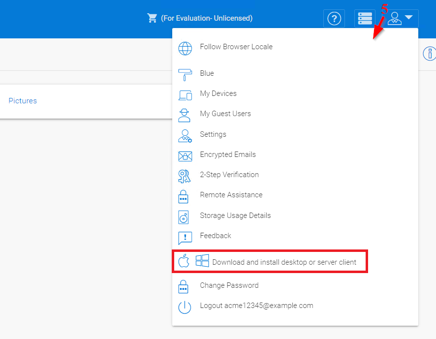

###################################################
File Browser
###################################################

After you log in to the web portal, the file and folder view **(1)** will show important settings and features that can be accessed by clicking the icons in the top right **(2)**. The small down arrow icon **(3)** allows you to choose different icon sizes or switch to a detailed list view, which gives you access to more information about the files **(4)**, such as versions.

.. figure:: _static/image_s6_1_1.png
    :align: center

    IMPORTANT SETTINGS AND FEATURES

The small user icon **(5)** gives you access to template settings, connected devices, guest users, notifications storage information, feedback, and client download options. You can also change your password or logout. 

    
    TEMPLATE, DOWNLOAD AND OTHER SETTINGS

The question icon **(6)** takes you to the Web Portal Tutorial. The stacked bar icon **(7)** is for access to the Cluster Manager. The person icon **(8)** opens the user settings menu. 

    
    SETTINGS AND ICONS

The icon with the encircled "i" **(9)** opens up an additional panel for additional information and options, including sharing, downloading, and revision history. The icon with squares **(10)** allows you to change how the files are displayed. The three stacked dots **(11)** opens a menu for more options in the file manager.
