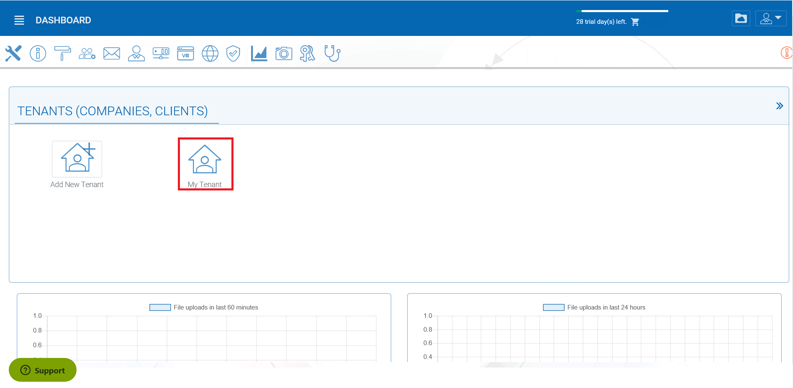
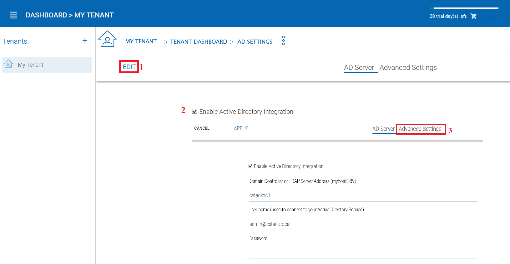
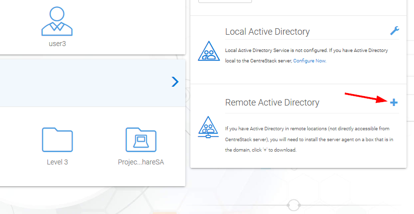
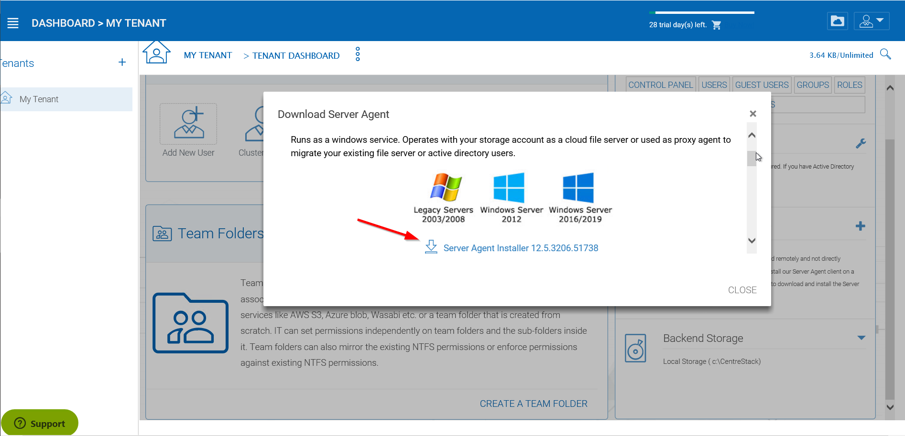
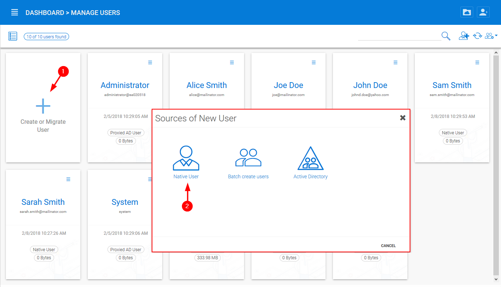
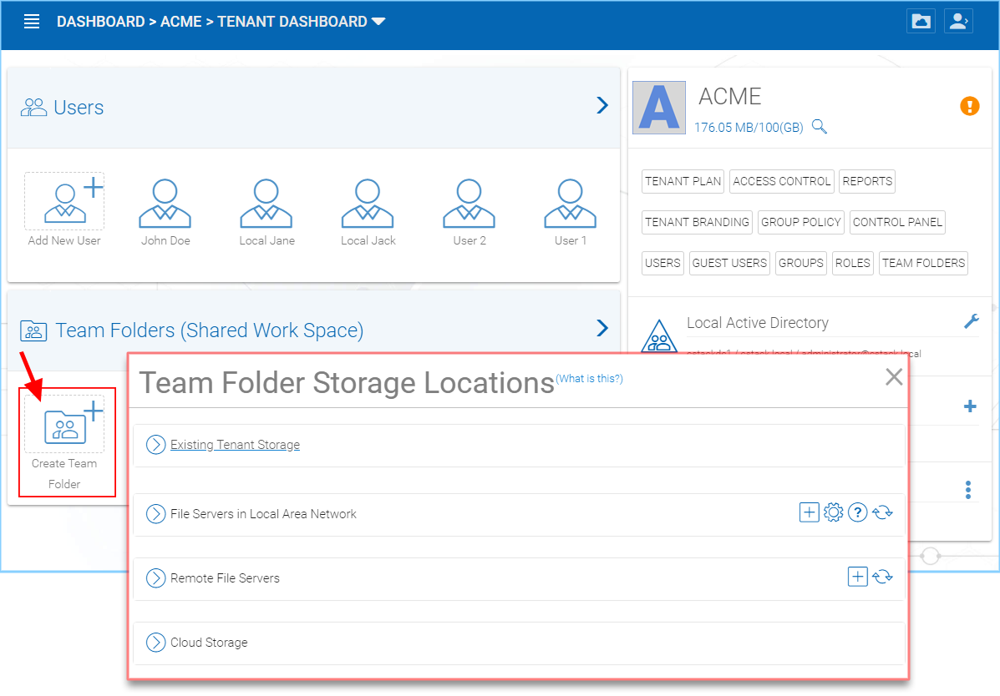
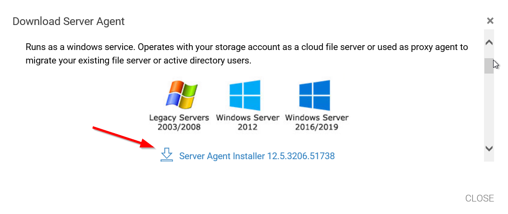

#################
Users and Files
#################

After you enter the "management console", you will be in the dashboard for the tenant. When you are at the dashboard, the top two objects to manage are users **(1)** and folders **(2)**. If you are using an Active Directory for importing users and permissions you can connect to your Active Directory by clicking the wrench icon **(3)**.

    MANAGE USERS AND FILES

Users
=======

Active Directory - LDAP
------------------------

In the AD Settings view you can add your local settings. Click Edit **(1)**, then select "Enable Active Directory Integration" **(2)**. 

    CONNECTING TO ACTIVE DIRECTORY (AD)

This gives you access to all the settings fields and the Advanced Settings Tab **(3)**. Once you have filled in the settings with an Administrator User account from your Active Directory, click **APPLY** to accept your changes. 

Active Directory - Remote 
--------------------------

If the users are coming from remote locations, away from the |prodname| server (so it is not in the same Local Area Network), the first step to take is to install the "server agent" software on a remote file server, as long as the file server is in the same remote Active Directory domain. Log into |prodname| from your File Server and download your Server Agent client. You can access this by clicking the **(+)** icon. Once this is setup on your File Server, |prodname| can access it to connect to your Remote Active Directory. 

    ACCESS YOUR SERVER AGENT CLIENT

    DOWNLOAD AND INSTALL

.. note::

    "Server Agent" software can import remote file server network share, and also import remote Active Directory users. Once Server Agent is installed and setup in remote location, the tenant administrator can use the Client Management Console "Migrate CIFS Shares" and "Migrate Users" **(1)** to import shares and users from Active Directory. Other actions are availible through the dropdown menu **(2)**. 
    
    .. figure:: _static/image_s7_3_1.png
        :align: center

        MIGRATE SHARES AND USERS

    
Other Users
------------

In the Web Portal you can also just add Native |prodname| Users by clicking the Users link. Once in the Manage Users view, click "Create or Migrate User" **(1)** and in the new window choose "Native User" **(2)**.

    ADDING A NATIVE |prodname| USER

    
Files
======

Adding files and folders can be accomplished by clicking **"Create Team Folder"**. Once the **"Team Folder Storage Locations"** view opens you can choose from many options: Existing Tenant Storage, File Servers in Local Area Network, Remote File Servers or Cloud Storage. 

    WAYS TO ADD STORAGE LOCATIONS

File Servers
-------------

If you have an existing file server in the Local Area Network (LAN), you can import the network share directly to |prodname| **(1)**. Under Remote File Servers, you can install the Server Agent client **(2)** and access your file server remotely.

    ADDING REMOTE FILES
    
    .. note::
    
       The Server Agent is only required when the remote file server doesn't have direct LAN (local area network) access
        to |prodname|. The Server Agent will be used in this case to facilitate communication between
        the |prodname| server to the remote file server.

    

