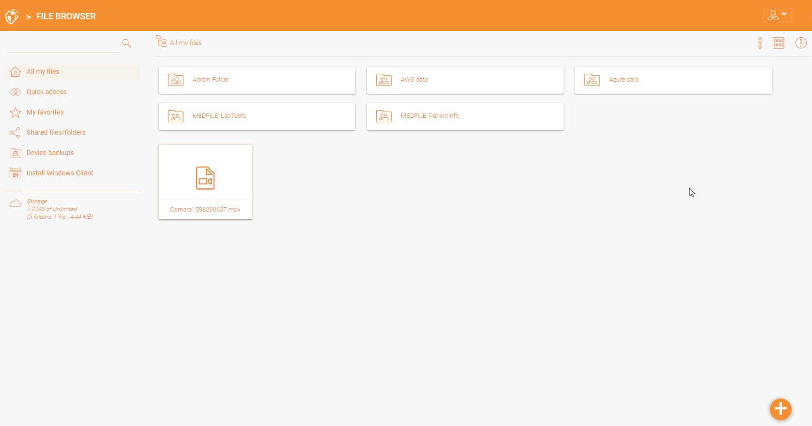
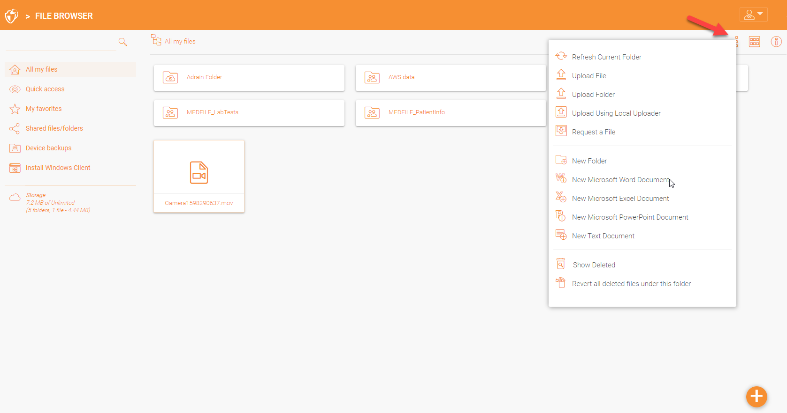
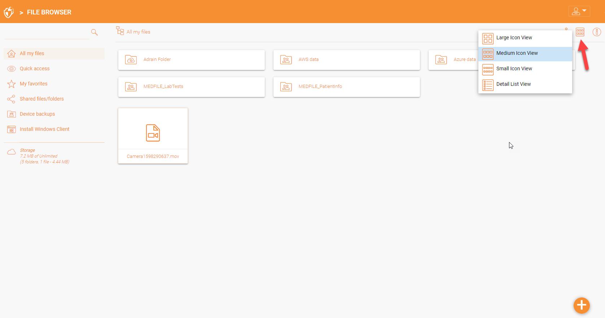
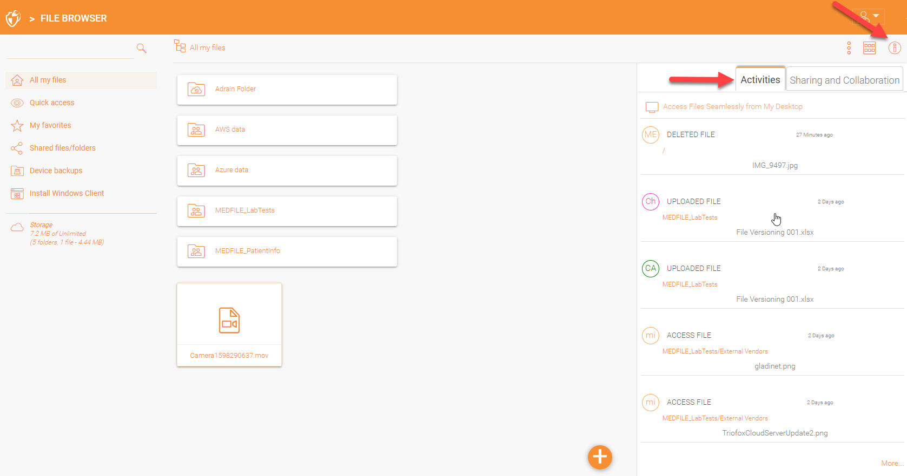
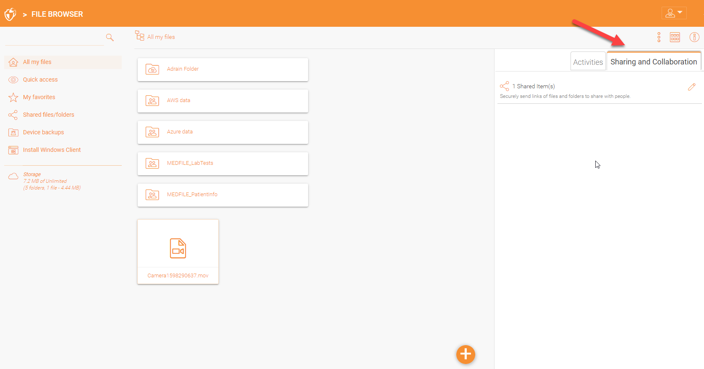
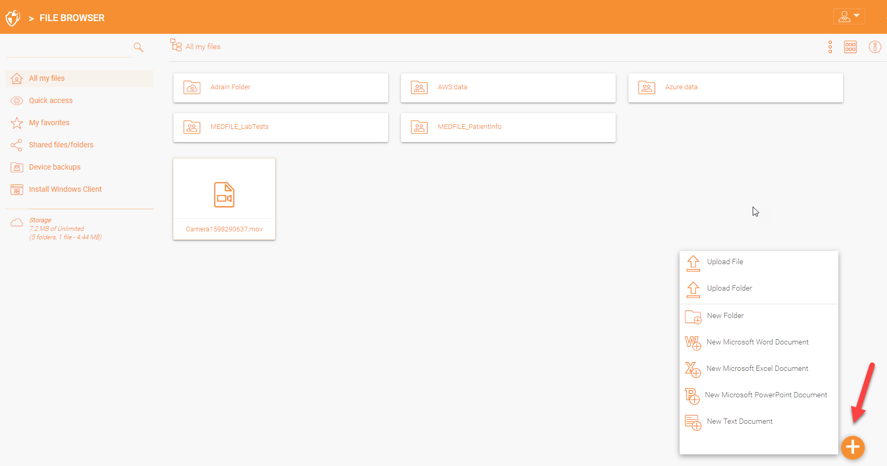

#################
Users and Files
#################

After you login, you will see all the folders and files you have access to in your web portal file browser. The folders can be on the local file server in your company's
network or folders for files in the cloud for example, Amazon AWS S3 or Microsoft Azure blob.

You can double click on any folders to see all the sub-folders and files in that folder.

The file browser view also have some additional options in the left panel which are listed below:

    - All my files shows all files and folders. 
    - Quick access shows all files recently accessed.
    - My favorites show all files which have been marked as favorites.
    - Shared files/folders show all files and folders shared. 
    - Device backups shows all the devices which have been backed up.
    - Install Windows/Mac client once clicked will take you into a window to download the clients.
   
More Actions
=============

You can click on the three stacked dots in the upper right to see more options for example upload file or folder, create a new file or a folder etc. 

Icon View
=============

You can also change the icon display by selecting the different view options available. 

More Info (i)
=============

You can click the (i) icon in the upper right which will display all the current activities on the content. 

'Sharing and Collaboration' tab displays the list of files and folders that have been shared. 

Plus Icon
=============

You can also the plus icon in the bottom right to see more options for example upload a file or folder, create a document etc. 

    

