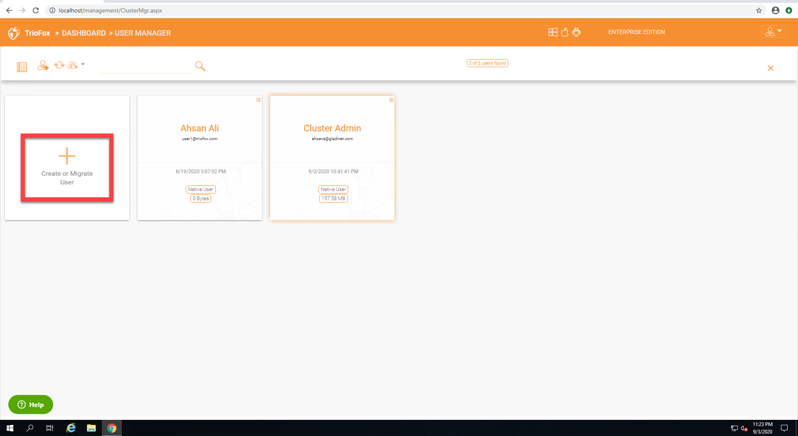
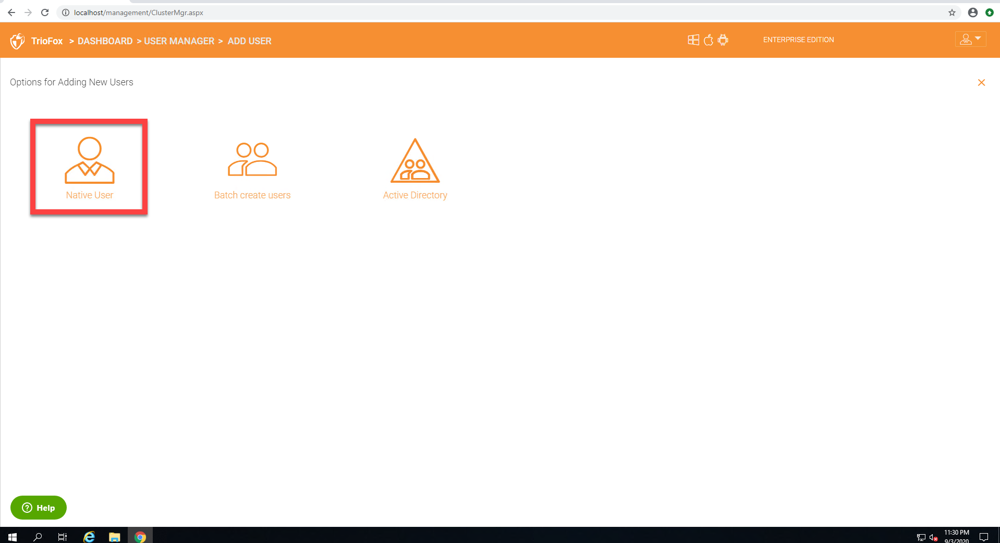
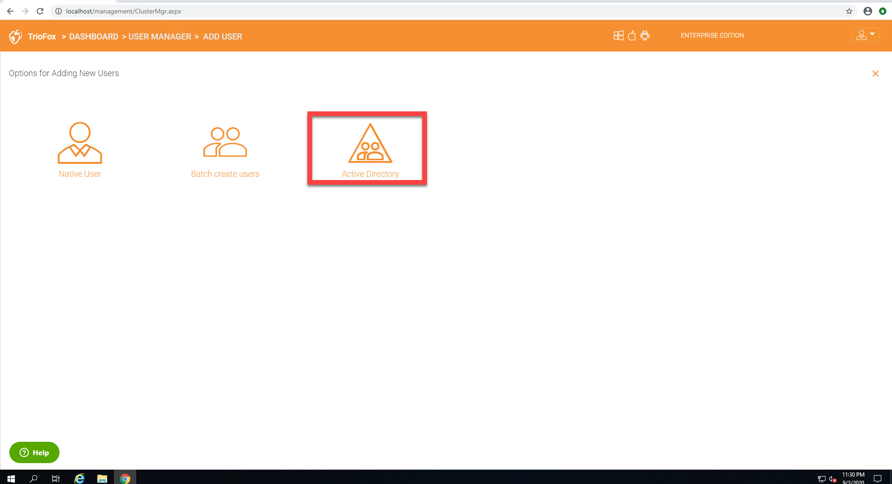

##############
Adding Users
##############

Add User
---------

Once in the dashboard, you can click on the users menu on the right panel and create a new user.

    ADDING USERS

**Native User** 

    Native user refers to |prodname| user that is not related
    to any Active Directory.
    
**Batch create users**

    These are native users in a comma separated file that can 
    be paste into a text area so the users can be batch created.
    
**Active Directory**

    Active Directory means users from Local Area Network (LAN) 
    that is in the same network as the |prodname| server.
    

Add Native User
--------------------

When a new user is created, the administrator will specify the amount of cloud storage that the new user is allowed to use. The email address will send a welcome email to the new user and will serve as his/her username.

    ADDING A NATIVE USER
    
.. note::

    When quota is left as zero, it means no limitation until the tenant quota limit is hit.

Add Active Directory Users from LDAP
-------------------------------------

If the Active Directory (LDAP) is not already configured, you will need to configure it first. Click the wrench icon in the right Local Active Directory panel to access the settings. 

    CONFIGURE YOUR ACTIVE DIRECTORY SETTINGS

If the Active Directory (LDAP) is already configured, you will see the Active Directory name at the bottom of the AD icon in the "Add User" view.

Add Active Directory Users where those users are from local area network.

.. figure:: _static/image_s8_2_5.png
    :align: center

