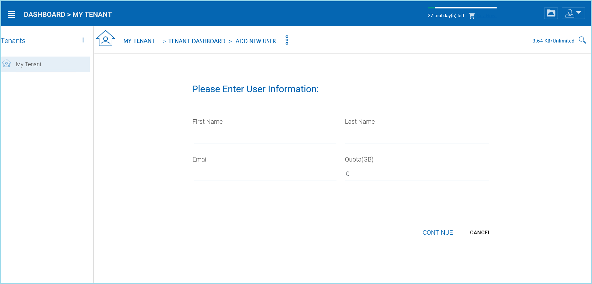

##############
Adding Users
##############

Go to the |prodname| server URL and enter the admin credentials to login.

.. figure:: _static/image_s8_1_1.png
    :align: center

    LOGIN AS TENANT ADMIN

After logging into the portal, select ‘Management Console’ on the top right corner of the web portal:

    GO TO MANAGEMENT CONSOLE

Under Management Console, an admin can configure storage, monitor shared objects, create and manage team folders, manage users, configure granular group policies, add new tenant administrators, look at different reports, and under advanced configure AD etc.

User Manager
=============

You can access the user manager by clicking one of these three items in the Management Console. 

.. figure:: _static/image_s8_2_2.png
    :align: center

    ACCESSING THE USER MANAGER

Add User
---------

You can add users from within the User Manager or simply click the Add New User button to open the **"Sources of New User"** panel. In that panel you have several options: add a Native User, Batch Create Users, import Active Directory users and permissions, and if you have Server Agents actively connected, you will also see those servers listed here as well.

.. figure:: _static/image_s8_2_3.png
    :align: center

    ADDING USERS

**Native User** 

    Native user refers to |prodname| user that is not related
    to any Active Directory.
    
**Batch create users**

    These are native users in a comma separated file that can 
    be paste into a text area so the users can be batch created.
    
**Active Directory**

    Active Directory means users from Local Area Network (LAN) 
    that is in the same network as the |prodname| server.
    
**Server-Agent-Name**

    If you already have "Server Agent" installed and the 
    server agent is actively connected to |prodname|, you will
    also see the server agents listed by name in the Add User page.

Add Native User
--------------------

When a new user is created, the administrator will specify the amount of cloud storage the new user  is allowed to use. The email address will be to send a welcome email to the new user and will serve as his/her username.

    ADDING A NATIVE USER
    
.. note::

    When quota is left as zero, it means no limitation until the tenant quota limit is hit.

Add Active Directory Users from LDAP
-------------------------------------

If the Active Directory (LDAP) is not already configured, you will need to configure it first. Click the wrench icon in the right Local Active Directory panel to access the settings. 

.. figure:: _static/image_s8_3_1.png
    :align: center

    CONFIGURE YOUR ACTIVE DIRECTORY SETTINGS

If the Active Directory (LDAP) is already configured, you will see the Active Directory name at the bottom of the AD icon in the "Add User" view.

Add Active Directory Users where those users are from local area network.

.. figure:: _static/image_s8_2_5.png
    :align: center

    ADDING ACTIVE DIRECTORY USERS

After the Active Directory is configured, you can use the Add User
wizard to import Active Directory users into |prodname|.

.. note::

    For best practice, you will only configure Active Directory via LDAP if the file server is also local
    in the same network as the Active Directory server.

Add Active Directory Users from Server Agent
----------------------------------------------

When the Server Agent is available and connect to the specific
tenant in the |prodname|, the Server Agent will show up
with the server's name at the bottom of the icon.

Click through the Server Agent icon, you will see the "Add User" wizard and complete the wizard to add users. This is very similar to the add AD user from local LDAP process above. 

.. note::

     When the Active Directory is at a remote location, not directly connected to |prodname| server, Server Agent can be used to facilitate the communication. Server Agent doesn't need to be installed directly on a remote Active Directory server, the Server Agent need to be installed on a remote file server that is part of the remote Active Directory domain.

