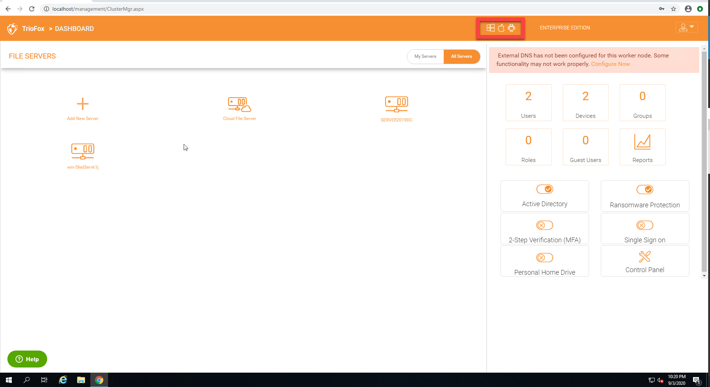
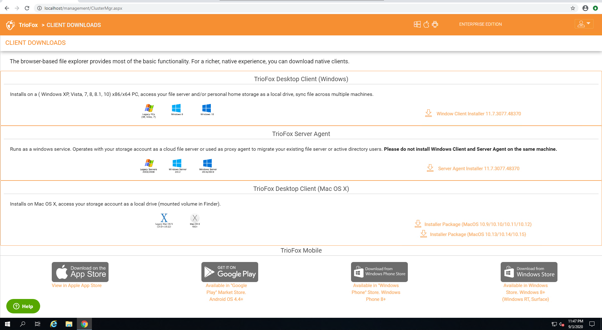

#####################################
Client Agent Software and Downloads
#####################################

The Triofox Cloud access platform supports several different clients which allow users to leverage cloud storage in ways that make sense for
the client. Supported clients include:

    *	HTML 5 based Web Portal 
    
        - Chrome
        - Firefox
        - Internet Explorer
        - Opera
        - Safari
        - older web browsers such as Internet Explorer 8
        
    *	Desktop Client for Windows and Mac
    *	Server Agent for Windows Servers
    *	Mobile Clients for iOS (iPad and iPhone)
    *	Mobile Clients for Android phones
    *   Mobile Clients for Windows Phone

    
    
Download Client Agent Software
===============================

Most of the Mobile clients will need to be downloaded from the Apple Store, Google Play Store or Windows Phone Market Place. 

The Windows and Mac client agent software can be downloaded directly from the Triofox web portal itself. Click the small user icon (1) and then click the client download graphic (2) to get started. 

    ACCESSING YOUR DOWNLOADS

    DOWNLOAD CLIENT AGENT SOFTWARE