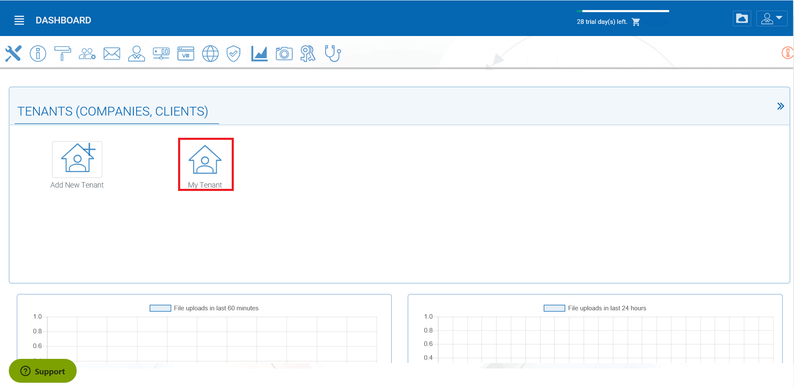
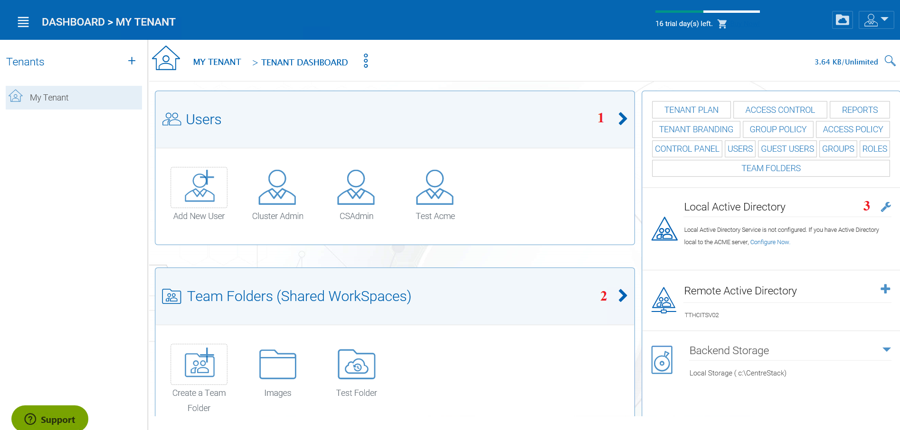
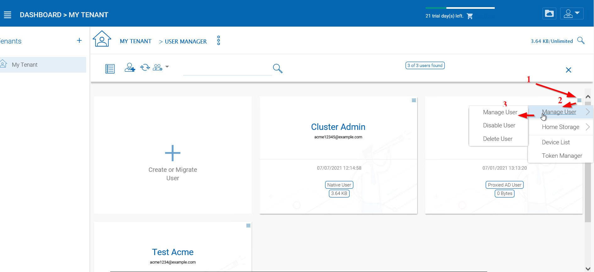

#################
Users and Files
#################

Please reference the `Admin Guide`__ for full documentation of the tenant administration. Here we will go over several commonly touched areas for tenant administrators.

.. _Admin_Guide: https://centrestack.com/Library/AdminGuide/ 
__ Admin_Guide_

After you enter the "management console", you will be in the dashboard. When you are at the dashboard, you can access the tenant by clicking on the desired tenant from the options.

Once you are in the tenant manager, the top two objects to manage are users **(1)** and folders **(2)**. If you are using an Active Directory for importing users and permissions you can connect to your Active Directory by clicking the wrench icon **(3)**.

    MANAGE USERS AND FILES

    
Files
======

Adding files and folders can be accomplished by clicking **"Create Team Folder"**. Once the **"Team Folder Storage Locations"** view opens you can choose from many options: Existing Tenant Storage, File Servers in Local Area Network, Remote File Servers or Cloud Storage. 

.. figure:: _static/image_s7_5_1.png
    :align: center

    WAYS TO ADD STORAGE LOCATIONS

File Servers
-------------

If you have an existing file server in the Local Area Network (LAN), you can import the network share directly to |prodname| **(1)**. Under Remote File Servers, you can install the Server Agent client **(2)** and access your file server remotely.

.. figure:: _static/image_s7_5_2.png
    :align: center

    ADDING REMOTE FILES
    
    .. note::
    
       The Server Agent is only required when the remote file server doesn't have direct LAN (local area network) access
        to |prodname|. The Server Agent will be used in this case to facilitate communication between
        the |prodname| server to the remote file server.

Sharing
========
Preventing Users From Sharing
------------------------------

Sometimes for security reasons, users should not be allowed to share files/folders.

There are two types of files and folders a user can access.

*	Userfs own folders, including versioned folders and attached local folders from the user's desktop.

When an administrator creates new users, he/she can check eDisable sharing home directory content with external party, to prevent the newly
created user from sharing his/her own files and folders.

    MANAGE USER SETTINGS

In the Manage User panel use the drop-down menu (4) to access the "Storage" settings (5). Once you are in the Storage View you can select (6) the "Disable team-user share home directory content externally" option. 

.. figure:: _static/image_s15_1_11.png
    :align: center

    DISABLE EXTERNAL SHARING

When publishing a team folder, administrator can check eDisable further sharingf, to prevent users from sharing anything in the team folder. You can access this setting after choosing your storage location. Click the "Create Team Folder" icon (1) and select your storage type (2), then select the "Disable further sharing" option (3). 

.. figure:: _static/image_s15_1_12.png
    :align: center

    DISABLE FURTHER SHARING

Protecting Shares By Requiring Login
-------------------------------------

When a user shares a file or folder, |prodname| will generate a URL. By default, anyone can use the URL to access the share.

Administrators can protect shares by requiring login credentials. Once enabled, when a user accesses the share URL, he /she will be prompted to
login to the |prodname| Cloud. After login, the user can view the file/folder shared with him/her under eFiles shared with mef.

To access this setting use the drop-down menu (1) and in the "Group Policy -> Sharing" (2) panel, select the "...user must login to his/her account..." setting. 

.. figure:: _static/image_s15_1_13.png
    :align: center

    SECURING SHARED FILES AND FOLDERS

