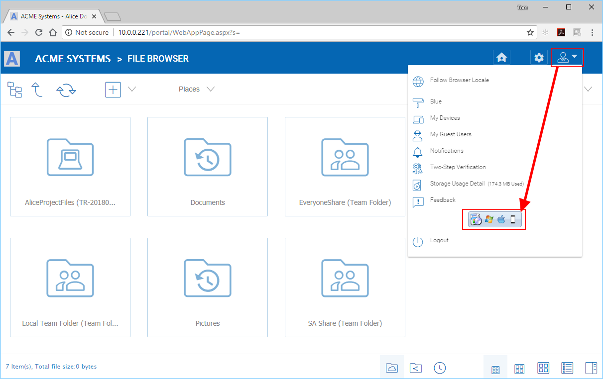
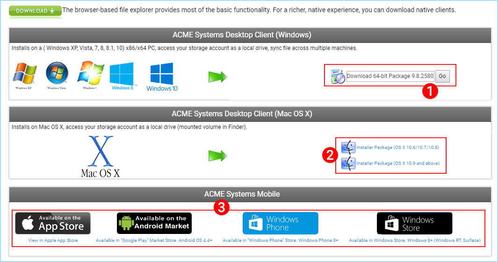
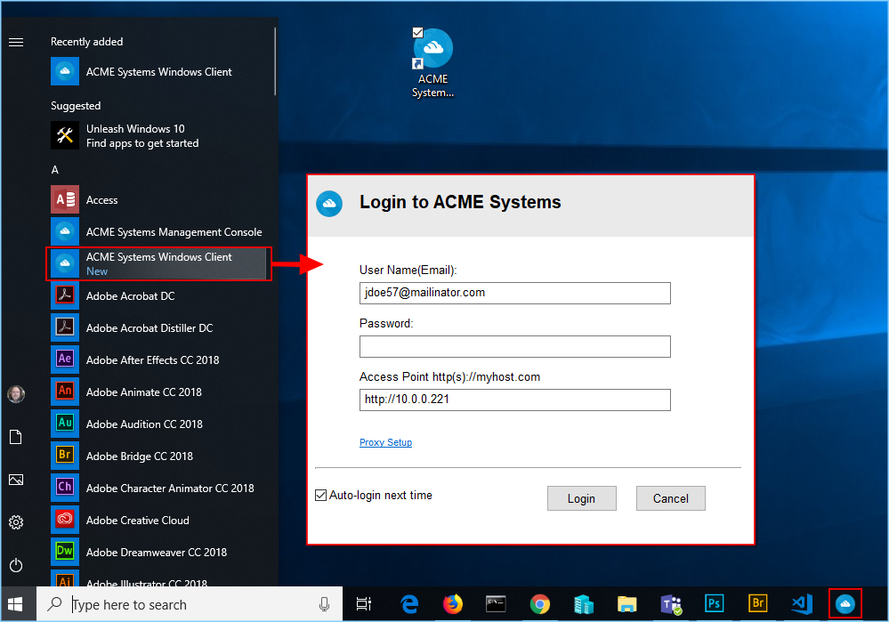
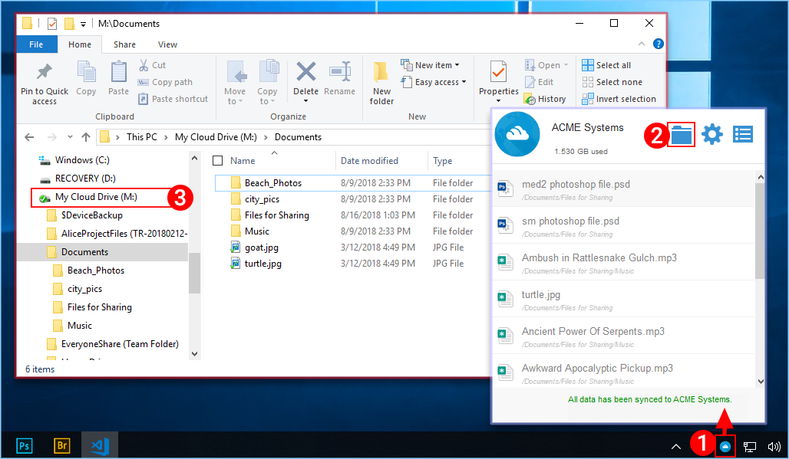
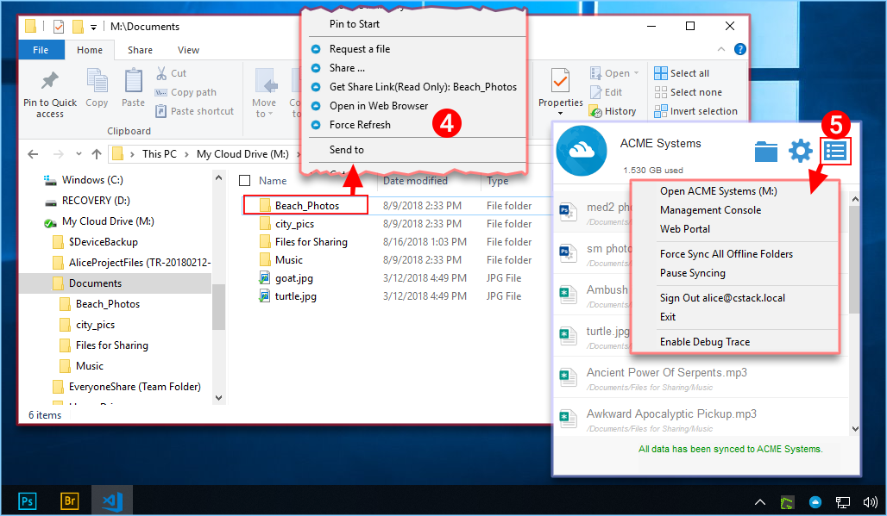
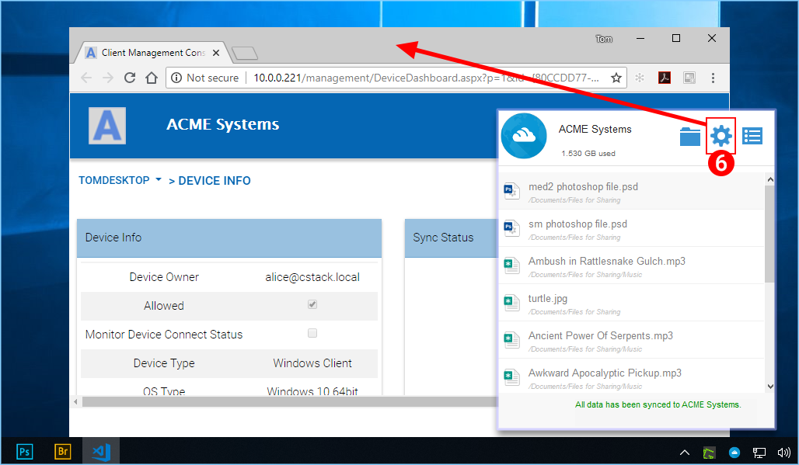

################
2 Installation
################

First login to your |prodname| web portal and click the user icon (1) in the top right corner. Then click the client download button (2) and download the respective client installer package.

.. note::
  **NOTE:** It is very important that you log in to |prodname| as a user before downloading the Windows or Mac Clients. This gives you access to client installation packages that are already tied to your |prodname| account, which makes installation and accessing |prodname| easy. 

        
    DOWNLOAD YOUR CLIENT

Once you click the download button you will see a page of options including Windows Desktop Client (1), Mac OS X Client (2) or Mobile client (3) and download the associated package. 

        
    CLIENT DOWNLOAD PAGE

Ensure that you choose the appropriate download for your operating system (eg, Windows 64-bit, Windows 32-bit). Run the downloaded MSI package **(1)** to start the installation. Then click "Next" **(2)** and follow the instructions to finish. In the Setup Windows Client screen, you can customize the installation if necessary.

.. figure:: _static/image_s2_1_3.png
    :align: center
        
    CLOUD WINDOWS CLIENT INSTALLER

Log In to |prodname|
=======================

At the end of the installation, you will be prompted to enter your |prodname| user account credentials. These credentials will authorize your |prodname| Windows Client and connect it to your |prodname| user account. Access to your Windows Client agent is also available under the Windows Start Menu. If the "Auto-login next time" option is selected (default), the Cloud Windows Client will be launched at Windows Startup. You can see the client icon in the lower right of the desktop or in the right-bottom notifications areas of your task bar. 

        
    LOGGING INTO |prodname| CLIENT

Accessing Your Files and Folders
==================================

There are two main ways to use |prodname| files and folders.

* First, there is a |prodname| Cloud Drive. 

    With the |prodname| Cloud Drive, you have direct on-demand access to your cloud storage. 

* Second, there are synchronization folders.

    Outside of the Cloud Drive, if you don't want to change where your existing folders are, you can then attach local folders as an access mechanism. The attached folder will be synchronized with Cloud in a bi-directional way.

Cloud Drive Access
====================

After the installation is completed, a system tray icon will appear that allows you to open your |prodname| Drive.

If you click the system tray icon **(1)** which will open the tray menu. You can access the cloud drive by clicking the folder icon **(2)** which will open Windows Explorer in the Cloud Drive veiw **(3)**. 

        
    ACCESSING THE CLOUD DRIVE

In the Cloud Drive folder, you can do typical Windows folder functions, and right click to access the Cloud Drive context menu **(4)**. 

Back in the Tray Menu, there is an additional menu icon **(5)** that gives you access to other important functions (e.g., web portal, force sync, sign out, exit, enable debug trace). 

        
    OTHER CLOUD DRIVE FUNCTIONS

Management Console
====================

Also in the Tray Menu there is a Mangement Console icon **(6)**. If you click this, a browser will open, giving you access to the Management Console.

        
    ACCESSING THE MANAGEMENT CONSOLE
