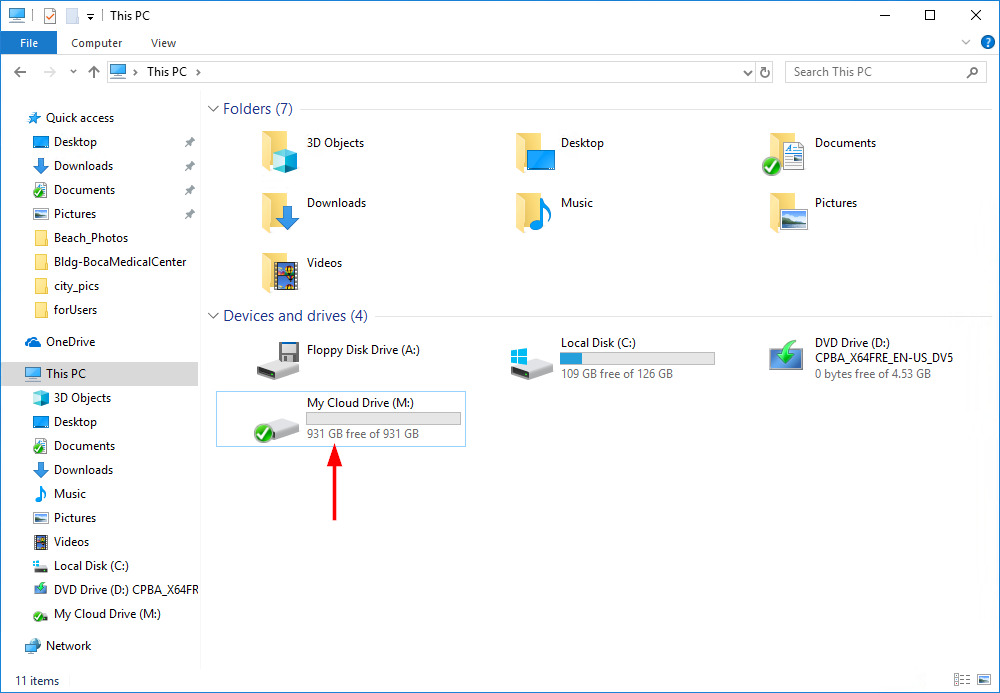
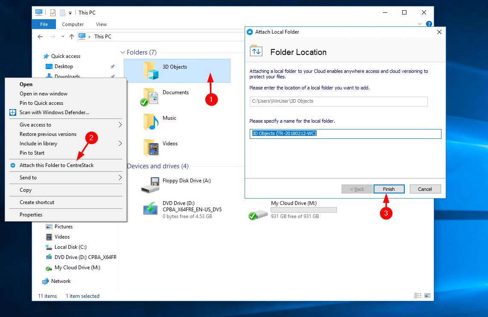

###########################
3 Connecting To The Cloud
###########################

Transferring Files
====================

Now you can use the Cloud Storage as if it were a Virtual Drive or Folder. Simply drag and drop to copy local documents to the Cloud Storage.

You can access your cloud drive directly with a drive letter.

        
    THE CLOUD DRIVE

|prodname| Windows Desktop Agent makes it very easy to move data into cloud storage or extract data from cloud storage.

Attaching Local Folders
=========================

The virtual drive provides on-demand access to files and folders from the |prodname| Cloud storage account.

Sometimes it is also desirable to work inside a local folder, and have the local folder synchronize with the |prodname| Cloud storage account. You can right click on a local folder (1) and select “Attach this Folder to |prodname|” (2). The pop-up (3) shows you where this folder is located on your system and allows you to change the name of the folder if you don't want to use the default.

        
    ATTACH A FOLDER TO |prodname|

Benefits of Attached folders:
===============================

*	They will be synchronized with the cloud.

*	Their contents immediately become accessible even before the sync is completed.

*	They can maintain a versioned backup of their contents.

*	Their content is available locally when offline.

*	They can be used in the same ways as any local folder.
