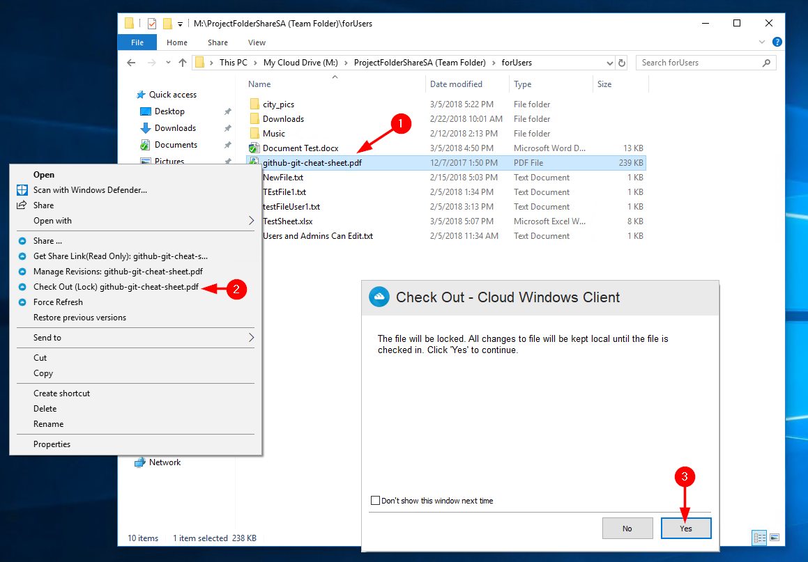
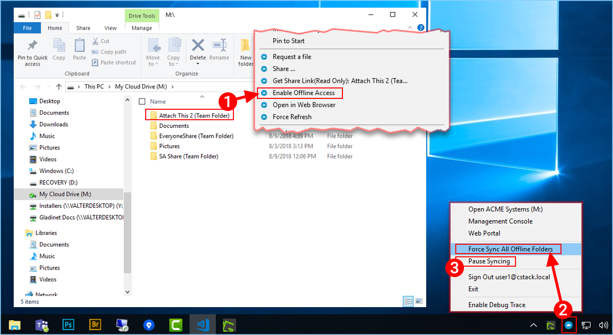

#################
5 Locking Files
#################

The |prodname| Cloud administrator has the option of enabling a setting that causes files to automatically become locked when they are in use - automatic distributed lock (see administration guide). This prevents more than one person from updating the file at the same time which can cause undesirable results. 

.. note::

    When to use automatic lock and when to use manual lock?
    
    When files are automatic locked, the same files need to be automatically unlocked. When files are automaticall locked, the agent that locks the file needs to maintain health heart beat with the central |prodname| server. When the heart beat can't be maintained, the file will be automatically unlocked.
    
    If you want the file to stay locked regardless what situation the agent machine is in, manual lock is recommened. A manually locked file will need to be manually unlocked.

Files can be manually locked. Right-click on any file **(1)** in the |prodname| drive and then select “check out (Lock) This File” **(2)** to toggle between its locked and unlocked state. Then click Yes in the pop-up **(3)**. 

        
    LOCKING A LOCAL FILE

The context menu will give the option to lock the file. It will stay locked until you 'Unlock' it. When you are finished with the file, you can unlock it by right-clicking it and choosing Check In from the context menu. 

Offline Access
===============

Cloud Drive files aren't fully synced by default; only the files you are using are synced. You can Force Sync your files however. Right-click the folder you want to make "Offline" and choose "Enable Offline Access **(1)**. Once this is done, you can click your drive icon **(2)**, and then choose "Force Sync All Offline Folders" to sync any folders you have enabled for Offline Access. 

Also, you might want to pause the synchronization of files while you are working on them. This can be done from the Cloud Drive icon as well. In the menu, choose "Pause Syncing" **(3)** temporarily stop files from sychronizing. The benefit is that you can keep modifying documents (drafts) locally until it is all done and then you can uncheck the "Pause" and connect to the |prodname| cloud drive to upload any changes. 

        
    OFFLINE ACCESS
