##################################
6 Client Side Management Console
##################################

Client Side Management Console - Native
==========================================

The desktop client has a management console that controls the client side of the behavior. The management console can be started from the system tray icon **(1)**. In the Client Menu, hold down the CTRL key and click on the management console gear icon **(2)**. 

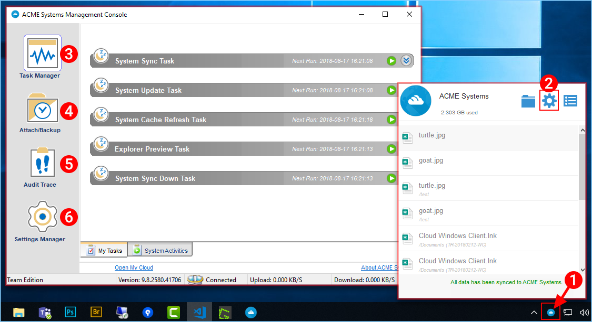
        
    WINDOWS CLIENT MANAGEM ENT CONSOLE

The management console has five sections:

   +-----------------+-----------------------------------------------------------------+ 
   | Section Name    || Description                                                    |
   +=================+=================================================================+ 
   | Task Manager    || You observe transferring tasks here, such as system updates,   |
   | (3)             || explorer previews, system synchronization in this section      |
   +-----------------+-----------------------------------------------------------------+
   | Attach/Backup   || You will Attach, Backup, and observe the two-way               |
   | (4)             || synchronization folders in this section                        |
   +-----------------+-----------------------------------------------------------------+
   | Audit Trace     || Audit Trace is generally used for troubleshooting purposes     |
   | (5)             |                                                                 |
   +-----------------+-----------------------------------------------------------------+
   | Settings        || Settings Manager stores the different client-side settings     |
   | Manager (6)     |                                                                 |
   +-----------------+-----------------------------------------------------------------+ 

Attach To Back Up
====================

You can attach local (from your Client Device) folders to |prodname| by clicking the "Attach/Backup" button **(1)**. In the main view, click "Attach a Folder to Backup" **(2)**. This will open a wizard. Type in the location of the folder in the provided field or click the "..." button **(3)** to explore to a folder you wish to attach **(4)**. Click "OK" then "Finish" to complete the process. 

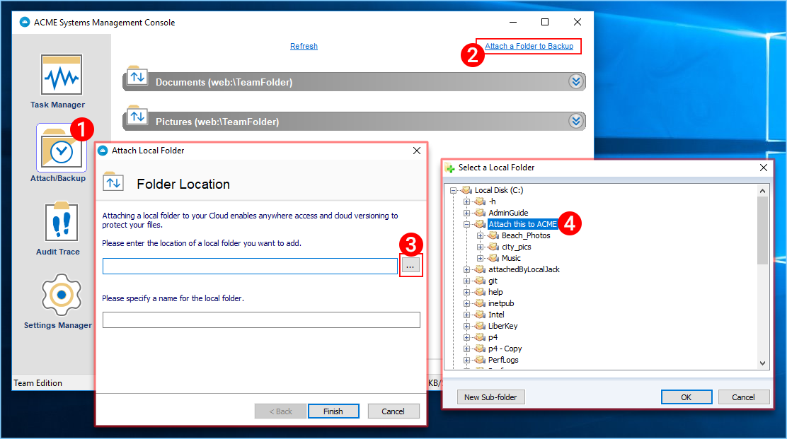
        
    ATTACH A FOLDER TO BACKUP

Audit Trace
==============

Audit trace on Windows client and server agent provides basic history information (Like a blackbox) on what happened to the application in a summary level. It provides the first level of information when it comes to troubleshooting issues. 

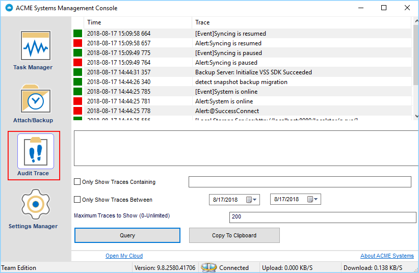
        
    AUDIT TRACE

Settings Explained
=====================

There are many settings under the Settings Manager in the desktop client. To access them click the Settings tab. 

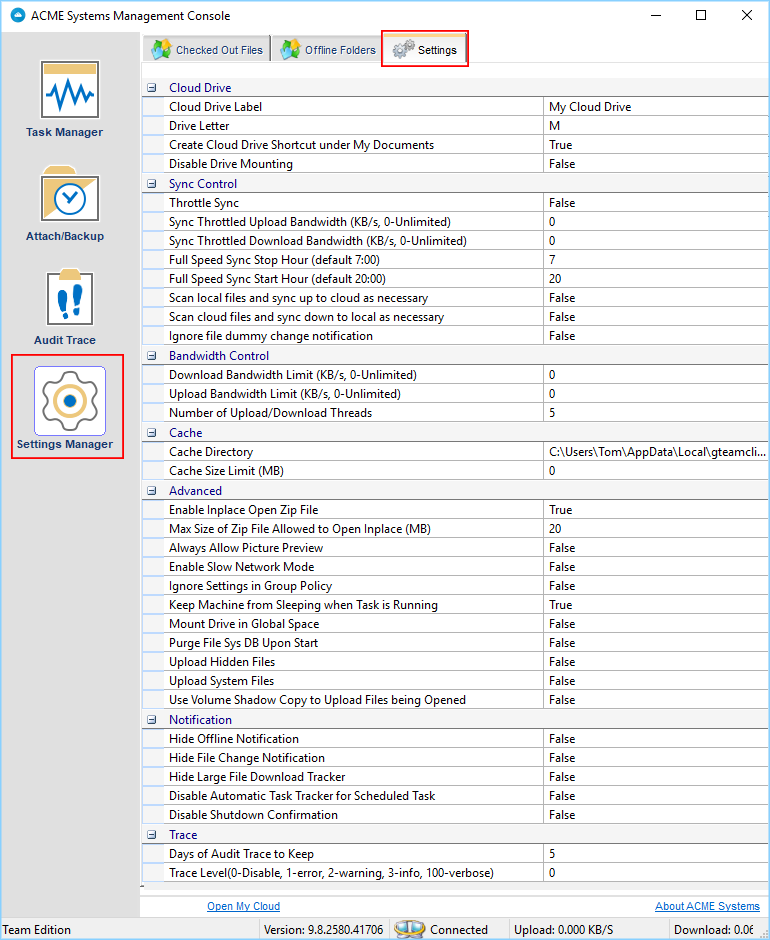
        
    SETTINGS TAB - SETTINGS MANAGER

Cloud Drive
=================

Cloud Drive Label
-------------------

    My Cloud Drive (default) - This is the drive label you can see from the Windows Explorer.

Drive Letter
--------------

    M (default) - This is the drive letter assignment.

Create Cloud Drive Shortcut under My Documents
------------------------------------------------

    True (default) - If true, there is a shortcut to the Cloud Drive under the My Documents' folder.

Disable Drive Mounting
------------------------

    False (default) - If true, no Cloud Drive will be mounted under My Computer for the Windows Client.

Sync Control
==================

    False (default) - If true, the synchronization and transferring of files will follow the throttle control defined in this section.

Throttle Sync
---------------

    False (default) - If true, the Upload and Download Throttling control defined under this settings.

Sync Throttled Upload Bandwidth (KB/s, 0-Unlimited)
-----------------------------------------------------

    0 (default) - The default setting is unlimited KB/s, enter a number here to reduce the bandwidth consummed to the set limit.

Sync Throttled Download Bandwidth (KB/s, 0-Unlimited)
-------------------------------------------------------

    0 (default) - The default setting is unlimited KB/s, enter a number here to reduce the bandwidth consummed to the set limit.

Full Speed Sync Stop Hour (default 7:00)
------------------------------------------

    7 (default) - This setting represents the hour (24 hour clock) of the day when Full Speed synchronization will stop - Usually it is desired to have full speed synchronization overnight when the Internet utilization is low.

Full Speed Sync Start Hour (default 20:00)
---------------------------------------------

    20 (default) - This setting represents the hour (24 hour clock) of the day when Full Speed synchronization will begin - Usually it is desired to have full speed synchronization overnight when the Internet utilization is low.

Scan local files and sync up to cloud as necessary
----------------------------------------------------

    False (default) - The desktop client builds up a state database that describes which files are in sync and which files are not. In the case where the desktop client is re-imaged, the state information may be lost. This option can be used to scan local files and upload them to the cloud as necessary. This is a quick way to re-build state information when the local files are more accurate than the information in the cloud.

Scan cloud files and sync down to local as necessary
------------------------------------------------------

    False (default) - The desktop client builds up a state database that describes which files are in sync and which files are not. In the case where the desktop client is re-imaged, the state information may be lost. This option can be used to scan local files and upload them to the cloud as necessary. This is a quick way to re-build state information when the cloud files are more accurate than the local files.

Ignore file dummy change notification
---------------------------------------

    False (default) - When set to True, notifications will not be sent for 0-byte files or files that received change notification from the file system but the files are not actually changed. 

Bandwidth Control
=======================

Download Bandwidth Limit (KB/s, 0-Unlimited)
----------------------------------------------

    0 (default) - This setting is defaulted to unlimited. Change this to limit your download bandwidth to the number you enter in Kilobytes.

Upload Bandwidth Limit (KB/s, 0-Unlimited) 
--------------------------------------------

    0 (default) - This setting is defaulted to unlimited. Change this to limit your upload bandwidth to the number you enter in Kilobytes.

Number of Upload/Download Threads
-----------------------------------

    5 (default) - Use this setting to restrict the number of threads used during synchronization.

Cache
===========

Cache Directory
-----------------

    C:\\Users\\username\\AppData\\Local\\gteamclient\\cache (default) - Use this setting to change the default location of the cache. 

Cach Size Limit (MB)
----------------------

    0 (default) - The default setting is zero which is unlimited. Set this to a different number to limit the cache to that size in MB. You can disable the cache (not recommended) using the Web Portal's Tenant Dashboard > Roles settings.

Advanced
==============

Enable Inplace Open Zip Files
-------------------------------

    False (default) - By default, Windows Client doesn't allow a user to open zip files in mounted M drive directly. This is because opening a zip file means to download the whole zip file to cache first. When the zip file is big, the download will generate high network traffic and cause windows explorer to slow down. Change this to True if you want users to be able to open Zip files within the M drive. The next setting determines the size limit of this feature.

Max Size of Zip File Allowed to Open Inplace (MB)
---------------------------------------------------

    20 (default) - This defines the size limit for the zip file the user is allowed to open. It is designed to prevent user/windows explorer from downloading very large zip files. By default, it is 20M. When admin enables inplace zip file opening, only files within 20M can be opened. 

Always Allow Picture previews
-------------------------------

    False (default) - If this is turned on preview thumbnails will be generated for your local files. This consumes a lot of bandwidth for unnecessary downloading of image files. 

Enable Slow Network Mode
--------------------------

    False (default) - No further information. 

Ignore Settings in Group Policy
---------------------------------

    False (default) - By default, the settings in Group Policy overrides the local settings. Change this to True if you wish to override the Group Policy setting. 

Keep Machine from Sleeping when Task is running
-------------------------------------------------

    True (default) - Nighttime is typically a good time to transfer files at full speed. However, the machine may go into a sleeping state, preventing the transfer of files. This setting can prevent the sleep mode from activating. 

Mount Drive in Global Space
-----------------------------

    False (default) - No furter information. 

Purge File Sys DB Upon Start
------------------------------

    False (default) - If you change this setting to True, upon startup the client will purge the cached cloud storage state file. This allows the client to rebuild the database as if it is being started for the first time.

Upload Hidden Files
---------------------

    False (default) - Change this setting to True if you want to upload Hidden Files to the cloud. 

Upload System Files
---------------------

    False (default) - Change this setting to True if you want to upload System Files to the cloud. 

Use Volume Shadow Copy to Upload Files being Opened
-----------------------------------------------------

    False (default) - By default an actively opened file will not be uploaded until it has been closed. This setting can override that behavior, uploading all of the files regardless of their open status.  

Notification
==================

Hide Offline Notification
---------------------------

    False (default) - A system that goes into offline mode will send a notification by default. Change this to True to hide that notification. 

Hide File Change Notification
-------------------------------

    False (default) - When files are modified by other people or by the same user but from another machine, there is a file change notification. Change this setting to True to turn off that notification.

Hide Large File Download Tracker
----------------------------------

    False (default) - When Windows Explorer is downloading a large file in the background, by default there is a large file download progress dialog showing. This setting allows you to turn off that notification.

Disable Automatic Task Tracker for Scheduled Task
---------------------------------------------------

    False (default) - 

Disable Shutdown Confirmation
-------------------------------

    False (default) - When shutdown the desktop client, there is a shutdown confirmation window. This setting controls whether that confirmation dialog will be shown. Set this to True to hide the confirmation dialog. 

Trace
===========

Days of Audit Trace to Keep
-----------------------------

    5 (default) - This setting defines how many days to keep the audit trace. 

Trace Level (0-Disable, 1-error, 2-warning, 3-info, 100-verbose)
------------------------------------------------------------------

    0 (default) - By default, the trace level is 0. It can be changed to the levels shown, or 101 for maximum debug trace. 

Client Side Management Console - Web
=======================================

When you click on the management console without holding down the CTRL key, the management console will open into a default web browser.

Device Information
---------------------

The default page is the Device Info page. This is an overview of the device including details such as Device Owner, Device Type, OS Type, Device Client Version (software build number), Last Login Time, Sync Status, Cache Size, Last Report Time, and more. 

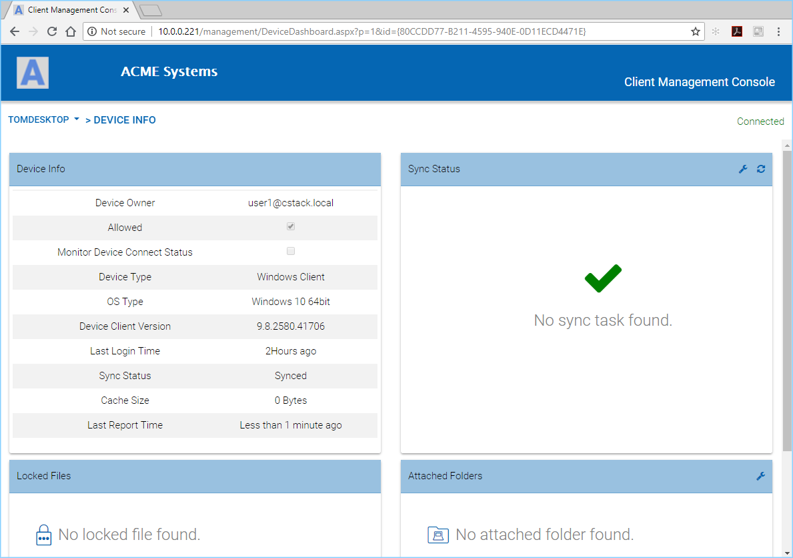
        
    CLIENT MANAGEMENT CONSOLE

To access other options and views click the left tab (Device Name) and that will open a menu.

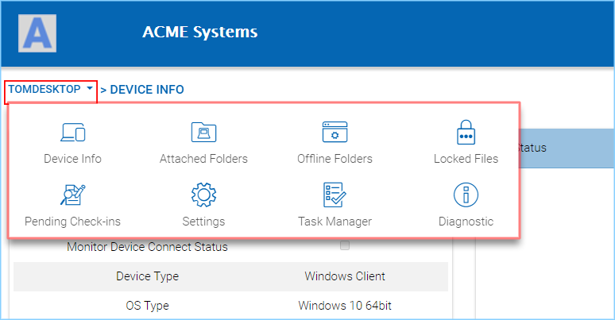
        
    MANAGEMENT CONSOLE MENU

Attached Folders
------------------

Attached Folders are local folders that are maintaining a two-way synchronization relationship with cloud storage. To add a new attached folder, click the **"+"** icon and use the wizard to explore to a folder you wish to attach. Provide a name you want to use in the "Name" field then click "ATTACH" to complete the process. 

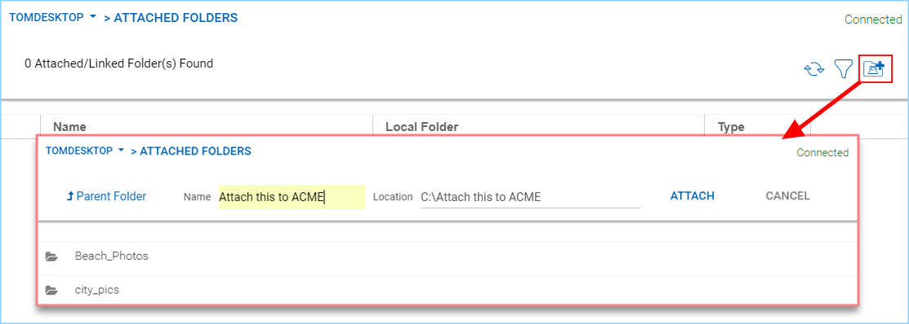
        
    ATTACHING A FOLDER TO THE CLOUD

Offline Folders
------------------

Most of the files on your local Cloud Drive are sychronized with place-holders or representations of the full file. This saves bandwidth and improves speed, as files are only fully fetched when they are accessed by the user. When a folder is changed to "offline" it forces all of the content to be pre-fetched immediately. Depending on the size, this may take some time, but after the initial sychronization, changes to the folder will be downloaded as needed to maintain the offline status. 

To add an offline folder, choose Offline Folders from the console menu and click the "+" icon **(1)**. You will then choose a folder **(2)** from the shared folders on the cloud, click Enable Offline Access **(3)**, select Yes in the confirmation dialog **(4)**, and the contents of that folder will be pre-fetched **(5)** for access while offline. 

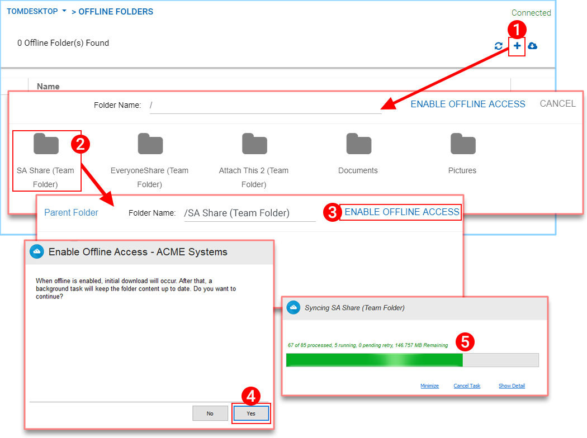
        
    ENABLE OFFLINE ACCESS

Locked Files
---------------

A file that is in use is locked. In the image below, the user has opened the document **(1)** in Word. When a user is editing a Word Document, that file will remain locked while it is open in Word. Sometimes you will need to click the "Refresh" text **(2)** to see files that are locked in the Locked Files view. These are locked files from the local device. The locked files include automatically locked files (e.g., opened in Word) and manually locked files (e.g., right-clicked and locked in context menu). If you need to force-unlock a file, this can be done using the lock icon **(3)**. 

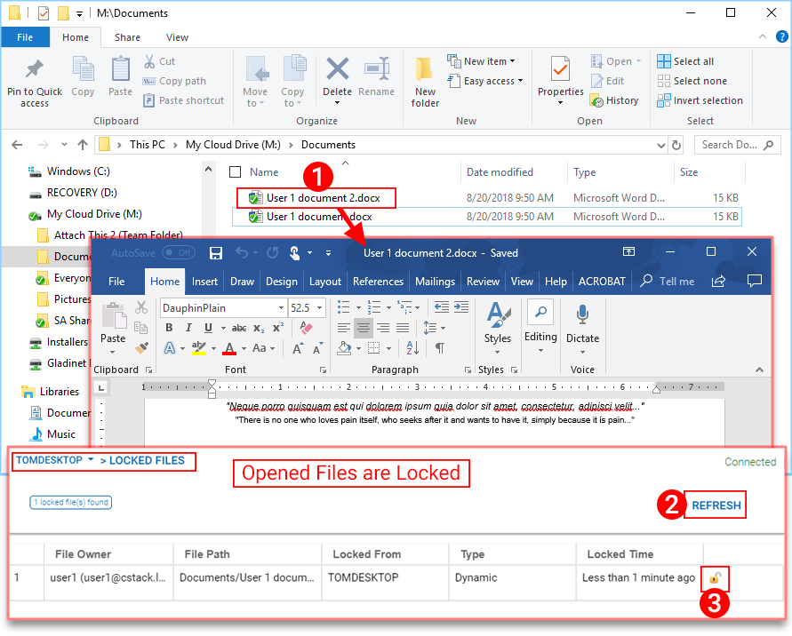
        
    LOCKED FILES VIEW

Pending Check-Ins
--------------------

You can check out files for editing. This can be done by right-clicking the file in your Cloud Drive, choosing "Check Out" **(1)** from the context menu, choose yes in the pop-up **(2)**, and then hit Refresh **(3)** in the Pending Check-Ins view. Pending check-ins are files that are manually checked out and will need to be manually checked in to remove them from the Pending Check-Ins view. You can also force unlock these files by clicking the lock icon **(4)**. 

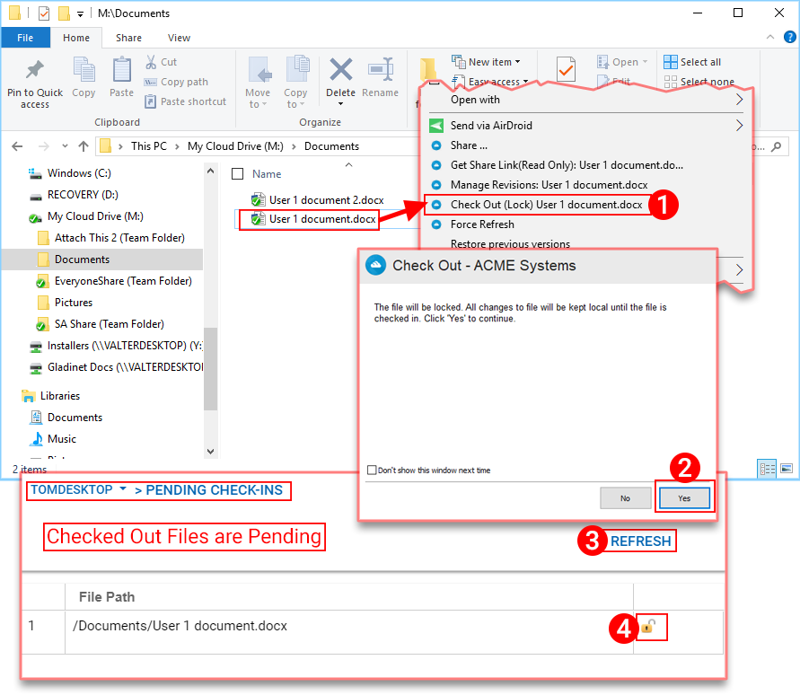
        
    PENDING CHECK-INS

Settings
------------

Settings are settings that can be applied to the current device.

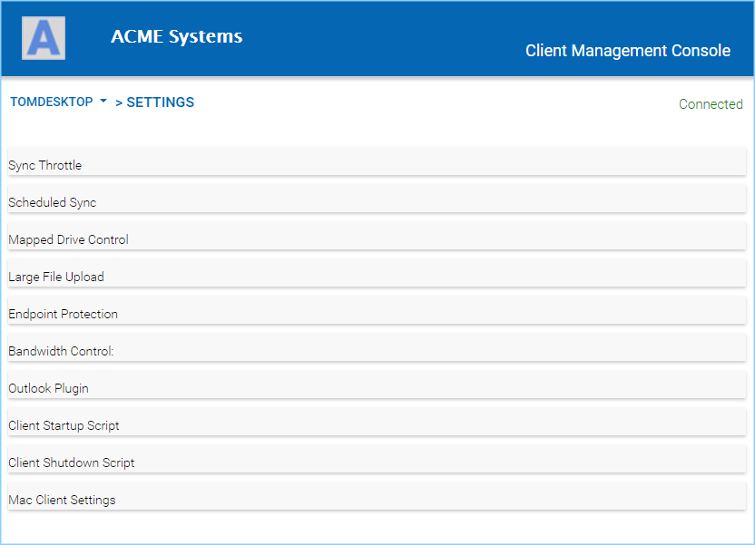
        
    CONSOLE SETTINGS

Task Manager
------------

The Task Manager can show the current running tasks on the current local device.

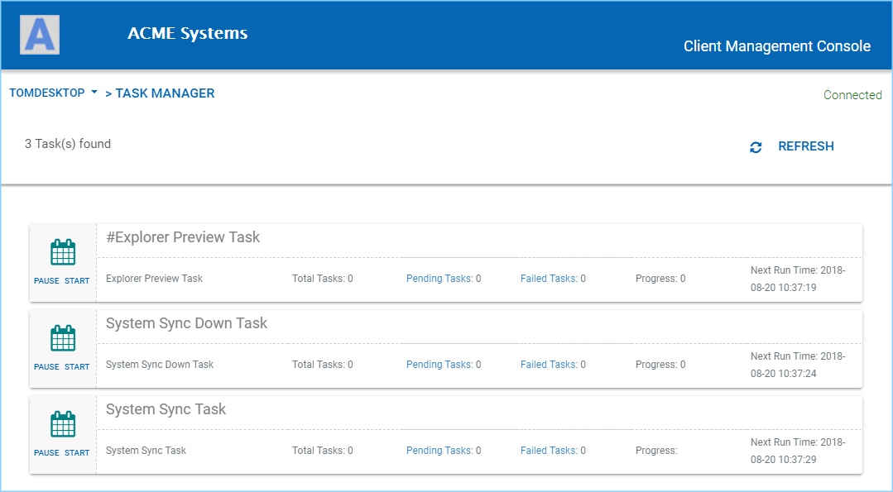
        
    TASK MANAGER

Diagnostic
------------

The Diagnostic view can enable tracing and give you access to the Audit Trace download for troubleshooting purpose.

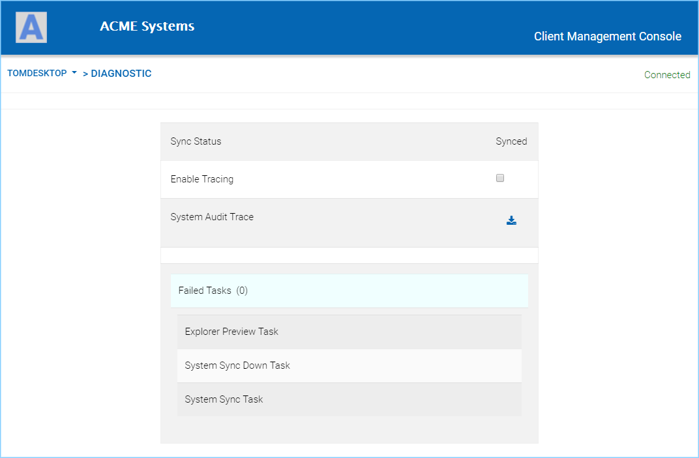
        
    DIAGNOSTIC VIEW
